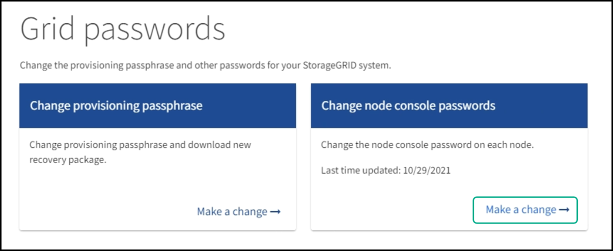

= 變更節點主控台密碼
:allow-uri-read: 
:icons: font
:imagesdir: ../media/

[role="lead"]
網格中的每個節點都有唯一的節點主控台密碼、您必須登入節點。請使用這些步驟來變更網格中每個節點的每個唯一節點主控台密碼。

.您需要的是 #8217 ；需要的是什麼
* 您將使用登入Grid Manager xref:../admin/web-browser-requirements.adoc[支援的網頁瀏覽器]。
* 您具有「維護」或「根」存取權限。
* 您有目前的資源配置通關密碼。

使用節點主控台密碼、以「admin」身分使用SSH登入節點、或以VM/實體主控台連線登入root使用者。變更節點主控台密碼程序會為網格中的每個節點建立新密碼、並將密碼儲存在更新的「密碼」檔案（位於「恢復套件」）中。密碼會列在Passwords.txt檔案的「Password（密碼）」欄中。

NOTE: SSH金鑰有個別的SSH存取密碼、用於節點之間的通訊。此程序不會變更SSH存取密碼。

== 存取精靈

. 選擇*組態*>*存取控制*>*網格密碼*。
+

. 在*變更節點主控台密碼*下選取*進行變更*。

== 輸入資源配置通關密碼

. 輸入您的資源配置通關密碼。
+
image::../media/node-console-provisioning-passphrase.png[輸入資源配置通關密碼]

. 選擇*繼續*。

== 下載目前的恢復套件

. 選擇*下載恢復套件*。
+
如果任何節點的密碼變更程序失敗、您都可以使用目前的恢復套件中的舊密碼。

+
image::../media/node-console-download-current-recovery-package.png[下載目前的恢復套件]

. 將恢復套件檔案（.zip）複製到兩個安全、安全且獨立的位置。
+

CAUTION: 必須保護恢復套件檔案、因為其中包含可用於從StorageGRID 該系統取得資料的加密金鑰和密碼。

. 選擇*繼續*。

== 變更節點主控台密碼

. 選擇* Yes（是）*確認您要變更節點主控台密碼。
+
image::../media/node-console-start-passwords-change.png[開始密碼變更]

+
當您選取* Yes（是）*時、系統會以新密碼產生新的恢復套件。使用新密碼產生新的恢復套件可能需要幾分鐘的時間。

+
當您選取*取消*時、會返回上一頁。

. 選擇*下載新的恢復套件*。
+
image::../media/node-console-download-new-recovery-package.png[下載新的恢復功能package.png]

. 下載完成時：
+
.. 開啟.Zip檔案。
.. 擷取.zip檔案的內容。
.. 確認您可以開啟「pers密碼」檔案、而且內容可以讀取。

. 將新的恢復套件檔案（.zip）複製到兩個安全、安全且獨立的位置。
+

CAUTION: 請勿覆寫舊的恢復套件。

+
您應該只檢視「passwors.txt」檔案、或者如果無法檢視、請先刪除擷取的「passwors.txt」檔案、再將「恢復套件」複製到兩個不同的安全位置。必須保護恢復套件檔案、因為其中包含可用於從StorageGRID 該系統取得資料的加密金鑰和密碼。

. 選取此核取方塊、表示您已下載新的恢復套件並驗證內容。
. 選擇*變更節點主控台密碼*、然後等待所有節點密碼更新。這可能需要幾分鐘的時間。
+
如果變更所有節點的密碼、會出現綠色的成功橫幅。前往下一步。

+
如果在更新程序期間發生錯誤、則會出現橫幅訊息、列出無法變更密碼的節點數量。系統會在任何無法變更密碼的節點上、自動重試此程序。如果程序結束時、部分節點仍未變更密碼、則會出現*重試*按鈕。

+
如果一或多個節點的密碼更新失敗：

+
.. 檢閱表中所列的錯誤訊息。
.. 解決問題。
.. 選擇*重試*。
+

NOTE: 重試只會變更先前密碼變更嘗試期間失敗之節點上的節點主控台密碼。

. 變更所有節點的節點主控台密碼後、請刪除舊的恢復套件。
. 您也可以使用*恢復套件*連結下載新的恢復套件的其他複本。

