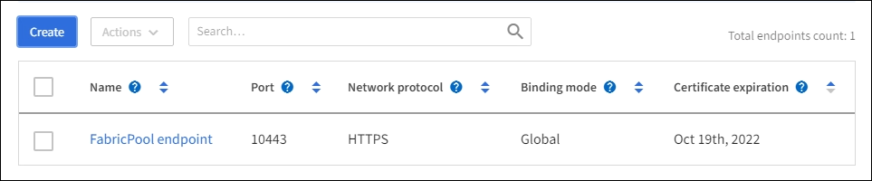
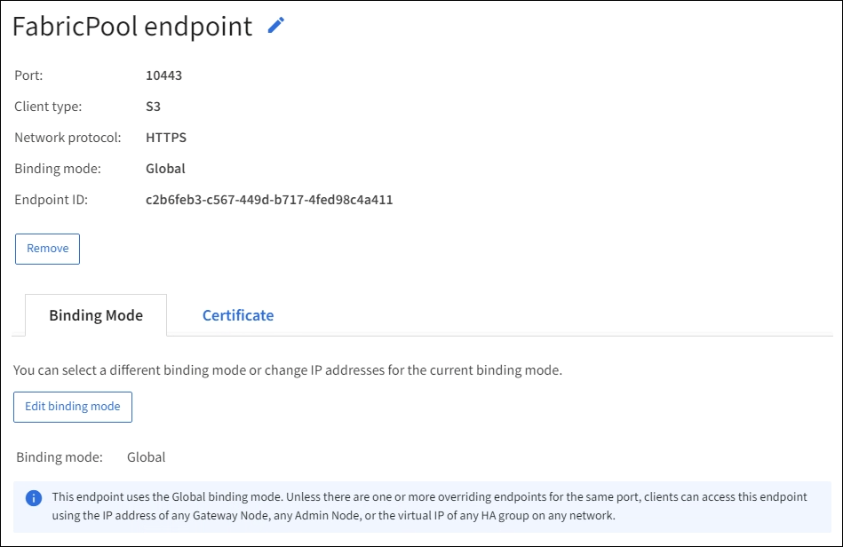

= 設定負載平衡器端點
:allow-uri-read: 
:icons: font
:imagesdir: ../media/

[role="lead"]
負載平衡器端點決定連接StorageGRID 至閘道和管理節點上的S3和Swift用戶端可使用的連接埠和網路傳輸協定。

.您需要的是 #8217 ；需要的是什麼
* 您將使用登入Grid Manager xref:../admin/web-browser-requirements.adoc[支援的網頁瀏覽器]。
* 您擁有root存取權限。
* 如果您先前已重新對應要用於負載平衡器端點的連接埠、您就擁有了 xref:../maintain/removing-port-remaps.adoc[已移除連接埠重新對應]。
* 您已建立任何打算使用的高可用度（HA）群組。建議使用HA群組、但不需要。請參閱 xref:managing-high-availability-groups.adoc[管理高可用度群組]。
* 如果將使用負載平衡器端點 xref:../admin/manage-s3-select-for-tenant-accounts.adoc[S3租戶選擇]、不得使用任何裸機節點的IP位址或FQDN。S3 Select所使用的負載平衡器端點只能使用SG100或SG1000應用裝置和VMware軟體節點。
* 您已設定任何打算使用的VLAN介面。請參閱 xref:configure-vlan-interfaces.adoc[設定VLAN介面]。
* 如果您要建立HTTPS端點（建議）、您就有伺服器憑證的資訊。
+

NOTE: 對端點憑證所做的變更、可能需要15分鐘才能套用至所有節點。

+
** 若要上傳憑證、您需要伺服器憑證、憑證私密金鑰、以及選擇性的CA套裝組合。
** 若要產生憑證、您需要S3或Swift用戶端用來存取端點的所有網域名稱和IP位址。您也必須知道主旨（辨別名稱）。
** 如果您想要使用StorageGRID Sfor S3和Swift API認證（也可用於直接連線至儲存節點）、則您已使用由外部憑證授權單位簽署的自訂認證來取代預設認證。請參閱xref:../admin/configuring-custom-server-certificate-for-storage-node-or-clb.adoc[設定S3和Swift API憑證]。
+
憑證可以使用萬用字元來代表執行負載平衡器服務之所有管理節點和閘道節點的完整網域名稱。例如、「*.storagegrid._example_.com」使用*萬用字元來表示「adm1.storagegrid._example_.com」和「gn1.storagegrid._example_.com」。請參閱 xref:configuring-s3-api-endpoint-domain-names.adoc[設定S3 API端點網域名稱]。

== 建立負載平衡器端點

每個負載平衡器端點都會指定連接埠、用戶端類型（S3或Swift）和網路傳輸協定（HTTP或HTTPS）。

=== 存取精靈

. 選擇*組態*>*網路*>*負載平衡器端點*。
. 選擇* Create *（建立*）。

=== 輸入端點詳細資料

. 輸入端點的詳細資料。
+
image::../media/load_balancer_endpoint_create_http.png[建立磅端點]

+
[cols="1a,3a"]
|===
| 欄位 | 說明 

 a| 
名稱
 a| 
端點的描述性名稱、會出現在「負載平衡器端點」頁面的表格中。

 a| 
連接埠
 a| 
連接埠用戶端將用來連線至管理節點和閘道節點上的負載平衡器服務。

接受建議的連接埠號碼、或輸入其他網格服務未使用的任何外部連接埠。輸入介於1和65535.之間的值。

如果輸入* 80*或* 443*、則端點只會在閘道節點上設定。這些連接埠保留在管理節點上。

請參閱 xref:../network/index.adoc[網路準則] 以取得外部連接埠的相關資訊。

 a| 
用戶端類型
 a| 
將使用此端點的用戶端應用程式類型：* S3 *或* Swift *。

 a| 
網路傳輸協定
 a| 
用戶端連線至此端點時所使用的網路傳輸協定。

** 選擇* HTTPS *進行安全的TLS加密通訊（建議）。您必須先附加安全性憑證、才能儲存端點。
** 選擇「* HTTP *」以獲得較不安全且未加密的通訊。僅將HTTP用於非正式作業網格。

|===
. 選擇*繼續*。

=== 選取繫結模式

. 選取端點的繫結模式、以控制端點的存取方式。
+
[cols="1a,3a"]
|===
| 選項 | 說明 

 a| 
全域（預設）
 a| 
用戶端可以使用完整網域名稱（FQDN）、任何閘道節點或管理節點的IP位址、或任何網路上任何HA群組的虛擬IP位址來存取端點。

除非您需要限制此端點的存取能力、否則請使用* Global *設定（預設）。

 a| 
節點介面
 a| 
用戶端必須使用所選節點和網路介面的IP位址來存取此端點。

 a| 
HA群組的虛擬IP
 a| 
用戶端必須使用HA群組的虛擬IP位址來存取此端點。

只要您為端點選取的HA群組不重疊、具有此繫結模式的端點都可以使用相同的連接埠號碼。

只要您為端點選取的介面不重疊、使用此模式的端點都可以使用相同的連接埠號碼。

|===
+

NOTE: 如果您對多個端點使用相同的連接埠、則使用* HA群組的虛擬IP *模式的端點會使用*節點介面*模式覆寫端點、此模式會使用*全域*模式覆寫端點。

. 如果您選取*節點介面*、請針對您要與此端點建立關聯的每個管理節點或閘道節點、選取一或多個節點介面。
+
image::../media/load_balancer_endpoint_node_interfaces_binding_mode.png[端點節點介面繫結模式]

. 如果您選取* HA群組的虛擬IP *、請選取一或多個HA群組。
+
image::../media/load_balancer_endpoint_ha_group_vips_binding_mode.png[端點HA群組VIP繫結模式]

. 如果您要建立* HTTP *端點、則不需要附加憑證。選取*「Create」（建立）*以新增負載平衡器端點。然後前往 ,完成後。否則、請選取*繼續*以附加憑證。

=== 附加憑證

. 如果您要建立* HTTPS *端點、請選取要附加到端點的安全性憑證類型。
+
憑證可保護S3和Swift用戶端與管理節點或閘道節點上的負載平衡器服務之間的連線。

+
** *上傳認證*。如果您有要上傳的自訂憑證、請選取此選項。
** *產生憑證*。如果您有產生自訂憑證所需的值、請選取此選項。
** *使用StorageGRID SS3和Swift認證*。如果您想要使用全域S3和Swift API憑證、也可以直接用於儲存節點的連線、請選取此選項。
+
除非您已使用外部憑證授權單位簽署的自訂憑證來取代由網格CA簽署的預設S3和Swift API憑證、否則無法選取此選項。請參閱xref:../admin/configuring-custom-server-certificate-for-storage-node-or-clb.adoc[設定S3和Swift API憑證]。

. 如果您未使用StorageGRID Ss3和Swift認證、請上傳或產生認證。
+
[role="tabbed-block"]
====
.上傳憑證
--
.. 選擇*上傳憑證*。
.. 上傳所需的伺服器憑證檔案：
+
*** *伺服器憑證*：自訂伺服器憑證檔案（以PEM編碼）。
*** *憑證私密金鑰*：自訂伺服器憑證私密金鑰檔（`.key'）。
+

NOTE: EC私密金鑰必須大於或等於224位元。RSA私密金鑰必須大於或等於2048位元。

*** * CA套裝組合*：單一選用檔案、內含來自每個中繼發行憑證授權單位（CA）的憑證。檔案應包含以憑證鏈順序串聯的每個由PEE編碼的CA憑證檔案。

.. 展開*憑證詳細資料*、即可查看您上傳之每個憑證的中繼資料。如果您上傳了選用的CA套件、每個憑證都會顯示在其各自的索引標籤上。
+
*** 選取*下載憑證*以儲存憑證檔案、或選取*下載CA套件*以儲存憑證套件組合。
+
指定憑證檔案名稱和下載位置。儲存副檔名為「.pem」的檔案。

+
例如：「toragegrid憑證.pem」

*** 選擇*複製憑證PEP*或*複製CA套裝組合PEP*、即可複製憑證內容以貼到其他位置。

.. 選擇* Create *（建立*）。+已建立負載平衡器端點。自訂憑證用於S3和Swift用戶端與端點之間的所有後續新連線。

--
.產生憑證
--
.. 選擇*產生憑證*。
.. 指定憑證資訊：
+
*** *網域名稱*：要包含在憑證中的一或多個完整網域名稱。使用*作為萬用字元來代表多個網域名稱。
*** * IP*：一個或多個IP位址要納入憑證中。
*** *主體*：憑證擁有者的X．509主體或辨別名稱（DN）。
*** *有效天數*：憑證建立後到期的天數。

.. 選取*產生*。
.. 選取*憑證詳細資料*以查看所產生憑證的中繼資料。
+
*** 選取*下載憑證*以儲存憑證檔案。
+
指定憑證檔案名稱和下載位置。儲存副檔名為「.pem」的檔案。

+
例如：「toragegrid憑證.pem」

*** 選取*複製憑證PEP*以複製憑證內容以貼到其他位置。

.. 選擇* Create *（建立*）。
+
隨即建立負載平衡器端點。自訂憑證用於S3和Swift用戶端與此端點之間的所有後續新連線。

--
====

=== 完成後

. 如果您使用網域名稱系統（DNS）、請確定DNS包含一筆記錄、將StorageGRID 完整網域名稱與用戶端用來建立連線的每個IP位址建立關聯。
+
您在DNS記錄中輸入的IP位址取決於您是否使用HA負載平衡節點群組：

+
** 如果您已設定HA群組、用戶端會連線至該HA群組的虛擬IP位址。
** 如果您未使用HA群組、用戶端將StorageGRID 使用任何閘道節點或管理節點的IP位址連線至該伺服器。
+
您也必須確保DNS記錄會參考所有必要的端點網域名稱、包括任何萬用字元名稱。

. 提供S3和Swift用戶端連線至端點所需的資訊：
+
** 連接埠號碼
** 完整網域名稱或IP位址
** 任何必要的憑證詳細資料

== 檢視及編輯負載平衡器端點

您可以檢視現有負載平衡器端點的詳細資料、包括安全端點的憑證中繼資料。您也可以變更端點的名稱或繫結模式、並更新任何相關的憑證。

您無法變更服務類型（S3或Swift）、連接埠或傳輸協定（HTTP或HTTPS）。

* 若要檢視所有負載平衡器端點的基本資訊、請檢閱「負載平衡器端點」頁面上的表格。
+

* 若要檢視特定端點的所有詳細資料、包括憑證中繼資料、請在表格中選取端點的名稱。
+

* 若要編輯端點、請使用負載平衡器端點頁面上的*動作*功能表、或使用特定端點的詳細資料頁面。
+

IMPORTANT: 編輯端點之後、您可能需要等待15分鐘、才能將變更套用至所有節點。

+
[cols="1a, 2a,2a"]
|===
| 工作 | 「行動」功能表 | 詳細資料頁面 

 a| 
編輯端點名稱
 a| 
.. 選取端點的核取方塊。
.. 選取*「動作*」>*「編輯端點名稱*」。
.. 輸入新名稱。
.. 選擇*保存*。

 a| 
.. 選取端點名稱以顯示詳細資料。
.. 選取編輯圖示 image:../media/icon_edit_tm.png["編輯圖示"]。
.. 輸入新名稱。
.. 選擇*保存*。

 a| 
編輯端點繫結模式
 a| 
.. 選取端點的核取方塊。
.. 選取*「動作*」>*「編輯端點繫結模式*」。
.. 視需要更新連結模式。
.. 選取*儲存變更*。

 a| 
.. 選取端點名稱以顯示詳細資料。
.. 選擇*編輯綁定模式*。
.. 視需要更新連結模式。
.. 選取*儲存變更*。

 a| 
編輯端點憑證
 a| 
.. 選取端點的核取方塊。
.. 選取*「動作*」>*「編輯端點憑證*」。
.. 視需要上傳或產生新的自訂憑證、或開始使用全域S3和Swift憑證。
.. 選取*儲存變更*。

 a| 
.. 選取端點名稱以顯示詳細資料。
.. 選擇*認證*標籤。
.. 選取*編輯憑證*。
.. 視需要上傳或產生新的自訂憑證、或開始使用全域S3和Swift憑證。
.. 選取*儲存變更*。

|===

== 移除負載平衡器端點

您可以使用* Actions（動作）*功能表移除一或多個端點、也可以從詳細資料頁面移除單一端點。

IMPORTANT: 若要避免用戶端中斷、請先更新任何受影響的S3或Swift用戶端應用程式、再移除負載平衡器端點。使用指派給另一個負載平衡器端點的連接埠、更新每個用戶端以進行連線。請務必同時更新任何必要的憑證資訊。

* 若要移除一或多個端點：
+
.. 在「負載平衡器」頁面中、選取您要移除的每個端點核取方塊。
.. 選擇*「Actions」（動作）*>*「Remove*」（移除
.. 選擇*確定*。

* 若要從詳細資料頁面移除一個端點：
+
.. 從「負載平衡器」頁面。選取端點名稱。
.. 在詳細資料頁面上選取*移除*。
.. 選擇*確定*。

