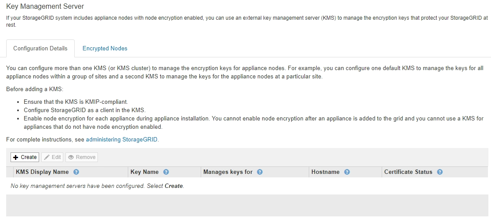
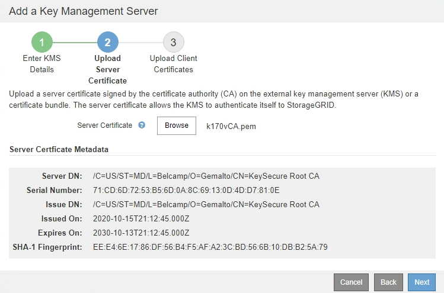

= 新增金鑰管理伺服器（KMS）
:allow-uri-read: 
:icons: font
:imagesdir: ../media/

[role="lead"]
您可以使用StorageGRID 「驗鑰管理伺服器」精靈來新增每個KMS或KMS叢集。

.您需要的產品
* 您已檢閱 xref:kms-considerations-and-requirements.adoc[使用金鑰管理伺服器的考量與要求]。
* 您有 xref:kms-configuring-storagegrid-as-client.adoc[設定StorageGRID 成KMS中的用戶端]，而且您擁有每個KMS或KMS叢集所需的資訊。
* 您將使用登入Grid Manager xref:../admin/web-browser-requirements.adoc[支援的網頁瀏覽器]。
* 您擁有root存取權限。

.關於這項工作
如有可能、請先設定任何站台專屬的金鑰管理伺服器、再設定適用於其他KMS未管理之所有站台的預設KMS。如果您先建立預設KMS、則網格中的所有節點加密應用裝置都會以預設KMS加密。如果您想要稍後建立站台專屬的KMS、必須先將目前版本的加密金鑰從預設的KMS複製到新的KMS。請參閱 xref:kms-considerations-for-changing-for-site.adoc[變更網站KMS的考量事項] 以取得詳細資料。

== 步驟1：輸入KMS詳細資料

在「新增金鑰管理伺服器」精靈的步驟1（輸入KMS詳細資料）中、您將提供有關KMS或KMS叢集的詳細資料。

.步驟
. 選擇*組態*>*安全性*>*金鑰管理伺服器*。
+
此時會出現「金鑰管理伺服器」頁面、並選取「組態詳細資料」索引標籤。

+

. 選擇* Create *（建立*）。
+
此時會出現「Add a Key Management Server（新增金鑰管理伺服器）」精靈的步驟1（輸入KMS詳細資料）。

+
image::../media/kms_step_1_enter_kms_details.png[KMS步驟1輸入KMS詳細資料]

. 針對您StorageGRID 在該KMS中設定的KMS和整套用戶端、輸入下列資訊。
+
[cols="1a,1a"]
|===
| 欄位 | 說明 

 a| 
公里顯示名稱
 a| 
可協助您識別此KMS的描述性名稱。必須介於1到64個字元之間。

 a| 
金鑰名稱
 a| 
KMS中適用於該客戶端的確切金鑰別名StorageGRID 。必須介於1到255個字元之間。

 a| 
管理的金鑰
 a| 
將與此KMS相關聯的網站。StorageGRID如有可能、您應該先設定任何站台專屬的金鑰管理伺服器、再設定適用於其他KMS未管理之所有站台的預設KMS。

** 如果此KMS將管理特定站台應用裝置節點的加密金鑰、請選取站台。
** 選取*不受其他KMS管理的站台（預設KMS）*來設定預設KMS、以套用至任何沒有專屬KMS的站台、以及您在後續擴充中新增的任何站台。
+
*附註：*如果您選取先前已由預設KMS加密的網站、但未將目前版本的原始加密金鑰提供給新的KMS、則儲存KMS組態時會發生驗證錯誤。

 a| 
連接埠
 a| 
KMS伺服器用於金鑰管理互通性傳輸協定（KMIP）通訊的連接埠。預設為5696、即KMIP標準連接埠。

 a| 
主機名稱
 a| 
KMS的完整網域名稱或IP位址。

*附註：*伺服器憑證的SAN欄位必須包含您在此輸入的FQDN或IP位址。否則StorageGRID 、無法將無法連接至KMS或KMS叢集中的所有伺服器。

|===
. 如果您使用KMS叢集、請選取加號 image:../media/icon_plus_sign_black_on_white_old.png["圖示加號"] 為叢集中的每個伺服器新增主機名稱。
. 選擇*下一步*。

== 步驟2：上傳伺服器憑證

在「新增金鑰管理伺服器」精靈的步驟2（上傳伺服器憑證）中、您會上傳KMS的伺服器憑證（或憑證套件組合）。伺服器憑證可讓外部KMS驗證自己StorageGRID 以供驗證。

.步驟
. 從*步驟2（上傳伺服器憑證）*瀏覽至儲存的伺服器憑證或憑證套裝組合位置。
+
image::../media/kms_step_2_upload_server_certificate.png[KMS步驟2上傳伺服器認證]

. 上傳憑證檔案。
+
隨即顯示伺服器憑證中繼資料。

+

+

NOTE: 如果您上傳了憑證套件組合、每個憑證的中繼資料都會顯示在其各自的索引標籤上。

. 選擇*下一步*。

== 步驟3：上傳用戶端憑證

在「新增金鑰管理伺服器」精靈的步驟3（上傳用戶端憑證）中、您會上傳用戶端憑證和用戶端憑證私密金鑰。用戶端憑證StorageGRID 可讓支援驗證本身到KMS。

.步驟
. 從*步驟3（上傳用戶端憑證）*瀏覽至用戶端憑證的位置。
+
image::../media/kms_step_3_upload_client_certificate.png[KMS步驟3上傳用戶端憑證]

. 上傳用戶端憑證檔案。
+
此時會出現用戶端憑證中繼資料。

. 瀏覽至用戶端憑證的私密金鑰位置。
. 上傳私密金鑰檔案。
+
此時會顯示用戶端憑證和用戶端憑證私密金鑰的中繼資料。

+
image::../media/kms_step_3_client_certificate_metadata.png[KMS步驟3用戶端憑證中繼資料]

. 選擇*保存*。
+
測試金鑰管理伺服器與應用裝置節點之間的連線。如果所有連線都有效、且KMS上找到正確的金鑰、新的金鑰管理伺服器就會新增至金鑰管理伺服器頁面的表格。

+

NOTE: 新增KMS之後、「金鑰管理伺服器」頁面上的憑證狀態會立即顯示為「未知」。可能需要StorageGRID 30分鐘才能取得每個憑證的實際狀態。您必須重新整理網頁瀏覽器、才能查看目前狀態。

. 如果在選擇*保存*時出現錯誤訊息、請檢閱訊息詳細資料、然後選擇*確定*。
+
例如、如果連線測試失敗、您可能會收到「無法處理的實體」錯誤。

. 如果您需要儲存目前的組態而不測試外部連線、請選取*強制儲存*。
+
image::../media/kms_force_save.png[KMS強制儲存]

+

IMPORTANT: 選取*強制儲存*會儲存KMS組態、但不會測試每個應用裝置與該KMS之間的外部連線。如果組態發生問題、您可能無法重新啟動受影響站台已啟用節點加密的應用裝置節點。在問題解決之前、您可能無法存取資料。

. 檢閱確認警告、如果您確定要強制儲存組態、請選取* OK *。
+
image::../media/kms_force_save_warning.png[KMS強制儲存警告]

+
系統會儲存KMS組態、但不會測試與KMS的連線。

