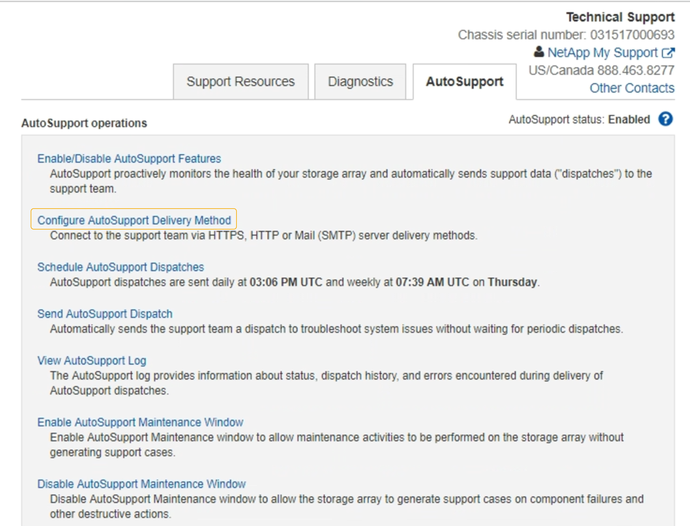

= 透過AutoSupport 支援功能發送E系列的訊息StorageGRID
:allow-uri-read: 
:icons: font
:imagesdir: ../media/

[role="lead"]
您可以SANtricity 透過「e系統管理節點」（AutoSupport 而非儲存應用裝置管理連接埠）、將E系列的《系統管理程式》（E-系列）功能資訊傳送給技術支援部門StorageGRID 。

.您需要的產品
* 您將使用登入Grid Manager xref:../admin/web-browser-requirements.adoc[支援的網頁瀏覽器]。
* 您擁有Storage Appliance管理員權限或根存取權限。

NOTE: 您必須擁有SANtricity 更新版本的韌體8.70（11.7）或更新版本、SANtricity 才能使用Grid Manager存取《系統管理程式》。

.關於這項工作
E系列AutoSupport 的資訊包含儲存硬體的詳細資料、比AutoSupport 其他由該系統傳送的資訊更具體StorageGRID 。

在SANtricity 不AutoSupport 使用應用裝置管理連接埠的情況StorageGRID 下、在「Ses供 系統管理程式」中設定一個特殊的Proxy伺服器位址、使其能透過「管理員節點」傳輸有關消息。以這種方式傳輸的資訊、會與Grid Manager中所設定的偏好的寄件者和管理Proxy設定相符。AutoSupport

若要在Grid Manager中設定管理Proxy伺服器、請參閱 xref:configuring-admin-proxy-settings.adoc[設定管理Proxy設定]。

NOTE: 此程序僅適用於設定StorageGRID 適用於E系列AutoSupport 的支援服務器。如需E系列AutoSupport 的進一步資訊、請參閱 https://["NetApp E系列與SANtricity VMware文檔"^]。

.步驟
. 在Grid Manager中、選取* nodes *。
. 從左側節點清單中、選取您要設定的儲存應用裝置節點。
. 選擇* SANtricity 《系統管理程式》*。
+
出現「系統管理程式」首頁。SANtricity

+
image::../media/autosupport_santricity_home_page.png[首頁AutoSupport SANtricity]

. 選擇*支援*>*支援中心*>* AutoSupport 支援*。
+
畫面上會出現「介紹操作」頁面。AutoSupport

+

. 選擇*設定AutoSupport 「供應方法」*。
+
此時會出現「設定AutoSupport 供應方法」頁面。

+
image::../media/autosupport_configure_delivery_santricity.png[執行不需執行的功能AutoSupport AutoSupport SANtricity]

. 選擇* HTTPS *作為交付方法。
+

NOTE: 啟用HTTPS傳輸協定的憑證已預先安裝。

. 選擇*透過Proxy伺服器*。
. 輸入"tunnunne-host"作爲*主機地址*。
+
「通道主機」是使用管理節點傳送E系列AutoSupport 資訊的特殊位址。

. 輸入「10225」作為*連接埠號碼*。
+
「10225」是StorageGRID 指從AutoSupport 應用裝置的E系列控制器接收到的功能性資訊、而該伺服器上的連接埠號碼。

. 選擇*測試組態*來測試AutoSupport 您的Proxy伺服器的路由和組態。
+
如果正確、則會出現綠色橫幅訊息：「Your AutoSupport 菜單組態已通過驗證。」

+
如果測試失敗、則會在紅色橫幅中顯示錯誤訊息。請檢查StorageGRID 您的支援DNS設定和網路、確定偏好的傳送者管理節點可以連線至NetApp支援網站、然後再試一次測試。

. 選擇*保存*。
+
系統會儲存組態、並顯示確認訊息：「已AutoSupport 設定『發送方法』。」

