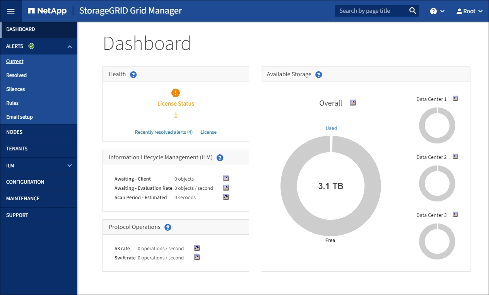

= 登入Grid Manager
:allow-uri-read: 
:icons: font
:imagesdir: ../media/

[role="lead"]
您可以在支援的網頁瀏覽器的位址列中輸入管理節點的完整網域名稱（FQDN）或IP位址、以存取Grid Manager登入頁面。

.您需要的產品
* 您擁有登入認證資料。
* 您有Grid Manager的URL。
* 您使用的是 xref:../admin/web-browser-requirements.adoc[支援的網頁瀏覽器]。
* Cookie會在您的網頁瀏覽器中啟用。
* 您擁有特定的存取權限。

.關於這項工作
每StorageGRID 個系統包含一個主要管理節點和任意數量的非主要管理節點。您可以登入任何管理節點上的Grid Manager來管理StorageGRID 此系統。不過、管理節點並不完全相同：

* 在一個管理節點上發出的警示認可（舊系統）不會複製到其他管理節點。因此、針對警示所顯示的資訊在每個管理節點上可能看起來不一樣。
* 部分維護程序只能從主要管理節點執行。

如果管理節點包含在高可用度（HA）群組中、您可以使用HA群組的虛擬IP位址或對應至虛擬IP位址的完整網域名稱來連線。主要管理節點應選取為群組的主要介面、以便在存取Grid Manager時、在主要管理節點上存取、除非主要管理節點無法使用。

.步驟
. 啟動支援的網頁瀏覽器。
. 在瀏覽器的網址列中、輸入Grid Manager的URL：
+
https://_FQDN_or_Admin_Node_IP_/`

+
其中，「_FQDN」或「管理節點」是完整網域名稱或管理節點的IP位址，或是管理節點HA群組的虛擬IP位址。

+
如果您必須在HTTPS（443）的標準連接埠以外的連接埠上存取Grid Manager、請輸入下列內容、其中「_FQDN」或「ADD_節點_IP」是完整網域名稱或IP位址、而連接埠是連接埠號碼：

+
https://_FQDN_or_Admin_Node_IP:port_/`

. 如果系統提示您輸入安全性警示、請使用瀏覽器的安裝精靈來安裝憑證（請參閱 xref:using-storagegrid-security-certificates.adoc[關於安全性憑證]）。
. 登入Grid Manager：
+
** 如果StorageGRID 您的作業系統未使用單一登入（SSO）：
+
... 輸入Grid Manager的使用者名稱和密碼。
... 選擇*登入*。
+
image::../media/sign_in_grid_manager_no_sso.gif[登入頁面]

** 如果StorageGRID 您的系統啟用SSO、而且這是您第一次存取此瀏覽器上的URL：
+
... 選擇*登入*。您可以將「帳戶ID」欄位保留空白。
+
image::../media/sso_sign_in_first_time.gif[如果啟用SSO且沒有Cookie、請登入畫面]

... 在組織的SSO登入頁面上輸入標準SSO認證。例如：
+
image::../media/sso_organization_page.gif[SSO的組織登入頁面範例]

** 如果StorageGRID 您的不支援系統已啟用SSO、且您先前曾存取Grid Manager或租戶帳戶：
+
... 執行下列任一項：
+
**** 輸入* 0*（Grid Manager的帳戶ID）、然後選取*登入*。
**** 如果* Grid Manager*出現在最近的帳戶清單中、請選取*登入*。
+
image::../media/sign_in_grid_manager_sso.gif[如果已啟用SSO、請從最近的帳戶清單中選取Grid Manager]

... 在組織的SSO登入頁面上、以標準SSO認證登入。當您登入時、會顯示Grid Manager的首頁、其中包括儀表板。若要瞭解提供的資訊、請參閱 xref:../monitor/viewing-dashboard.adoc[檢視儀表板]。

+

. 若要登入其他管理節點：
+
[cols="1a,2a"]
|===
| 選項 | 步驟 

 a| 
未啟用SSO
 a| 
.. 在瀏覽器的位址列中、輸入其他管理節點的完整網域名稱或IP位址。視需要附上連接埠號碼。
.. 輸入Grid Manager的使用者名稱和密碼。
.. 選擇*登入*。

 a| 
SSO已啟用
 a| 
在瀏覽器的位址列中、輸入其他管理節點的完整網域名稱或IP位址。

如果您已登入一個管理節點、則無需再次登入、即可存取其他管理節點。不過、如果SSO工作階段過期、系統會再次提示您輸入認證資料。

*附註：* SSO無法在受限網格管理器連接埠上使用。如果您想要使用者透過單一登入進行驗證、則必須使用預設的HTTPS連接埠（443）。

|===

.相關資訊
* xref:controlling-access-through-firewalls.adoc[透過防火牆控制存取]
* xref:configuring-sso.adoc[設定單一登入]
* xref:managing-admin-groups.adoc[管理管理群組]
* xref:managing-high-availability-groups.adoc[管理高可用度群組]
* xref:../tenant/index.adoc[使用租戶帳戶]
* xref:../monitor/index.adoc[監控及疑難排解]

