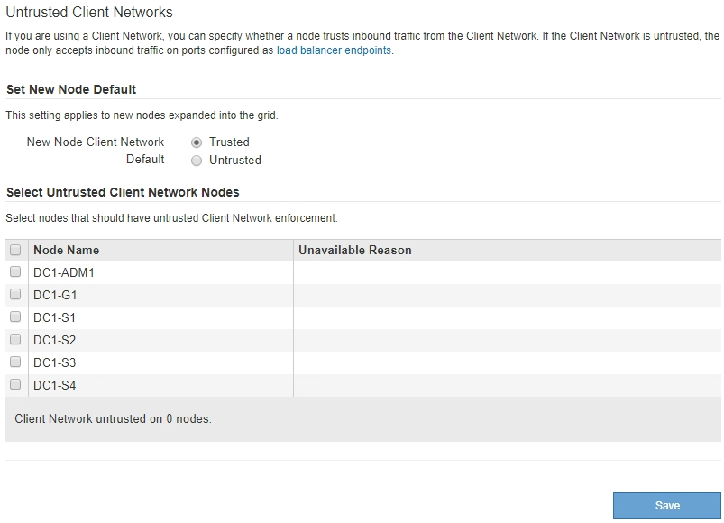

= 指定節點的用戶端網路不受信任
:allow-uri-read: 
:icons: font
:imagesdir: ../media/

[role="lead"]
如果您使用的是用戶端網路、則可以指定每個節點的用戶端網路是否受信任或不受信任。您也可以為新增至擴充中的新節點指定預設設定。

.您需要的產品
* 您將使用登入Grid Manager xref:../admin/web-browser-requirements.adoc[支援的網頁瀏覽器]。
* 您擁有root存取權限。
* 如果您希望管理節點或閘道節點僅接受明確設定的端點上的傳入流量、則表示您已定義負載平衡器端點。
+

NOTE: 如果尚未設定負載平衡器端點、現有的用戶端連線可能會失敗。

.步驟
. 選擇*組態*>*安全性*>*不受信任的用戶端網路*。
+
「不受信任的用戶端網路」頁面會列出StorageGRID 您的整個作業系統中的所有節點。如果節點上的用戶端網路必須信任、則「不可用原因」欄會包含一個項目。

+

. 在「*設定新節點預設*」區段中、指定在擴充程序中將新節點新增至網格時、應採用的預設設定。
+
** *信任*：在擴充中新增節點時、其用戶端網路是受信任的。
** *不受信任*：在擴充中新增節點時、其用戶端網路不受信任。您可以視需要返回此頁面、變更特定新節點的設定。

+

NOTE: 此設定不會影響StorageGRID 到您的不完善系統中現有的節點。

. 在「*選取不受信任的用戶端網路節點*」區段中、選取只允許用戶端連線到明確設定的負載平衡器端點的節點。
+
您可以選取或取消選取標題中的核取方塊、以選取或取消選取所有節點。

. 選擇*保存*。
+
新的防火牆規則會立即新增並強制執行。如果尚未設定負載平衡器端點、現有的用戶端連線可能會失敗。

