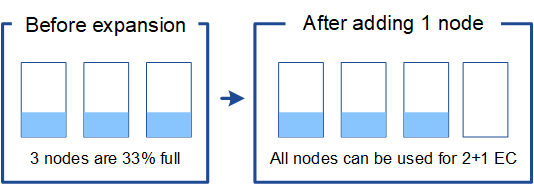

= 新增銷毀編碼物件的儲存容量
:allow-uri-read: 
:icons: font
:imagesdir: ../media/

[role="lead"]
如果您的ILM原則包含製作銷毀編碼複本的規則、您必須規劃新增儲存設備的位置、以及新增儲存設備的時間。您新增的儲存容量和新增的時間、可能會影響網格的可用儲存容量。

規劃儲存擴充的第一步是檢查ILM原則中建立銷毀編碼物件的規則。由於此功能可為每個銷毀編碼物件建立_k+m_片段、並將每個片段儲存在不同的儲存節點上、因此您必須確保擴充後至少有_k+m_儲存節點空間可容納新的銷毀編碼資料。StorageGRID如果銷毀編碼設定檔提供站台遺失保護、您必須將儲存設備新增至每個站台。請參閱 xref:../ilm/index.adoc[使用ILM管理物件]。

您需要新增的節點數量也取決於執行擴充時現有節點的完整程度。

== 新增銷毀編碼物件儲存容量的一般建議

如果您想要避免詳細計算、當現有儲存節點的容量達到70%時、您可以在每個站台新增兩個儲存節點。

這項一般建議針對單一站台網格和磁碟區編碼提供站台遺失保護的網格、提供廣泛的銷毀編碼方案合理的結果。

若要更深入瞭解導致此建議的因素、或是為您的站台擬定更精確的計畫、請檢閱下一節。如需針對您的情況最佳化的自訂建議、請聯絡您的NetApp客戶代表。

== 計算要新增用於銷毀編碼物件的擴充儲存節點數量

若要最佳化擴充儲存銷毀編碼物件的部署方式、您必須考量許多因素：

* 使用中的銷毀編碼方案
* 用於銷毀編碼的儲存資源池特性、包括每個站台的節點數量、以及每個節點的可用空間量
* 是否先前擴充過網格（因為每個儲存節點的可用空間量可能與所有節點的空間量不完全相同）
* ILM原則的確切性質、例如ILM規則是否同時建立複寫和銷毀編碼的物件

下列範例可協助您瞭解銷毀編碼方案的影響、儲存資源池中的節點數、以及每個節點上的可用空間量。

類似的考量也會影響ILM原則的計算、該原則會同時儲存複寫和銷毀編碼的資料、以及先前擴充的網格計算。

IMPORTANT: 本節的範例代表將儲存容量新增至StorageGRID 某個系統的最佳實務做法。如果您無法新增建議的節點數、可能需要執行EC重新平衡程序、以允許儲存其他以銷毀編碼的物件。請參閱 xref:considerations-for-rebalancing-erasure-coded-data.adoc[重新平衡銷毀編碼資料]。

== 範例1：展開使用2+1銷毀編碼的單一站台網格

本範例說明如何擴充僅包含三個儲存節點的簡單網格。

NOTE: 本範例僅使用三個儲存節點、以簡化作業。不過、不建議只使用三個儲存節點：實際的正式作業網格應使用最少_k+m_+ 1個儲存節點來進行備援、這等於本例中的四個儲存節點（2+1+1）。

假設下列項目：

* 所有資料均使用2+1銷毀編碼方案儲存。使用2+1銷毀編碼方案時、每個物件都會儲存為三個片段、每個片段都會儲存在不同的儲存節點上。
* 您有一個站台有三個儲存節點。每個儲存節點的總容量為100 TB。
* 您想要透過新增100 TB儲存節點來擴充。
* 您最終想要在新舊節點之間平衡以銷毀編碼的資料。

您可以根據執行擴充時儲存節點的完整容量、選擇多種選項。

* *當現有節點100%滿*時、請新增三個100 TB儲存節點
+
在此範例中、現有節點已滿100%。由於沒有可用容量、您必須立即新增三個節點、才能繼續進行2+1銷毀編碼。

+
擴充完成後、當物件以銷毀編碼時、所有片段都會放置在新節點上。

+
image::../media/used_space_after_3_node_expansion.png[3節點擴充之後的已用空間]

+

NOTE: 此擴充功能可新增_k+m_節點。建議新增四個節點以提供備援。如果現有節點100%滿時只新增_k+m_擴充儲存節點、則所有新物件都會儲存在擴充節點上。如果有任何新節點無法使用、即使暫時無法使用StorageGRID 、也無法滿足ILM需求。

* *當現有的儲存節點已滿67%時、請新增兩個100 TB儲存節點*
+
在此範例中、現有節點已滿67%。由於現有節點上有100 TB的可用容量（每個節點33 TB）、因此如果您現在執行擴充、只需要新增兩個節點即可。

+
新增200 TB的額外容量、可讓您繼續進行2+1銷毀編碼、並最終平衡所有節點之間的銷毀編碼資料。

+
image::../media/node_expansion_example_67_percent.png[節點擴充範例1、67%]

* *當現有的儲存節點已滿33%時、請新增一個100 TB儲存節點*
+
在此範例中、現有節點已滿33%。由於現有節點上有200 TB的可用容量（每個節點67 TB）、因此如果您現在執行擴充、只需要新增一個節點即可。

+
增加100 TB的額外容量、可讓您繼續進行2+1銷毀編碼、並最終平衡所有節點之間的銷毀編碼資料。

+

== 範例2：展開使用6+3銷毀編碼的三站台網格

此範例說明如何針對多站台網格、針對具有大量片段的銷毀編碼方案、開發擴充計畫。儘管這些範例之間存在差異、但建議的擴充計畫仍非常相似。

假設下列項目：

* 所有資料均使用6+3銷毀編碼方案儲存。使用6+3銷毀編碼方案時、每個物件都會儲存為9個片段、每個片段都會儲存至不同的儲存節點。
* 您有三個站台、每個站台有四個儲存節點（總共12個節點）。每個節點的總容量為100 TB。
* 您想要透過新增100 TB儲存節點來擴充。
* 您最終想要在新舊節點之間平衡以銷毀編碼的資料。

您可以根據執行擴充時儲存節點的完整容量、選擇多種選項。

* *新增九個100 TB儲存節點（每個站台三個）、當現有節點100%滿*時
+
在此範例中、12個現有節點已滿100%。由於沒有可用容量、您必須立即新增九個節點（額外容量900 TB）、才能繼續進行6+3銷毀編碼。

+
擴充完成後、當物件以銷毀編碼時、所有片段都會放置在新節點上。

+

NOTE: 此擴充功能可新增_k+m_節點。建議新增12個節點（每個站台四個）以提供備援。如果現有節點100%滿時只新增_k+m_擴充儲存節點、則所有新物件都會儲存在擴充節點上。如果有任何新節點無法使用、即使暫時無法使用StorageGRID 、也無法滿足ILM需求。

* *新增六個100 TB儲存節點（每個站台兩個）、當現有節點已滿75%時*
+
在此範例中、12個現有節點已滿75%。由於有300 TB的可用容量（每個節點25 TB）、因此如果您現在執行擴充、只需要新增六個節點。您可以在這三個站台中分別新增兩個節點。

+
新增600 TB的儲存容量、可讓您繼續進行6+3的銷毀編碼、並最終平衡所有節點之間的銷毀編碼資料。

* *當現有節點已滿50%時、請新增三個100 TB儲存節點（每個站台一個）*
+
在此範例中、12個現有節點已滿50%。由於有600 TB的可用容量（每個節點50 TB）、因此如果您現在執行擴充、只需要新增三個節點。您可以在這三個站台中分別新增一個節點。

+
新增300 TB的儲存容量、可讓您繼續進行6+3銷毀編碼、並最終平衡所有節點之間的銷毀編碼資料。

