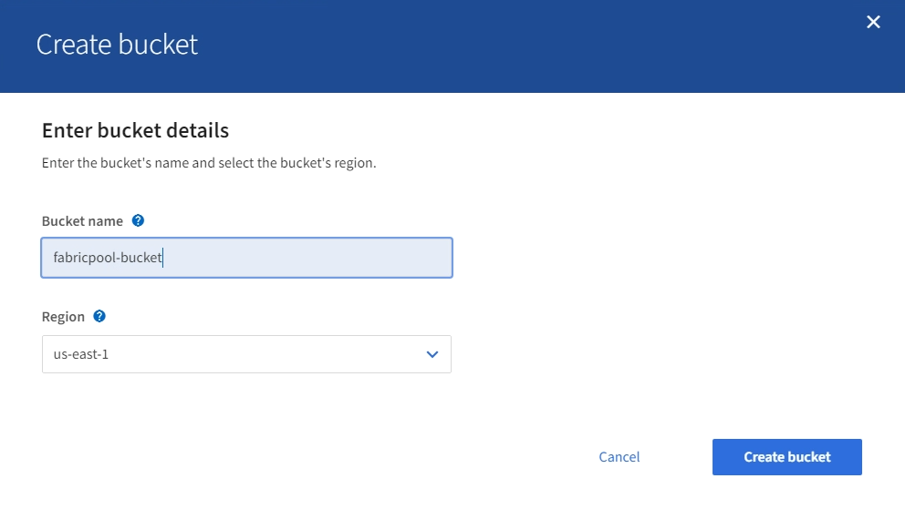

= 建立S3儲存區並取得存取金鑰
:allow-uri-read: 
:icons: font
:imagesdir: ../media/

[role="lead"]
在將StorageGRID 支援FabricPool 功能與功能性工作負載一起使用之前、您必須先建立S3儲存庫來儲存FabricPool 您的功能性資料。您也需要取得將用於FabricPool 執行此功能的租戶帳戶的存取金鑰和秘密存取金鑰。

.您需要的產品
* 您已建立一個可供FabricPool 使用的租戶帳戶。

.關於這項工作
這些說明說明如何使用StorageGRID 「NetApp客戶管理程式」來建立儲存庫並取得存取金鑰。您也可以使用租戶管理API或StorageGRID S3 REST API來執行這些工作。或者、如果您使用ONTAP 的是「資訊區9.10」、您可以改用FabricPool 「資訊區設定精靈」來建立儲存區。

若要深入瞭解：

* xref:../tenant/index.adoc[使用租戶帳戶]
* xref:../s3/index.adoc[使用S3]

.步驟
. 登入租戶管理程式。
+
您可以執行下列其中一項：

+
** 在Grid Manager的「租戶帳戶」頁面中、選取租戶的*登入*連結、然後輸入您的認證資料。
** 在網頁瀏覽器中輸入租戶帳戶的URL、然後輸入您的認證資料。

. 建立S3儲存庫以供FabricPool 資料使用。
+
您必須為ONTAP 計畫使用的每個叢集建立獨特的儲存庫。

+
.. 選擇*儲存設備（S3）*>*桶*。
.. 選取*建立桶*。
.. 輸入StorageGRID 您將搭配FabricPool 使用的這個景點名稱。例如、「fabricpool桶」。
+

IMPORTANT: 建立貯體後、您無法變更貯體名稱。

+
庫位名稱必須符合下列規則：

+
*** 必須在各個StorageGRID 方面都是獨一無二的（不只是租戶帳戶內的獨特功能）。
*** 必須符合DNS規範。
*** 必須包含至少3個字元、且不得超過63個字元。
*** 可以是一或多個標籤的系列、相鄰的標籤以句點分隔。每個標籤都必須以英文字母或數字開頭和結尾、而且只能使用英文字母、數字和連字號。
*** 不得看起來像是文字格式的IP位址。
*** 不應在虛擬託管樣式要求中使用期間。期間會導致伺服器萬用字元憑證驗證發生問題。

.. 選取此儲存區的區域。
+
根據預設、所有的貯體都會建立在「us-east-1」區域。

+

.. 選取*建立桶*。

+

NOTE: 對於這個領域、建議的儲存貯體一致性層級為「全新寫入後的準則」FabricPool 。 不建議使用「可用」一致性層級。請參閱 xref:../tenant/changing-consistency-level.adoc[變更一致性層級]。

. 建立存取金鑰和秘密存取金鑰。
+
.. 選擇*儲存設備（S3）*>*我的存取金鑰*。
.. 選取*建立金鑰*。
.. 選取*建立存取金鑰*。
.. 將存取金鑰ID和秘密存取金鑰複製到安全位置、或選取*下載.csv*以儲存內含存取金鑰ID和秘密存取金鑰的試算表檔案。
+
當您將「靜態」設定為「雲端層」時、將會在ONTAP 「靜態」中輸入這些值StorageGRID 。FabricPool

+

IMPORTANT: 如果您在未來建立新的存取金鑰和秘密存取金鑰、請記得ONTAP 立即更新下列項目的對應值：功能變數ONTAP 、以確保能夠在StorageGRID 不中斷的情況下、將資料儲存及擷取到不中斷的情況下進行。

