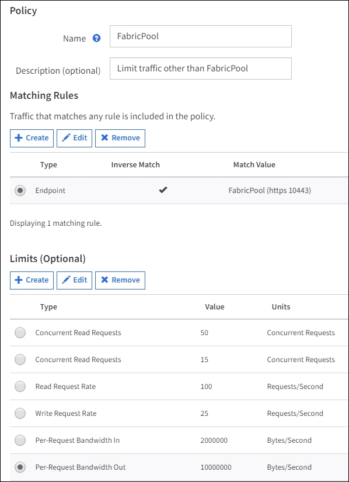
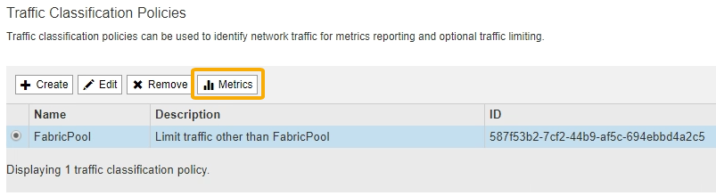

= 建立FabricPool 一套適用於此功能的流量分類原則
:allow-uri-read: 
:icons: font
:imagesdir: ../media/

[role="lead"]
您可以選擇性地設計StorageGRID 一套「動態流量分類」原則、以最佳化FabricPool 針對該工作負載的服務品質。

.您需要的產品
* 您將使用登入Grid Manager xref:../admin/web-browser-requirements.adoc[支援的網頁瀏覽器]。
* 您擁有「根存取」權限。

.關於這項工作
建立FabricPool 適用於功能的流量分類原則的最佳實務做法取決於工作負載、如下所示：

* 如果您計畫將FabricPool 主要的工作負載資料分層StorageGRID 至元數據、則應確保FabricPool 該工作負載擁有大部分頻寬。您可以建立流量分類原則、以限制所有其他工作負載。
+

NOTE: 一般FabricPool 而言、將不區分寫入作業的優先順序、改為執行不必要的讀取作業。

+
例如、如果其他S3用戶端使用StorageGRID 此功能、您應該建立流量分類原則。您可以限制其他儲存區、租戶、IP子網路或負載平衡器端點的網路流量。

* 一般而FabricPool 言、您不應將服務品質限制強加給任何的功能、只能限制其他工作負載。
* 對其他工作負載的限制、應考慮到這些工作負載的行為。所規定的限制也會因網格的規模和功能、以及預期的使用量而有所不同。

若要深入瞭解： xref:../admin/managing-traffic-classification-policies.adoc[管理流量分類原則]

.步驟
. 選擇*組態*>*網路*>*流量分類*。
. 輸入名稱和說明。
. 在「符合規則」區段中、建立至少一個規則。
+
.. 選擇* Create *（建立*）。
.. 選取*端點*、然後選取您為FabricPool 之建立的負載平衡器端點。
+
您也可以選取FabricPool 「綁定帳戶」或「桶」。

.. 如果您希望此流量原則限制其他端點的流量、請選取*反轉比對*。

. 或者、建立一或多個限制。
+

NOTE: 即使流量分類原則未設定任何限制、也會收集指標、讓您瞭解流量趨勢。

+
.. 選擇* Create *（建立*）。
.. 選取您要限制的流量類型和要套用的限制。
+
本範例FabricPool 介紹可限制的網路流量類型、以及可選擇的值類型。實際原則的限制取決於您的特定需求。

+

. 建立流量分類原則之後、選取原則、然後選取* Metrics *、以判斷原則是否依預期限制流量。
+

