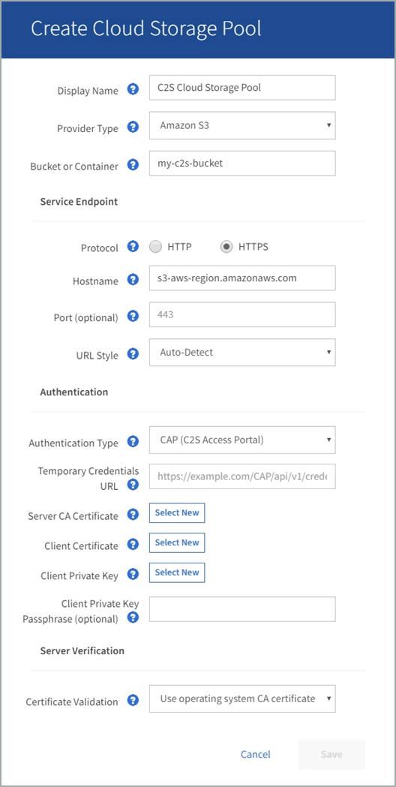

= C2S S3：指定雲端儲存資源池的驗證詳細資料
:allow-uri-read: 
:icons: font
:imagesdir: ../media/

[role="lead"]
若要將商業雲端服務（C2S）S3服務當作雲端儲存資源池使用、您必須將C2S存取入口網站（CAP）設定為驗證類型、StorageGRID 以便讓Sf2可以要求暫用認證、以便在您的C2S帳戶中存取S3資源桶。

.您需要的是 #8217 ；需要的是什麼
* 您已輸入Amazon S3 Cloud Storage Pool的基本資訊、包括服務端點。
* 您知道StorageGRID 完整的URL、將使用此URL從CAP伺服器取得暫用認證、包括指派給您的C2S帳戶的所有必要和選用API參數。
* 您擁有由適當的政府憑證授權單位（CA）核發的伺服器CA憑證。此憑證可用來驗證CAP伺服器的身分。StorageGRID伺服器CA憑證必須使用PEE編碼。
* 您擁有由適當的政府憑證授權單位（CA）核發的用戶端憑證。此憑證可用於將自己的身分識別至CAP伺服器。StorageGRID用戶端憑證必須使用PEE編碼、而且必須已獲得存取您的C2S帳戶的權限。
* 您有一個用於用戶端憑證的PEM/encoded私密金鑰。
* 如果用戶端憑證的私密金鑰已加密、您就會有解密密碼。

.步驟
. 在「*驗證*」區段中、從「*驗證類型*」下拉式清單中選取「* CAP（C2S存取入口網站）*」。
+
此時會顯示CAP CGS驗證欄位。

+

. 提供下列資訊：
+
.. 對於*暫用認證URL*、請輸入StorageGRID 完整的URL、以便讓整個URL能夠從CAP伺服器取得暫用認證、包括指派給您的C2S帳戶的所有必要和選用API參數。
.. 若為*伺服器CA憑證*、請選取*選取「新增*」、然後上傳StorageGRID 可供驗證CAP伺服器的PEP-編碼CA憑證。
.. 若為*用戶端憑證*、請選取*選取「新增* StorageGRID 」、然後上傳PEP-編碼的憑證、以供其識別至CAP伺服器。
.. 若為*用戶端私密金鑰*、請選取*選取「新增」*、然後上傳用戶端憑證的PEP-編碼私密金鑰。
+
如果私密金鑰已加密、則必須使用傳統格式。（不支援PKCS #8加密格式。）

.. 如果用戶端私密金鑰已加密、請輸入密碼來解密用戶端私密金鑰。否則、請將*用戶端私密金鑰密碼*欄位保留空白。

. 在「伺服器驗證」區段中、提供下列資訊：
+
.. 若為*憑證驗證*、請選取*使用自訂CA憑證*。
.. 選取*選取「New*（新增）」、然後上傳PEM/encoded CA憑證。

. 選擇*保存*。

當您儲存雲端儲存資源池時StorageGRID 、下列功能將會隨之執行：

* 驗證儲存區和服務端點是否存在、以及是否可以使用您指定的認證來達到。
* 將標記檔案寫入儲存區、以將儲存區識別為雲端儲存資源池。請勿移除名為「x-ntap-sgws-Cloud Pool - uuid」的檔案。

如果Cloud Storage Pool驗證失敗、您會收到錯誤訊息、說明驗證失敗的原因。例如、如果發生憑證錯誤或您指定的儲存區不存在、可能會報告錯誤。

image::../media/cloud_storage_pool_create_error.gif[雲端儲存資源池建立錯誤]

請參閱的說明 xref:troubleshooting-cloud-storage-pools.adoc[疑難排解雲端儲存資源池]、解決此問題、然後再次嘗試儲存雲端儲存資源池。
