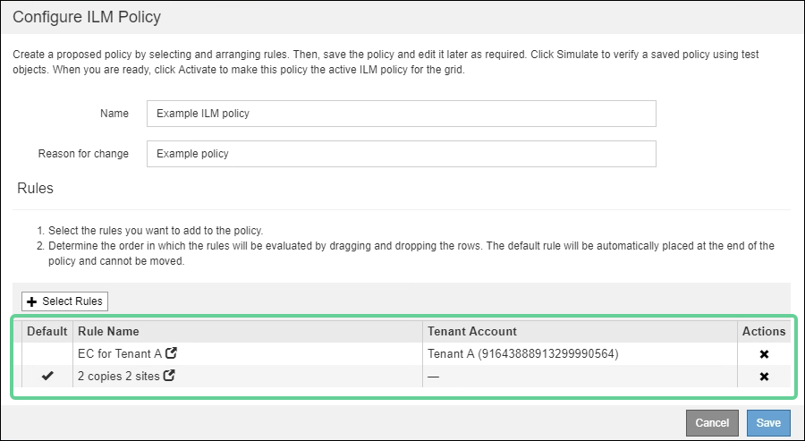

= 建立預設ILM規則
:allow-uri-read: 
:icons: font
:imagesdir: ../media/

[role="lead"]
在建立ILM原則之前、您必須建立預設規則、將任何不符合其他規則的物件放入原則中。預設規則無法使用任何篩選器。它必須套用至所有租戶、所有貯體及所有物件版本。

.您需要的是 #8217 ；需要的是什麼
* 您將使用登入Grid Manager xref:../admin/web-browser-requirements.adoc[支援的網頁瀏覽器]。
* 您擁有特定的存取權限。

預設規則是ILM原則中最後評估的規則、因此無法使用任何篩選器或非目前參考時間。預設規則的放置指示會套用至原則中其他規則不相符的任何物件。

在此範例原則中、第一個規則僅適用於屬於租戶A的物件最後一個預設規則會套用至屬於所有其他租戶帳戶的物件。

建立預設規則時、請謹記下列需求：

* 預設規則會自動放入原則的最後一個規則。
* 預設規則無法使用任何基本或進階篩選器。
* 預設規則必須套用至所有物件版本、因此無法使用非目前時間參考時間。
* 預設規則應建立複寫複本。
+

IMPORTANT: 請勿使用建立銷毀編碼複本的規則作為原則的預設規則。銷毀編碼規則應使用進階篩選器、以防止較小的物件遭到銷毀編碼。

* 一般而言、預設規則應該永遠保留物件。
* 如果您使用（或打算啟用）全域S3物件鎖定設定、則作用中或建議原則的預設規則必須相容。

.步驟
. 選擇* ILM *>* Rules *。
+
此時將顯示ILM Rules（ILM規則）頁面。

. 選擇* Create *（建立*）。
+
此時將出現Create ILM Rule（建立ILM規則）精靈的步驟1（定義基礎）。

. 在*名稱*欄位中輸入規則的唯一名稱。
. （可選）在* Description（說明）*字段中輸入規則的簡短說明。
. 將*租戶帳戶*欄位保留空白。
+
預設規則必須套用至所有租戶帳戶。

. 將*庫位名稱*欄位保留空白。
+
預設規則必須套用至所有S3儲存區和Swift容器。

. 請勿選擇*進階篩選*
+
預設規則無法指定任何篩選條件。

. 選擇*下一步*。
+
步驟2（定義放置位置）隨即出現。

. 若為參考時間、請選取*非目前時間*以外的任何選項。
+
預設規則必須套用所有物件版本。

. 指定預設規則的放置指示。
+
** 預設規則應永遠保留物件。當您啟動新原則時、如果預設規則不會永久保留物件、就會出現警告。您必須確認這是您期望的行為。
** 預設規則應建立複寫複本。
+

IMPORTANT: 請勿使用建立銷毀編碼複本的規則作為原則的預設規則。銷毀編碼規則應包含*物件大小（MB）大於0.2 *的進階篩選器、以防止較小的物件遭到銷毀編碼。

** 如果您使用（或打算啟用）全域S3物件鎖定設定、則預設規則必須符合：
+
*** 它必須建立至少兩個複寫的物件複本、或一個銷毀編碼複本。
*** 這些複本必須存在於儲存節點上、且必須在放置說明中的每一行的整個期間內存在。
*** 物件複本無法儲存在雲端儲存資源池中。
*** 物件複本無法儲存在歸檔節點上。
*** 至少一行的放置指示必須從第0天開始、使用擷取時間作為參考時間。
*** 至少一行的放置說明必須是「永遠」。

. 選擇* Refresh*（重新整理*）以更新保留圖並確認您的放置指示。
. 選擇*下一步*。
+
此時會出現步驟3（定義擷取行為）。

. 選取要在擷取物件時使用的資料保護選項、然後選取*儲存*。

