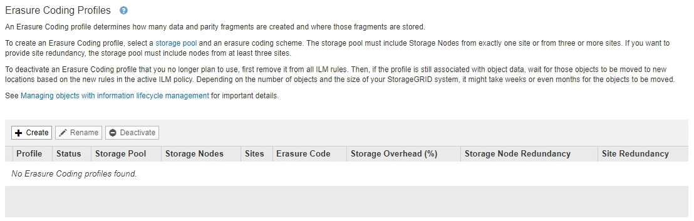

= 建立銷毀編碼設定檔
:allow-uri-read: 
:icons: font
:imagesdir: ../media/

[role="lead"]
若要建立「刪除編碼」設定檔、請將包含「儲存節點」的儲存資源池與銷毀編碼配置建立關聯。此關聯可決定所建立的資料和同位元檢查片段數目、以及系統將這些片段分佈在何處。

.您需要的是 #8217 ；需要的是什麼
* 您將使用登入Grid Manager xref:../admin/web-browser-requirements.adoc[支援的網頁瀏覽器]。
* 您擁有特定的存取權限。
* 您已建立儲存資源池、其中只包含一個站台或包含三個以上站台的儲存資源池。只有兩個站台的儲存資源池無法使用任何銷毀編碼方案。

「刪除編碼」設定檔中使用的儲存資源池必須只包含一個站台或三個以上站台。如果您想要提供站台備援、儲存資源池必須至少有三個站台。

NOTE: 您必須選取包含儲存節點的儲存資源池。您無法將歸檔節點用於銷毀編碼資料。

.步驟
. 選擇* ILM *>*銷毀編碼*。
+
「刪除編碼設定檔」頁面隨即出現。

+

. 選擇* Create *（建立*）。
+
「建立EC設定檔」對話方塊隨即出現。

+
image::../media/create_ec_profile_page.png[「建立EC設定檔」頁面]

. 輸入「刪除編碼」設定檔的唯一名稱。
+
銷毀編碼設定檔名稱必須是唯一的。如果您使用現有設定檔的名稱、即使該設定檔已停用、也會發生驗證錯誤。

+

NOTE: 「刪除編碼」設定檔名稱會附加至ILM規則放置指示中的儲存資源池名稱。

+
image::../media/storage_pool_and_erasure_coding_profile.png[儲存資源池和EC設定檔名稱]

. 選取您為此「刪除編碼」設定檔所建立的儲存資源池。
+

NOTE: 如果您的網格目前僅包含一個站台、您將無法使用預設的儲存資源池、所有儲存節點或任何包含預設站台「所有站台」的儲存資源池。如果新增第二個站台、此行為可防止「刪除編碼」設定檔變成無效。

+

NOTE: 如果儲存資源池只包含兩個站台、您就無法使用該儲存資源池來進行銷毀編碼。對於有兩個站台的儲存資源池、沒有可用的銷毀編碼方案。

+
當您選取儲存資源池時、可用的銷毀編碼配置清單會根據儲存池中的儲存節點和站台數目而顯示。

+
image::../media/create_ec_profile_three_sites.png[建立EC設定檔三個站台]

+
每個可用的銷毀編碼方案都會列出下列資訊：

+
** *銷毀程式碼*：下列格式的銷毀編碼方案名稱：資料片段+同位元檢查片段。
** *儲存負荷（%）*：同位元檢查片段相對於物件資料大小所需的額外儲存容量。儲存負荷=同位元檢查片段總數/資料片段總數。
** *儲存節點備援*：儲存節點的數量、在保留擷取物件資料的能力的同時可能會遺失。
** *站台備援*：選取的銷毀程式碼是否允許在站台遺失時擷取物件資料。
+
若要支援站台備援、所選的儲存資源池必須包含多個站台、每個站台都有足夠的儲存節點、以允許任何站台遺失。例如、若要使用6+3銷毀編碼方案來支援站台備援、所選的儲存資源池必須包含至少三個站台、且每個站台至少有三個儲存節點。

+
在下列情況下會顯示訊息：

+
** 您選取的儲存資源池不提供站台備援。當選取的儲存資源池僅包含一個站台時、預期會出現下列訊息。您可以在ILM規則中使用此「刪除編碼」設定檔、以防止節點故障。
+
image::../media/create_ec_profile_no_site_redundancy.png[建立EC設定檔無站台備援]

** 您選取的儲存資源池不符合任何銷毀編碼方案的需求。例如、當選取的儲存資源池只包含兩個站台時、預期會出現下列訊息。如果您要使用銷毀編碼來保護物件資料、則必須選取一個儲存資源池、其中只有一個站台或儲存資源池、其中有三個或更多站台。
+
image::../media/ec_profile_error.png[銷毀編碼設定檔錯誤]

** 您的網格只包含一個站台、而且您選取了預設的儲存資源池、所有儲存節點或任何包含預設站台「所有站台」的儲存資源池。
+
image::../media/ilm_ec_profile_all_storage_nodes_warning.png[ILM EC設定檔所有儲存節點警告]

** 您選取的銷毀編碼方案和儲存資源池會與另一個「刪除編碼」設定檔重疊。
+
image::../media/ilm_ec_profile_ec_scheme_warning.png[ILM EC設定檔銷毀編碼方案警告]

+
在此範例中、會出現一則警告訊息、因為另一個「刪除編碼」設定檔使用2+1配置、而另一個設定檔的儲存資源池也使用All 3站台儲存資源池中的其中一個站台。

+
雖然您無法建立此新設定檔、但在ILM原則中開始使用該設定檔時必須非常小心。如果將此新設定檔套用至已受其他設定檔保護的現有銷毀編碼物件、StorageGRID 則會建立一組全新的物件片段。它不會重複使用現有的2+1片段。當您從一個「刪除編碼」設定檔移轉至另一個設定檔時、可能會發生資源問題、即使銷毀編碼配置相同。

. 如果列出多個銷毀編碼方案、請選取您要使用的方案。
+
在決定要使用哪種銷毀編碼方案時、您應該在容錯能力（透過擁有更多同位元區段而達成）與網路流量修復需求（更多片段等於更多網路流量）之間取得平衡。例如、在4+2方案和6+3方案之間決定時、如果需要額外的同位元檢查和容錯能力、請選取6+3方案。如果網路資源受到限制、以減少節點修復期間的網路使用量、請選取4+2方案。

. 選擇*保存*。

