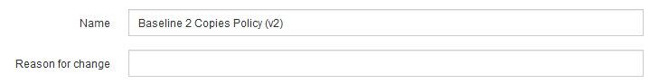
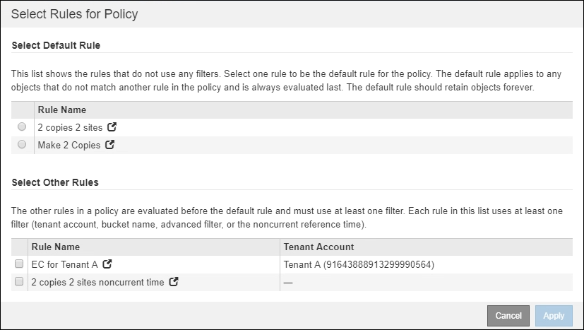
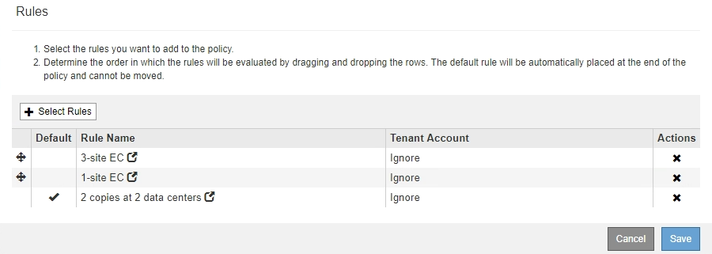

= 建立建議的ILM原則
:allow-uri-read: 
:icons: font
:imagesdir: ../media/

[role="lead"]
您可以從頭開始建立建議的ILM原則、或是想要從相同的規則集開始複製目前的作用中原則。

NOTE: 如果已啟用全域S3物件鎖定設定、請改用下列程序： xref:creating-ilm-policy-after-s3-object-lock-is-enabled.adoc[在啟用S3物件鎖定之後建立ILM原則]。

.您需要的產品
* 您將使用登入Grid Manager xref:../admin/web-browser-requirements.adoc[支援的網頁瀏覽器]。
* 您擁有特定的存取權限。
* 您已建立要新增至建議原則的ILM規則。視需要、您可以儲存建議的原則、建立其他規則、然後編輯建議的原則以新增規則。
* 您有 xref:creating-default-ilm-rule.adoc[已建立預設ILM規則] 不含任何篩選器的原則。
* 您也可以選擇觀看影片： https://["影片：StorageGRID 《ILM原則》"^]
+
[link=https://netapp.hosted.panopto.com/Panopto/Pages/Viewer.aspx?id=c929e94e-353a-4375-b112-acc5013c81c7]
image::../media/video-screenshot-ilm-policies.png[影片：StorageGRID 《ILM原則》]

.關於這項工作
建立建議ILM原則的典型理由包括：

* 您新增了一個新站台、需要使用新的ILM規則將物件放置在該站台。
* 您正在汰換網站、因此必須移除所有有關該網站的規則。
* 您新增了具有特殊資料保護需求的新租戶。
* 您開始使用雲端儲存資源池。

IMPORTANT: 僅在測試系統中使用系統的內建原則「基準2複本原則」。此原則中的「製作2份複本」規則會使用包含所有站台的「所有儲存節點」儲存資源池。如果StorageGRID 您的作業系統有多個站台、則一個物件的兩份複本可能會放在同一個站台上。

.步驟
. 選擇* ILM *>* Policies *。
+
此時將顯示ILM Policies（ILM策略）頁面。在此頁面中、您可以檢閱建議、作用中及歷史原則的清單；建立、編輯、 或移除建議的原則、複製作用中原則、或檢視任何原則的詳細資料。

+
image::../media/ilm_policies_page.gif[ILM原則頁面]

. 判斷您要如何建立建議的ILM原則。
+
[cols="1a,2a"]
|===
| 選項 | 步驟 

 a| 
建立尚未選取任何規則的新建議原則
 a| 
.. 如果目前存在建議的ILM原則、請選取該原則、然後選取*移除*。
+
如果建議的原則已經存在、您就無法建立新的建議原則。

.. 選取*建立建議的原則*。

 a| 
根據作用中原則建立建議的原則
 a| 
.. 如果目前存在建議的ILM原則、請選取該原則、然後選取*移除*。
+
如果建議的原則已經存在、則無法複製作用中原則。

.. 從表中選取作用中原則。
.. 選擇* Clone（克隆）*。

 a| 
編輯現有的建議原則
 a| 
.. 從表中選取建議的原則。
.. 選擇*編輯*。

|===
+
此時將顯示Configure ILM Policy（配置ILM策略）對話框。

+
如果您要建立新的建議原則、則所有欄位均為空白、且未選取任何規則。

+
image::../media/ilm_policies_configure_ilm_policy.png[ILM原則設定ILM原則]

+
如果要複製作用中原則、「*名稱*」欄位會顯示作用中原則的名稱、並附加一個版本號碼（範例中為「'v2」）。作用中原則中使用的規則會依其目前順序選取並顯示。

+

. 在「*名稱*」欄位中輸入建議原則的唯一名稱。
+
您必須輸入至少1個字元、且不得超過64個字元。如果您要複製作用中原則、可以使用目前名稱加上附加版本編號、也可以輸入新名稱。

. 在「*變更理由*」欄位中輸入您建立新建議原則的原因。
+
您必須輸入至少1個字元、且不得超過128個字元。

. 若要新增規則至原則、請選取*選取規則*。
+
此時會出現「選取原則規則」對話方塊、其中列出所有已定義的規則。如果您要複製原則：

+
** 您正在複製的原則所使用的規則會被選取。
** 如果您正在複製的原則使用的任何規則都沒有非預設規則的篩選器、系統會提示您移除其中一個規則以外的所有規則。
** 如果預設規則使用篩選器或非目前參照時間、系統會提示您選取新的預設規則。
** 如果預設規則不是最後一個規則、則可透過按鈕將規則移至新原則的結尾。
+

. 選取規則名稱或「更多詳細資料」圖示 image:../media/icon_nms_more_details.gif["更多詳細資料圖示"] 可查看該規則的設置。
+
此範例顯示ILM規則的詳細資料、該規則會在兩個站台建立兩個複寫複本。

+
image::../media/ilm_rule_summary_page.png[ILM規則摘要頁面]

. 在「*選取預設規則*」區段中、為建議的原則選取一個預設規則。
+
預設規則適用於任何不符合原則中其他規則的物件。預設規則無法使用任何篩選條件、而且永遠是最後評估的規則。

+

NOTE: 如果「選取預設規則」區段中未列出任何規則、您必須結束ILM原則頁面和 xref:creating-default-ilm-rule.adoc[建立預設ILM規則]。

+

IMPORTANT: 請勿使用「製作2份複本」常用規則做為原則的預設規則。「製作2份複本」規則使用單一儲存資源池「所有儲存節點」、其中包含所有站台。如果StorageGRID 您的作業系統有多個站台、則一個物件的兩份複本可能會放在同一個站台上。

. 在「*選取其他規則*」區段中、選取您要納入原則的任何其他規則。
+
其他規則會在預設規則之前評估、而且必須至少使用一個篩選器（租戶帳戶、庫位名稱、進階篩選器或非目前參考時間）。

. 選取規則後、請選取*套用*。
+
此時會列出您選取的規則。預設規則結尾為、其上方則為其他規則。

+

+
[NOTE]
====
如果預設規則不會永久保留物件、則會出現警告。當您啟動此原則時、必須確認StorageGRID 您想要在預設規則的放置指示完成時刪除物件（除非儲存庫生命週期將物件保留較長時間）。

image::../media/ilm_policy_default_rule_not_forever.png[ILM原則預設規則不會永遠存在]

====
. 拖放非預設規則的列、以決定評估這些規則的順序。
+
您無法移動預設規則。

+

IMPORTANT: 您必須確認ILM規則的順序正確。當原則啟動時、新物件和現有物件會依照列出的順序進行評估、從上方開始。

. 視需要選取刪除圖示 image:../media/icon_nms_delete_new.gif["刪除圖示"] 若要刪除原則中不想要的任何規則、或選取*選取規則*以新增更多規則。
. 完成後、請選取*「Save（儲存）」*。
+
ILM Policies（ILM原則）頁面隨即更新：

+
** 您儲存的原則會顯示為「建議」。建議的原則沒有開始和結束日期。
** 將啟用*模擬*和*啟動*按鈕。
+
image::../media/ilm_policy_proposed_policy_saved.png[ILM原則建議原則已儲存]

. 前往 xref:simulating-ilm-policy.adoc[模擬ILM原則]。

.相關資訊
* xref:what-ilm-policy-is.adoc[什麼是ILM原則]
* xref:managing-objects-with-s3-object-lock.adoc[使用S3物件鎖定來管理物件]

