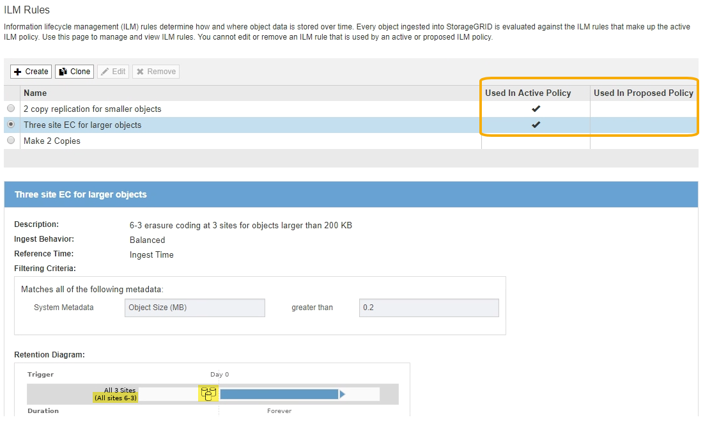

= 停用銷毀編碼設定檔
:allow-uri-read: 
:icons: font
:imagesdir: ../media/

[role="lead"]
如果您不打算再使用刪除編碼設定檔、而且目前未在任何ILM規則中使用該設定檔、則可以停用刪除編碼設定檔。

.您需要的是 #8217 ；需要的是什麼
* 您將使用登入Grid Manager xref:../admin/web-browser-requirements.adoc[支援的網頁瀏覽器]。
* 您擁有特定的存取權限。
* 您已確認目前未執行任何銷毀編碼資料修復作業或取消委任程序。如果您在任一作業進行期間嘗試停用「刪除編碼」設定檔、就會傳回錯誤訊息。

當您停用「刪除編碼」設定檔時、該設定檔仍會顯示在「刪除編碼設定檔」頁面上、但其狀態為*停用*。

image::../media/deactivated_ec_profile.png[停用EC設定檔]

您無法再使用已停用的「刪除編碼」設定檔。建立ILM規則的放置指示時、不會顯示停用的設定檔。您無法重新啟動停用的設定檔。

如果符合下列任一項條件、則可防止您停用「刪除編碼」設定檔：StorageGRID

* 「刪除編碼」設定檔目前用於ILM規則。
* 「刪除編碼」設定檔已不再用於任何ILM規則、但設定檔的物件資料和同位元檢查分段仍存在。

.步驟
. 選擇* ILM *>* Erasure Coding *。
+
「刪除編碼設定檔」頁面隨即出現。「*重新命名*」和「*停用*」按鈕都會停用。

. 檢閱「*狀態*」欄、確認您要停用的「刪除編碼」設定檔未用於任何ILM規則。
+
如果在任何ILM規則中使用「刪除編碼」設定檔、則無法停用該設定檔。在此範例中、至少有一個ILM規則使用* 2_1 EC設定檔*。

+
image::../media/ec_profile_used_in_ilm_rule.png[ILM規則中使用的EC設定檔]

. 如果在ILM規則中使用設定檔、請遵循下列步驟：
+
.. 選擇* ILM *>* Rules *。
.. 針對列出的每個規則、選取選項按鈕並檢閱保留圖、以判斷規則是否使用您要停用的「刪除編碼」設定檔。
+
在此範例中、*大型物件*的*三站台EC規則使用稱為*所有3站台*的儲存資源池、以及*所有站台6-3*銷毀編碼設定檔。銷毀編碼設定檔會以下列圖示表示： image:../media/icon_nms_erasure_coded.gif["EC設定檔圖示"]

+

.. 如果ILM規則使用您要停用的「刪除編碼」設定檔、請判斷該規則是否用於作用中的ILM原則或建議的原則。
+
在此範例中、「大型物件*的*三站台EC」規則會用於作用中的ILM原則。

.. 請根據使用「刪除編碼」設定檔的位置、完成表格中的其他步驟。
+
[cols="2a,3a,1a"]
|===
| 設定檔在哪裡使用？ | 停用設定檔之前要執行的其他步驟 | 請參閱這些額外說明 

 a| 
絕不用於任何ILM規則
 a| 
不需執行其他步驟。繼續執行此程序。
 a| 
_無_

 a| 
在從未用於任何ILM原則的ILM規則中
 a| 
... 編輯或刪除所有受影響的ILM規則。如果您編輯規則、請移除所有使用「刪除編碼」設定檔的放置位置。
... 繼續執行此程序。

 a| 
xref:working-with-ilm-rules-and-ilm-policies.adoc[使用ILM規則和ILM原則]

 a| 
目前位於作用中ILM原則中的ILM規則
 a| 
... 複製作用中原則。
... 移除使用「刪除編碼」設定檔的ILM規則。
... 新增一或多個新的ILM規則、以確保物件受到保護。
... 儲存、模擬及啟動新原則。
... 等待新原則套用、並根據您新增的新規則、將現有物件移至新位置。
+
*附註：* StorageGRID 視物件數量和您的一套系統尺寸而定、ILM作業可能需要數週甚至數月的時間、才能根據新的ILM規則、將物件移至新位置。

+
雖然您可以安全地嘗試停用「刪除編碼」設定檔、但它仍與資料相關聯、但停用作業將會失敗。如果設定檔尚未準備好停用、將會出現錯誤訊息通知您。

... 編輯或刪除您從原則中移除的規則。如果您編輯規則、請移除所有使用「刪除編碼」設定檔的放置位置。
... 繼續執行此程序。

 a| 
*** xref:creating-ilm-policy.adoc[建立ILM原則]
*** xref:working-with-ilm-rules-and-ilm-policies.adoc[使用ILM規則和ILM原則]

 a| 
目前位於建議ILM原則中的ILM規則
 a| 
... 編輯建議的原則。
... 移除使用「刪除編碼」設定檔的ILM規則。
... 新增一或多個新的ILM規則、確保所有物件都受到保護。
... 儲存建議的原則。
... 編輯或刪除您從原則中移除的規則。如果您編輯規則、請移除所有使用「刪除編碼」設定檔的放置位置。
... 繼續執行此程序。

 a| 
*** xref:creating-ilm-policy.adoc[建立ILM原則]
*** xref:working-with-ilm-rules-and-ilm-policies.adoc[使用ILM規則和ILM原則]

 a| 
在歷史ILM原則中的ILM規則中
 a| 
... 編輯或刪除規則。如果您編輯規則、請移除所有使用「刪除編碼」設定檔的放置位置。（此規則現在會在歷史原則中顯示為歷史規則。）
... 繼續執行此程序。

 a| 
xref:working-with-ilm-rules-and-ilm-policies.adoc[使用ILM規則和ILM原則]

|===
.. 重新整理「刪除編碼設定檔」頁面、確保ILM規則中未使用設定檔。

. 如果ILM規則中未使用設定檔、請選取選項按鈕、然後選取* Deactonate*。
+
此時會出現停用EC設定檔對話方塊。

+
image::../media/deactivate_ec_profile_confirmation.png[停用EC設定檔確認]

. 如果確定要停用設定檔、請選取* Deactivate（停用）*。
+
** 如果StorageGRID 能夠停用「刪除編碼」設定檔、則其狀態為*停用*。您無法再為任何ILM規則選取此設定檔。
** 如果StorageGRID 無法停用設定檔、就會出現錯誤訊息。例如、如果物件資料仍與此設定檔相關聯、就會出現錯誤訊息。您可能需要等待數週、才能再次嘗試停用程序。

