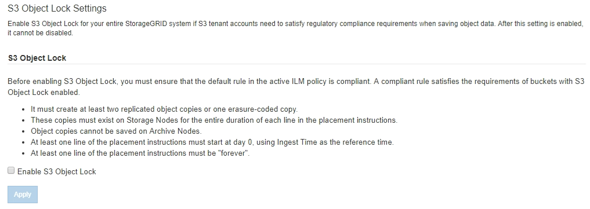
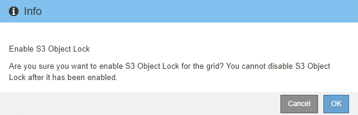

= 全域啟用S3物件鎖定
:allow-uri-read: 
:icons: font
:imagesdir: ../media/

[role="lead"]
如果S3租戶帳戶在儲存物件資料時需要遵守法規要求、您必須為整個StorageGRID 整個整個系統啟用S3物件鎖定。啟用全域S3物件鎖定設定、可讓任何S3租戶使用者使用S3物件鎖定來建立及管理儲存區和物件。

.您需要的產品
* 您擁有root存取權限。
* 您將使用登入Grid Manager xref:../admin/web-browser-requirements.adoc[支援的網頁瀏覽器]。
* 您已檢閱S3物件鎖定工作流程、而且必須瞭解考量事項。
* 作用中ILM原則中的預設規則相容。
+
** xref:creating-default-ilm-rule.adoc[建立預設ILM規則]
** xref:creating-ilm-policy.adoc[建立ILM原則]

.關於這項工作
網格管理員必須啟用全域S3物件鎖定設定、才能讓租戶使用者建立啟用S3物件鎖定的新儲存區。啟用此設定之後、就無法停用。

NOTE: 如果您使用舊版StorageGRID 的支援功能啟用全域規範設定、StorageGRID 則S3物件鎖定設定會在支援功能11.6.您可以繼續使用StorageGRID 效益管理功能來管理現有的相容庫位設定、但您無法建立新的相容庫位。請參閱 https://kb.netapp.com/Advice_and_Troubleshooting/Hybrid_Cloud_Infrastructure/StorageGRID/How_to_manage_legacy_Compliant_buckets_in_StorageGRID_11.5["NetApp知識庫：如何管理StorageGRID 支援老舊的知識庫、請參閱《知識庫文章"^]。

.步驟
. 選擇*組態*>*系統*>* S3物件鎖定*。
+
「S3物件鎖定設定」頁面隨即出現。

+

+
如果您已使用舊版StorageGRID 的支援功能啟用「全球法規遵循」設定、則頁面會包含下列附註：

+
image::../media/s3_object_lock_global_setting_compliant_note.png[S3物件鎖定全域設定相容附註]

. 選取*啟用S3物件鎖定*。
. 選擇*應用*。
+
此時會出現確認對話方塊、提醒您啟用S3物件鎖定後、將無法停用該對話方塊。

+

. 如果確定要為整個系統永久啟用S3物件鎖定、請選取*確定*。
+
當您選取*確定*時：

+
** 如果作用中ILM原則中的預設規則相容、則「S3物件鎖定」現在會針對整個網格啟用、而且無法停用。
** 如果預設規則不相容、則會出現錯誤、表示您必須建立並啟動新的ILM原則、其中包含以相容規則為預設規則的新ILM原則。選取*確定*、然後建立新的建議原則、加以模擬並加以啟動。
+
image::../media/s3_object_lock_global_setting_error.gif[S3物件鎖定全域設定錯誤]

.完成後
啟用全域S3物件鎖定設定之後、您可能需要 xref:../ilm/creating-default-ilm-rule.adoc[建立預設規則] 這是符合法規的且 xref:creating-ilm-policy-after-s3-object-lock-is-enabled.adoc[建立ILM原則] 這是符合法規的。啟用此設定之後、ILM原則可以選擇性地同時包含相容的預設規則和不相容的預設規則。例如、您可能想要使用不符合規定的規則、該規則不具備未啟用S3物件鎖定之儲存區中物件的篩選條件。

.相關資訊
* xref:managing-objects-with-s3-object-lock.adoc#comparing-s3-object-lock-to-legacy-compliance[比較S3物件鎖定與舊版法規遵循]

