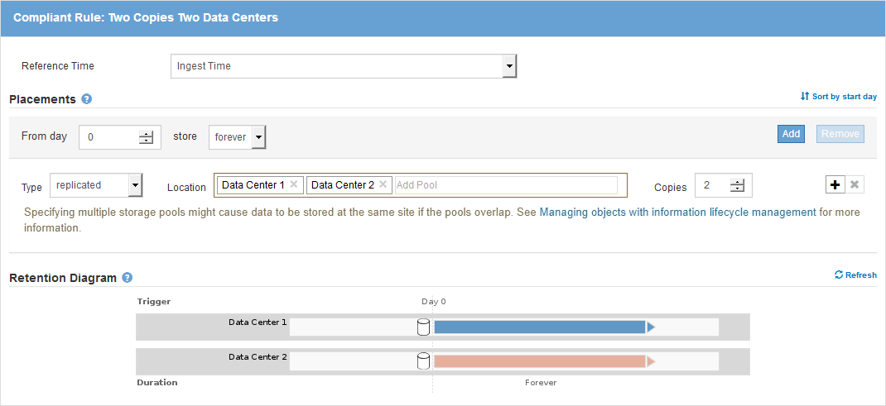

= 範例7：S3物件鎖定的符合ILM原則
:allow-uri-read: 
:icons: font
:imagesdir: ../media/

[role="lead"]
在定義ILM原則時、您可以使用本範例中的S3儲存區、ILM規則和ILM原則作為起點、以符合已啟用S3物件鎖定之儲存區中物件的物件保護和保留需求。

NOTE: 如果您在先前StorageGRID 版本的支援功能中使用舊版法規遵循功能、也可以使用此範例來協助管理任何已啟用舊版法規遵循功能的現有儲存庫。

CAUTION: 下列ILM規則和原則僅為範例。有許多方法可以設定ILM規則。在啟動新原則之前、請先模擬建議的原則、確認其運作方式符合保護內容免於遺失的目的。

.相關資訊
* xref:managing-objects-with-s3-object-lock.adoc[使用S3物件鎖定來管理物件]
* xref:creating-ilm-policy.adoc[建立ILM原則]

== S3物件鎖定範例的儲存區和物件

在此範例中、名為Bank of ABC的S3租戶帳戶已使用租戶管理程式建立啟用S3物件鎖定的儲存庫、以儲存重要的銀行記錄。

[cols="1a,2a"]
|===
| 儲存區定義 | 範例值 

 a| 
租戶帳戶名稱
 a| 
ABC銀行

 a| 
儲存區名稱
 a| 
銀行記錄

 a| 
桶區
 a| 
美國東部-1（預設）

|===
image::../media/compliant_bucket.png[符合範例的儲存貯體的螢幕擷取畫面]

每個新增至銀行記錄儲存區的物件和物件版本、都會使用下列值進行「保留至日期」和「合法保留」設定。

[cols="1a,2a"]
|===
| 每個物件的設定 | 範例值 

 a| 
「直到目前為止」
 a| 
「2030-12-30T23：59：59Z」（2030年12月30日）

每個物件版本都有自己的「更新至日期」設定。此設定可以增加、但不能減少。

 a| 
合法持有
 a| 
「Off」（關）（非有效）

在保留期間內、任何物件版本均可隨時保留或撤銷合法保留。如果某個物件處於合法持有狀態、即使已達到「保留至日期」、也無法刪除該物件。

|===

== S3物件鎖定的ILM規則1範例：具有儲存區比對的銷毀編碼設定檔

此範例ILM規則僅適用於名為Bank of ABC的S3租戶帳戶。它會比對「銀行記錄」儲存區中的任何物件、然後使用銷毀編碼、將物件儲存在三個資料中心站台的儲存節點上、使用6+3銷毀編碼設定檔。此規則符合啟用S3物件鎖定的儲存區需求：儲存節點會從第0天一直保留以銷毀編碼的複本、並使用擷取時間做為參考時間。

[cols="1a,2a"]
|===
| 規則定義 | 範例值 

 a| 
規則名稱
 a| 
符合法規：銀行記錄庫中的EC物件- ABC銀行

 a| 
租戶帳戶
 a| 
ABC銀行

 a| 
儲存區名稱
 a| 
《銀行記錄》

 a| 
進階篩選
 a| 
物件大小（MB）大於1

*附註：*此篩選器可確保刪除編碼不會用於1 MB或更小的物件。

|===

[cols="1a,2a"]
|===
| 規則定義 | 範例值 

 a| 
參考時間
 a| 
擷取時間

 a| 
刊登位置
 a| 
從第0天開始、永遠儲存

 a| 
銷毀編碼設定檔
 a| 
* 在三個資料中心站台的儲存節點上建立銷毀編碼複本
* 使用6+3銷毀編碼方案

|===
image::../media/compliant_rule_ec_copy_step_2.png[範例相容規則EC複本步驟2的快照]

== S3物件鎖定範例的ILM規則2：不符合規則

本範例ILM規則一開始會在儲存節點上儲存兩個複寫的物件複本。一年後、它會將一份複本永久儲存在雲端儲存資源池中。由於此規則使用Cloud Storage Pool、因此不符合法規要求、也不會套用至啟用S3物件鎖定的儲存區中的物件。

[cols="1a,2a"]
|===
| 規則定義 | 範例值 

 a| 
規則名稱
 a| 
不符合法規：使用雲端儲存資源池

 a| 
租戶帳戶
 a| 
未指定

 a| 
儲存區名稱
 a| 
未指定、但僅適用於未啟用S3物件鎖定（或舊版法規遵循功能）的儲存區。

 a| 
進階篩選
 a| 
未指定

|===
image::../media/ilm_example_non_compliant_rule_step_1.png[不符合規則步驟1範例]

[cols="1a,2a"]
|===
| 規則定義 | 範例值 

 a| 
參考時間
 a| 
擷取時間

 a| 
刊登位置
 a| 
* 在第0天、將兩個複寫複本保留在資料中心1的儲存節點和資料中心2上365天
* 1年後、請將一份複寫複本永遠保留在雲端儲存資源池中

|===

== S3物件鎖定的ILM規則3範例：預設規則

此範例ILM規則會將物件資料複製到兩個資料中心的儲存資源池。此相容規則是ILM原則中的預設規則。它不含任何篩選器、不使用非目前的參考時間、並符合啟用S3物件鎖定的儲存區需求：儲存節點會從第0天一直保留兩個物件複本、使用「內嵌」作為參考時間。

[cols="1a,2a"]
|===
| 規則定義 | 範例值 

 a| 
規則名稱
 a| 
預設符合法規：兩份複本兩個資料中心

 a| 
租戶帳戶
 a| 
未指定

 a| 
儲存區名稱
 a| 
未指定

 a| 
進階篩選
 a| 
未指定

|===

[cols="1a,2a"]
|===
| 規則定義 | 範例值 

 a| 
參考時間
 a| 
擷取時間

 a| 
刊登位置
 a| 
從第0天到第2天、請保留兩個複寫複本：一個在資料中心1的儲存節點上、另一個在資料中心2的儲存節點上。

|===

== S3物件鎖定範例的符合ILM原則

若要建立可有效保護系統中所有物件（包括已啟用S3物件鎖定的儲存區中的物件）的ILM原則、您必須選取符合所有物件儲存需求的ILM規則。然後、您必須模擬並啟動建議的原則。

=== 新增規則至原則

在此範例中、ILM原則包含三個ILM規則、順序如下：

. 一種相容的規則、使用銷毀編碼來保護特定儲存區中大於1 MB的物件、並啟用S3物件鎖定。物件會從第0天儲存在儲存節點上、直到永遠儲存在儲存節點上。
. 不符合法規的規則、會在儲存節點上建立一年的兩個複寫物件複本、然後將一個物件複本永久移至雲端儲存池。此規則不適用於啟用S3物件鎖定的儲存區、因為它使用雲端儲存池。
. 在儲存節點上建立兩個複寫物件複本的預設相容規則（從第0天到永遠）。

image::../media/compliant_policy.png[符合法規的原則範例]

=== 模擬建議的原則

在建議的原則中新增規則、選擇預設的相容規則、並安排其他規則之後、您應該從啟用S3物件鎖定的儲存區和其他儲存區測試物件、以模擬原則。例如、當您模擬範例原則時、測試物件的評估方式如下：

* 第一條規則只會比對ABC銀行租戶的貯體銀行記錄中大於1 MB的測試物件。
* 第二個規則會比對所有其他租戶帳戶的不符合規範桶中的所有物件。
* 預設規則會符合下列物件：
+
** 目標1 MB或更小、位於ABC銀行租戶的庫位記錄中。
** 在任何其他已啟用S3物件鎖定的儲存區中、所有其他租戶帳戶的物件。

=== 啟動原則

當您完全滿意新原則會依照預期保護物件資料時、就可以啟動它。
