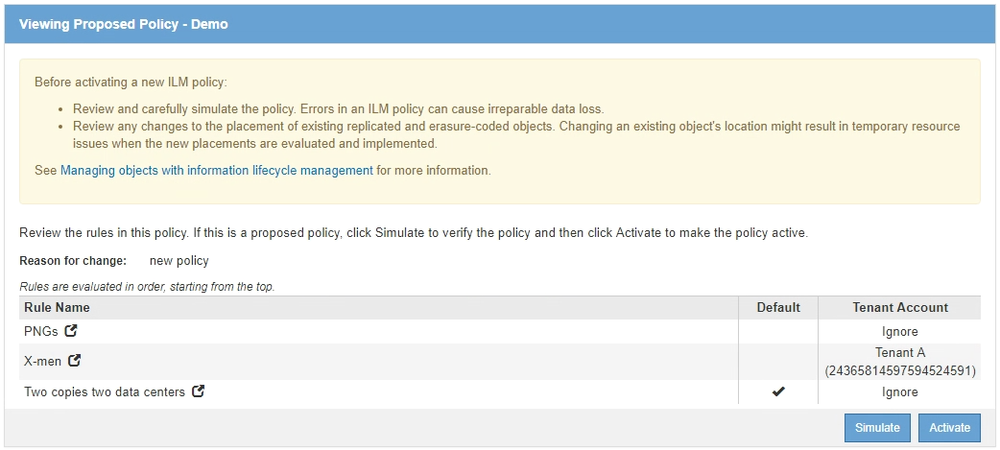

= 模擬ILM原則
:allow-uri-read: 
:icons: font
:imagesdir: ../media/

[role="lead"]
在啟動原則並將其套用至正式作業資料之前、您應該先模擬測試物件上的建議原則。模擬視窗提供獨立式環境、可在原則啟動並套用至正式作業環境中的資料之前、安全地進行測試。

.您需要的是 #8217 ；需要的是什麼
* 您將使用登入Grid Manager xref:../admin/web-browser-requirements.adoc[支援的網頁瀏覽器]。
* 您擁有特定的存取權限。
* 您知道要測試的每個物件的S3儲存區/物件金鑰或Swift容器/物件名稱、而且已經擷取這些物件。

您必須仔細選取要測試建議原則的物件。若要徹底模擬原則、您應該針對每個規則中的每個篩選器測試至少一個物件。

例如、如果原則包含一個規則來比對儲存區A中的物件、以及另一個規則來比對儲存區B中的物件、則您必須從儲存區A選取至少一個物件、然後從儲存區B選取一個物件、才能徹底測試原則。您也必須從另一個儲存區選取至少一個物件、以測試預設規則。

模擬原則時、請考量下列事項：

* 變更原則之後、請儲存建議的原則。然後、模擬已儲存的建議原則行為。
* 當您模擬原則時、原則中的ILM規則會篩選測試物件、讓您可以查看套用到每個物件的規則。不過、不會建立物件複本、也不會放置任何物件。執行模擬並不會以任何方式修改資料、規則或原則。
* Simulation頁面會保留您測試過的物件、直到您關閉、瀏覽或重新整理ILM原則頁面為止。
* Simulation會傳回相符規則的名稱。若要判斷哪個儲存資源池或銷毀編碼設定檔有效、您可以選取規則名稱或「更多詳細資料」圖示來檢視保留圖 image:../media/icon_nms_more_details.gif["更多詳細資料圖示"]。
* 如果啟用S3版本管理、則只會針對物件的目前版本模擬原則。

.步驟
. 選取並排列規則、然後儲存建議的原則。
+
本範例中的原則有三個規則：

+
[cols="1a,1a,1a,1a"]
|===
| 規則名稱 | 篩選器 | 複本類型 | 保留 

 a| 
X-men
 a| 
** 租戶A
** 使用者中繼資料（series=x-men）

 a| 
兩個資料中心提供2份複本
 a| 
2年

 a| 
PNGs
 a| 
金鑰結尾為.png-
 a| 
兩個資料中心提供2份複本
 a| 
5年

 a| 
兩份複本兩個資料中心
 a| 
_無_
 a| 
兩個資料中心提供2份複本
 a| 
永遠

|===
+
image::../media/ilm_policies_viewing_proposed.png[ILM原則檢視建議項目]

. 使用S3或Swift用戶端或 xref:../tenant/use-s3-console.adoc[S3主控台處於實驗階段]（可在租戶管理程式中針對每個租戶使用）、擷取測試每個規則所需的物件。
. 選擇*模擬*。
+
此時會出現Simulation ILM Policy（模擬ILM原則）對話方塊。

. 在「*物件*」欄位中、輸入測試物件的S3儲存區/物件金鑰或Swift容器/物件名稱、然後選取*模擬*。
+
[NOTE]
====
如果您指定尚未擷取的物件、則會出現訊息。

image::../media/object_not_available_for_simulation.gif[指定遺失物件時顯示訊息]

====
. 在「*模擬結果*」下、確認每個物件都符合正確的規則。
+
在本例中、「Havok.png-」和「Warpath.jpg`物件」已正確符合X-men規則。不含「系列=x-men」使用者中繼資料的「FullSteam」物件、與X-men規則不符、但與PNGs規則相符。未使用預設規則、因為這三個物件都與其他規則相符。

+
image::../media/ilm_policy_simulation_results.gif[模擬結果]

== 範例1：模擬提議的ILM原則時、請驗證規則

此範例說明如何在模擬建議的原則時驗證規則。

在此範例中、針對兩個儲存區中擷取的物件來模擬*範例ILM原則*。此原則包含三項規則、如下所示：

* 第一條規則*兩份複本（2年、2年用於Bucke-A*）僅適用於Bucke-a中的物件
* 第二條規則* EC物件> 1 MB*、適用於所有儲存區、但會篩選大於1 MB的物件。
* 第三項規則是*兩份複本、兩個資料中心*、這是預設規則。它不包含任何篩選器、也不使用非目前的參考時間。

image::../media/saved_policy_for_simulation.png[Simulation的儲存原則]

.步驟
. 新增規則並儲存原則之後、請選取*模擬*。
+
此時會出現「模擬ILM原則」對話方塊。

. 在「*物件*」欄位中、輸入測試物件的S3儲存區/物件金鑰或Swift容器/物件名稱、然後選取*模擬*。
+
此時會出現模擬結果、顯示原則中的哪一項規則符合您測試的每個物件。

+
image::../media/simulate_policy_screen.png[模擬原則畫面]

. 確認每個物件都符合正確的規則。
+
在此範例中：

+
.. 「Bucke-a/Bucke-A object.pdf」正確符合第一項規則、可篩選「Bucke-A」中的物件。
.. 「bucke-b/test object大於1 MB.pdf」位於「bucke-b」中、因此不符合第一條規則。相反地、第二個規則會正確比對此規則、該規則會篩選大於1 MB的物件。
.. 「bucke-b/test object less小於1 MB.pdf」與前兩個規則中的篩選條件不符、因此會依照預設規則放置、其中不含篩選條件。

== 範例2：模擬提議的ILM原則時重新排序規則

此範例說明如何在模擬原則時重新排序規則、以變更結果。

在此範例中、*示範*原則正在模擬中。此原則旨在尋找具有series=x-men使用者中繼資料的物件、其中包含三項規則、如下所示：

* 第一條規則* PNGS*會篩選以".pnnp"結尾的金鑰名稱。
* 第二條規則* X-men*僅適用於租戶A的物件、以及「系列=x-men」使用者中繼資料的篩選器。
* 最後一個規則*兩個複本兩個資料中心*是預設規則、它會比對任何不符合前兩個規則的物件。

.步驟
. 新增規則並儲存原則之後、請選取*模擬*。
. 在「*物件*」欄位中、輸入測試物件的S3儲存區/物件金鑰或Swift容器/物件名稱、然後選取*模擬*。
+
此時會出現模擬結果、顯示「Havok.png-」物件與* PNGS*規則相符。

+
image::../media/simulate_reorder_rules_pngs_result.gif[範例2：模擬提議的ILM原則時重新排序規則]

+
但是《Havok.png-noon*》（哈瓦克.png-ng-men）對象的測試規則是這樣的規則。

. 若要解決此問題、請重新排序規則。
+
.. 選取*完成*以關閉「模擬ILM原則」頁面。
.. 選取*編輯*以編輯原則。
.. 將* X-men *規則拖曳到清單頂端。
+
image::../media/simulate_reorder_rules_correct_rule.png[模擬-重新排序規則-正確規則]

.. 選擇*保存*。

. 選擇*模擬*。
+
您先前測試的物件會根據更新的原則重新評估、並顯示新的模擬結果。在範例中、「規則相符」欄顯示「Havok.pnpn'物件現在符合X-men中繼資料規則（如預期）。上一個「比對」欄顯示、PNGs規則與先前模擬中的物件相符。

+
image::../media/simulate_reorder_rules_correct_result.gif[範例2：模擬提議的ILM原則時重新排序規則]

+

NOTE: 如果您停留在「設定原則」頁面、則可在進行變更後重新模擬原則、而不需要重新輸入測試物件的名稱。

== 範例3：模擬提議的ILM原則時、請修正規則

此範例說明如何模擬原則、修正原則中的規則、以及繼續模擬。

在此範例中、*示範*原則正在模擬中。此原則是為了尋找具有「系列=x-men」使用者中繼資料的物件。但是、針對「Beast.jpg`物件」模擬此原則時、卻發生非預期的結果。物件不符合X-men中繼資料規則、而是符合預設規則、兩個複本複製兩個資料中心。

image::../media/simulate_results_for_object_wrong_metadata.png[範例3：模擬提議的ILM原則時修正規則]

當測試物件與原則中的預期規則不符時、您必須檢查原則中的每個規則、並修正任何錯誤。

.步驟
. 針對原則中的每個規則、選取規則名稱或「更多詳細資料」圖示、即可檢視規則設定 image:../media/icon_nms_more_details.gif["更多詳細資料圖示"] 在顯示規則的任何對話方塊上。
. 檢閱規則的租戶帳戶、參考時間及篩選條件。
+
在此範例中、X-men規則的中繼資料包含錯誤。中繼資料值輸入為「'x-men1'」、而非「'x-men」。

+
image::../media/simulate_rules_select_rule_popup_with_wrong_metadata.png[範例3：模擬提議的ILM原則時修正規則]

. 若要解決錯誤、請依照下列步驟修正規則：
+
** 如果規則是建議原則的一部分、您可以複製規則、或是從原則中移除規則、然後加以編輯。
** 如果規則是作用中原則的一部分、則必須複製規則。您無法編輯或移除作用中原則的規則。
+
[cols="1a,3a"]
|===
| 選項 | 說明 

 a| 
複製規則
 a| 
... 選擇* ILM *>* Rules *。
... 選取不正確的規則、然後選取* Clone（複製）*。
... 變更不正確的資訊、然後選取*儲存*。
... 選擇* ILM *>* Policies *。
... 選取建議的原則、然後選取*編輯*。
... 選擇*選擇規則*。
... 選取新規則的核取方塊、取消核取原始規則的核取方塊、然後選取*套用*。
... 選擇*保存*。

 a| 
編輯規則
 a| 
... 選取建議的原則、然後選取*編輯*。
... 選取刪除圖示 image:../media/icon_nms_delete_new.gif["刪除圖示"] 若要移除不正確的規則、請選取*儲存*。
... 選擇* ILM *>* Rules *。
... 選取不正確的規則、然後選取*編輯*。
... 變更不正確的資訊、然後選取*儲存*。
... 選擇* ILM *>* Policies *。
... 選取建議的原則、然後選取*編輯*。
... 選取修正後的規則、選取*「Apply」（套用）*、然後選取*「Save"（儲存）*。

|===

. 再次執行模擬。
+

NOTE: 由於您已離開ILM原則頁面來編輯規則、因此先前輸入的模擬物件將不再顯示。您必須重新輸入物件名稱。

+
在此範例中、修正的X-men規則現在會符合「Beast.jpg`」物件（根據「系列=x-men」使用者中繼資料）、如預期。

+
image::../media/simulate_results_for_object_corrected_metadata.gif[範例3：模擬提議的ILM原則時修正規則]

