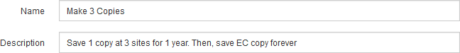

= 步驟1（共3步）：定義基礎知識
:allow-uri-read: 
:icons: font
:imagesdir: ../media/

[role="lead"]
建立ILM規則精靈的步驟1（定義基礎）可讓您定義規則的基本和進階篩選器。

.關於這項工作
根據ILM規則評估物件時StorageGRID 、功能將物件中繼資料與規則的篩選條件進行比較。如果物件中繼資料符合所有篩選條件、StorageGRID 則使用規則放置物件。您可以設計規則以套用至所有物件、也可以指定基本篩選條件、例如一個或多個租戶帳戶或庫位名稱、或是進階篩選條件、例如物件的大小或使用者中繼資料。

image::../media/ilm_create_ilm_rule_wizard_1.png[建立ILM規則步驟1（共3步）]

.步驟
. 在*名稱*欄位中輸入規則的唯一名稱。
+
您必須輸入1到64個字元。

. （可選）在* Description（說明）*字段中輸入規則的簡短說明。
+
您應該說明規則的用途或功能、以便日後辨識規則。

+

. 您也可以選擇套用此規則的一或多個S3或Swift租戶帳戶。如果此規則適用於所有租戶、請將此欄位留白。
+
如果您沒有根存取權限或租戶帳戶權限、就無法從清單中選取租戶。請改為輸入租戶ID、或輸入多個ID作為以逗號分隔的字串。

. 您也可以指定套用此規則的S3儲存區或Swift容器。
+
如果選取*符合全部*（預設）、則規則會套用至所有S3儲存區或Swift容器。

. 或者、選取*進階篩選*以指定其他篩選條件。
+
如果您未設定進階篩選、則規則會套用至符合基本篩選條件的所有物件。

+
如果此規則將建立銷毀編碼複本、請新增*物件大小（MB）*進階篩選器、並將其設為*大於1*。大小篩選器可確保1 MB或更小的物件不會被銷毀編碼。

+

IMPORTANT: 銷毀編碼最適合大於1 MB的物件。請勿針對小於200 KB的物件使用銷毀編碼、以避免管理非常小的銷毀編碼片段。

. 選擇*下一步*。
+
步驟2（定義放置位置）隨即出現。

.相關資訊
* xref:what-ilm-rule-is.adoc[什麼是ILM規則]
* xref:using-advanced-filters-in-ilm-rules.adoc[在ILM規則中使用進階篩選器]
* xref:step-2-of-3-define-placements.adoc[步驟2（共3步）：定義放置位置]

