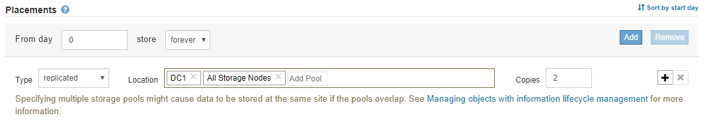

= 步驟2（共3步）：定義放置位置
:allow-uri-read: 
:icons: font
:imagesdir: ../media/

[role="lead"]
建立ILM規則精靈的步驟2（定義放置位置）可讓您定義放置指示、以決定物件的儲存時間、複本類型（複寫或銷毀編碼）、儲存位置及複本數量。

ILM規則可以包含一或多個放置指示。每項放置指示均適用於單一時間段。當您使用多個指示時、時間段必須是連續的、且至少必須在第0天開始一項指示。指令可以永遠繼續、或直到您不再需要任何物件複本為止。

如果您想要建立不同類型的複本、或在該期間使用不同的位置、每個放置指示都可以有多行。

本範例ILM規則會在第一年建立兩個複寫複本。每個複本都會儲存在不同站台的儲存資源池中。一年後、便會製作2+1銷毀編碼的複本、並僅儲存於一個站台。

image::../media/ilm_create_ilm_rule_wizard_2.png[建立ILM規則精靈第2頁]

.步驟
. 若為*參考時間*、請選取計算放置指示的開始時間時所使用的時間類型。
+
[cols="1a,2a"]
|===
| 選項 | 說明 

 a| 
擷取時間
 a| 
擷取物件的時間。

 a| 
上次存取時間
 a| 
上次擷取（讀取或檢視）物件的時間。

*附註：*若要使用此選項、必須針對S3儲存區或Swift容器啟用「上次存取時間」更新。請參閱 xref:using-last-access-time-in-ilm-rules.adoc[在ILM規則中使用上次存取時間]。

 a| 
非目前時間
 a| 
物件版本因擷取新版本而變成非目前版本的時間、並將其取代為目前版本。

*附註：*非目前時間僅適用於啟用版本管理的儲存區中的S3物件。

您可以使用此選項來篩選非目前物件版本、以降低版本控制物件的儲存影響。請參閱 xref:example-4-ilm-rules-and-policy-for-s3-versioned-objects.adoc[範例4：S3版本化物件的ILM規則和原則]。

 a| 
使用者定義的建立時間
 a| 
使用者定義中繼資料中指定的時間。

|===
+

NOTE: 如果您要建立相容規則、必須選取*擷取時間*。

. 在「*刊登位置*」區段中、選取第一時間段的開始時間和持續時間。
+
例如、您可能想要指定第一年的物件儲存位置（「365天0」）。至少必須在第0天開始執行一項指示。

. 若要建立複寫複本：
+
.. 從*類型*下拉式清單中、選取*複寫*。
.. 在「*位置*」欄位中、針對您要新增的每個儲存資源池、選取*「新增資源池」。
+
*如果您只指定一個儲存資源池*、請注意StorageGRID 、在任何指定的儲存節點上、只能儲存物件的一個複製複本。如果您的網格包含三個儲存節點、而您選取4作為複本數、則只會製作三份複本、每個儲存節點只會製作一份複本。

+

NOTE: 觸發「無法實現的ILM放置」警示、表示無法完全套用ILM規則。

+
*如果您指定多個儲存資源池*、請謹記下列規則：

+
*** 複本數量不得大於儲存資源池數量。
*** 如果複本數量等於儲存資源池數量、則每個儲存資源池中會儲存一個物件複本。
*** 如果複本數量少於儲存資源池數量、系統會散佈複本、以在資源池之間維持磁碟使用量的平衡、同時確保站台不會獲得一個物件的多個複本。
*** 如果儲存資源池重疊（包含相同的儲存節點）、則物件的所有複本可能只會儲存在一個站台。因此、請勿指定預設的All Storage Node儲存資源池和其他儲存資源池。
+

.. 選取您要製作的份數。
+
如果您將複本數目變更為1、就會出現警告。ILM規則只會在任何時間段建立一個複寫複本、使資料有永久遺失的風險。請參閱 xref:why-you-should-not-use-single-copy-replication.adoc[為何不應使用單一複製複寫]。

+
image::../media/ilm_create_ilm_rule_warning_for_1_copy.png[建立ILM規則第2頁警告、適用於1份複本]

+
若要避免這些風險、請執行下列一項或多項操作：

+
*** 增加期間的複本數量。
*** 選取加號圖示 image:../media/icon_plus_sign_black_on_white.gif["加上白色上的黑色符號"] 可在期間內建立額外的複本。然後選取不同的儲存資源池或雲端儲存資源池。
*** 為類型選擇*銷毀編碼*、而非*複寫*。如果此規則已為所有時間段建立多個複本、您可以安全地忽略此警告。

.. 如果您只指定一個儲存資源池、請忽略*暫用位置*欄位。
+

NOTE: 暫用位置已過時、將在未來的版本中移除。請參閱 xref:using-storage-pool-as-temporary-location-deprecated.adoc[使用儲存資源池做為暫用位置（已過時）]。

. 如果您要建立銷毀編碼複本：
+
.. 從*類型*下拉式清單中、選取*銷毀編碼*。
+
複本數量會變更為1。如果規則沒有進階篩選條件、無法忽略200 KB或更小的物件、則會出現警告。

+
image::../media/ilm_rule_warning_for_ec_size.png[EC大小的ILM規則警告]

+

IMPORTANT: 銷毀編碼最適合大於1 MB的物件。請勿針對小於200 KB的物件使用銷毀編碼、以避免管理非常小的銷毀編碼片段。

.. 如果出現物件大小警告、請選取*上一步*以返回步驟1。然後選取*進階篩選*、並將物件大小（MB）篩選器設定為大於0.2的任何值。
.. 選取儲存位置。
+
銷毀編碼複本的儲存位置包括儲存資源池名稱、後面接著「刪除編碼」設定檔名稱。

+
image::../media/storage_pool_and_erasure_coding_profile.png[儲存資源池和EC設定檔名稱]

. 或者、您也可以在不同位置新增不同的時段或建立額外的複本：
+
** 選取加號圖示、可在同一時間段內在不同位置建立額外的複本。
** 選取*「Add*（新增*）」、將不同的時間段新增至放置指示。
+

NOTE: 物件會在最終期間結束時自動刪除、除非最終期間以* forever *結束。

. 若要將物件儲存在雲端儲存資源池中：
+
.. 從*類型*下拉式清單中、選取*複寫*。
.. 在*位置*欄位中、選取*新增資源池*。然後選取雲端儲存資源池。
+
image::../media/ilm_cloud_storage_pool.gif[將Cloud Storage Pool新增至放置指示]

+
使用雲端儲存資源池時、請謹記下列規則：

+
*** 您無法在單一放置指示中選取多個雲端儲存池。同樣地、您也無法在相同的放置指示中選取Cloud Storage Pool和儲存資源池。
+
image::../media/ilm_cloud_storage_pool_error.gif[ILM規則>雲端儲存資源池錯誤]

*** 您只能在任何指定的Cloud Storage Pool中儲存物件的一份複本。如果您將*份數*設為2個以上、就會出現錯誤訊息。
+
image::../media/ilm_cloud_storage_pool_error_one_copy.gif[ILM規則：如果有多個複本、雲端儲存池就會發生錯誤]

*** 您無法同時在任何雲端儲存資源池中儲存多個物件複本。如果使用雲端儲存資源池的多個放置位置日期重疊、或同一放置位置的多行使用雲端儲存資源池、則會出現錯誤訊息。
+
image::../media/ilm_rule_cloud_storage_pool_error_overlapping_dates.png[ILM Rule Cloud Storage Pool錯誤重疊日期]

*** 您可以將物件儲存在Cloud Storage Pool中、同時將物件儲存為StorageGRID 用作邊複製或刪除邊編碼的複本。不過、如本範例所示、您必須在期間的放置指示中包含多行、以便為每個位置指定複本的數量和類型。
+
image::../media/ilm_cloud_storage_pool_multiple_locations.png[ILM規則>雲端儲存資源池和其他位置]

. 選擇* Refresh*（重新整理*）以更新保留圖並確認您的放置指示。
+
圖表中的每一行都會顯示物件複本的放置位置和時間。複本類型以下列其中一個圖示表示：

+
[cols="1a,2a"]
|===

 a| 
image:../media/icon_nms_replicated.gif["複寫複本的圖示"]
 a| 
複寫複本

 a| 
image:../media/icon_nms_erasure_coded.gif["銷毀編碼複本的圖示"]
 a| 
銷毀編碼複本

 a| 
image:../media/icon_cloud_storage_pool.gif["雲端儲存資源池圖示"]
 a| 
雲端儲存資源池複本

|===
+
在此範例中、兩個複寫複本會儲存至兩個儲存資源池（DC1和DC2）一年。然後、使用6 + 3個站台的銷毀編碼方案、再將銷毀編碼複本儲存10年。11年後、這些物件將會從StorageGRID 無法恢復的地方刪除。

+
image::../media/ilm_rule_retention_diagram.png[ILM規則保留圖]

. 選擇*下一步*。
+
此時會出現步驟3（定義擷取行為）。

.相關資訊
* xref:what-ilm-rule-is.adoc[什麼是ILM規則]
* xref:managing-objects-with-s3-object-lock.adoc[使用S3物件鎖定來管理物件]
* xref:step-3-of-3-define-ingest-behavior.adoc[步驟3之3：定義擷取行為]

