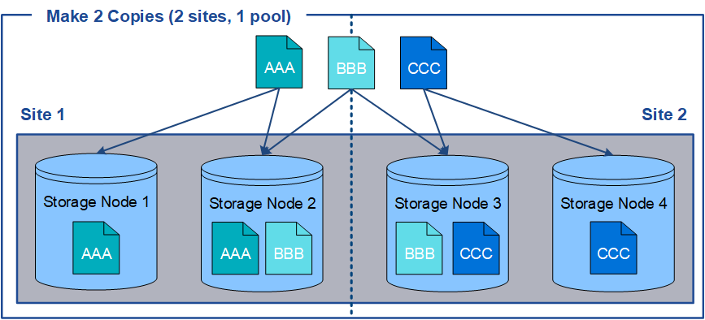
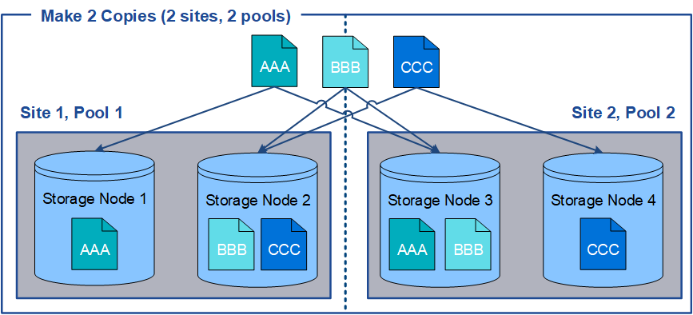

= 使用多個儲存資源池進行跨站台複寫
:allow-uri-read: 
:icons: font
:imagesdir: ../media/

[role="lead"]
如果StorageGRID 您的靜態部署包含多個站台、您可以為每個站台建立儲存資源池、並在規則的放置指示中指定兩個儲存資源池、以啟用站台遺失保護。例如、如果您將ILM規則設定為製作兩個複寫複本、並在兩個站台指定儲存資源池、則每個站台都會放置一個物件複本。如果您將規則設定為製作兩個複本、並指定三個儲存資源池、則複本會分散以平衡儲存資源池之間的磁碟使用量、同時確保兩個複本儲存在不同的站台。

下列範例說明如果ILM規則將複寫的物件複本放到包含兩個站台之儲存節點的單一儲存集區、會發生什麼情況。由於系統在放置複本時會使用儲存池中的任何可用節點、因此可能只會將部分物件的所有複本放在其中一個站台內。在此範例中、系統會在站台1的儲存節點上儲存兩份物件aaa複本、並在站台2的儲存節點上儲存兩份物件ccc複本。只有物件BBB在其中一個站台故障或無法存取時才受到保護。

相反地、此範例說明當您使用多個儲存資源池時、物件的儲存方式。在範例中、ILM規則指定要建立每個物件的兩個複寫複本、並將複本分散到兩個儲存集區。每個儲存資源池都包含單一站台的所有儲存節點。由於每個物件的複本都儲存在每個站台、因此物件資料可受到保護、避免站台故障或無法存取。

使用多個儲存資源池時、請謹記下列規則：

* 如果您要建立n個複本、則必須新增n個或更多儲存資源池。例如、如果規則設定為製作三個複本、則必須指定三個以上的儲存資源池。
* 如果複本數量等於儲存資源池數量、則每個儲存資源池中會儲存一個物件複本。
* 如果複本數量少於儲存資源池數量、系統會散佈複本、以在資源池之間維持磁碟使用量的平衡、並確保兩個以上的複本不會儲存在相同的儲存資源池中。
* 如果儲存資源池重疊（包含相同的儲存節點）、則物件的所有複本可能只會儲存在一個站台。您必須確保所選的儲存資源池不包含相同的儲存節點。

