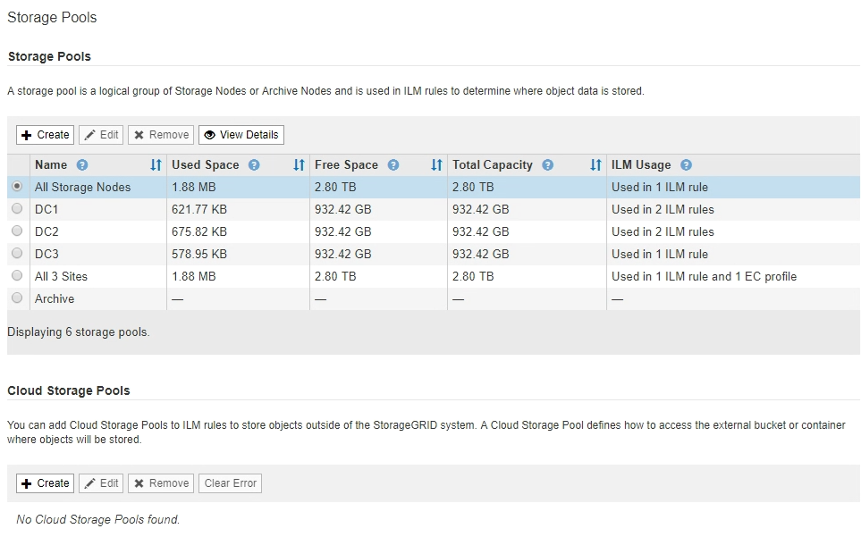

= 檢視儲存資源池詳細資料
:allow-uri-read: 
:icons: font
:imagesdir: ../media/

[role="lead"]
您可以檢視儲存資源池的詳細資料、以判斷儲存資源池的使用位置、並查看其中包含哪些節點和儲存等級。

.您需要的產品
* 您將使用登入Grid Manager xref:../admin/web-browser-requirements.adoc[支援的網頁瀏覽器]。
* 您擁有特定的存取權限。

.步驟
. 選擇* ILM *>* Storage Pools*。
+
此時將出現「儲存資源池」頁面。本頁列出所有已定義的儲存資源池。

+

+
下表包含每個包含儲存節點的儲存資源池的下列資訊：

+
** *名稱*：儲存資源池的唯一顯示名稱。
** *已用空間*：目前用於儲存資源池中物件的空間量。
** *可用空間*：儲存資源池中仍可用於儲存物件的空間量。
** *總容量*：儲存資源池的大小、等於儲存資源池中所有節點的物件資料可用空間總量。
** * ILM使用率*：儲存資源池目前的使用方式。儲存資源池可能未使用、也可能用於一或多個ILM規則、刪除編碼設定檔或兩者。
+

NOTE: 如果正在使用儲存資源池、則無法將其移除。

. 若要檢視特定儲存資源池的詳細資料、請選取其選項按鈕、然後選取*檢視詳細資料*。
+
此時將出現Storage Pool Details（儲存資源池詳細資料）模式。

. 檢視*包含節點*索引標籤、瞭解儲存資源池中包含的儲存節點或歸檔節點。
+
image::../media/storage_pools_details_nodes.png[儲存資源池詳細資料節點]

+
下表包含每個節點的下列資訊：

+
** 節點名稱
** 站台名稱
** 已使用（%）：對於儲存節點、已使用物件資料的可用空間總量百分比。此值不包含物件中繼資料。
+

NOTE: 每個儲存節點的「使用的儲存設備-物件資料」圖表中也會顯示相同的使用率（%）值（選取「*節點*」>「*儲存節點_*」>「*儲存設備*」）。

. 選取「* ILM使用率*」索引標籤、以判斷儲存資源池目前是否正在任何ILM規則或「刪除編碼」設定檔中使用。
+
在此範例中、DC1儲存資源池用於三個ILM規則：兩個規則位於作用中ILM原則中、另一個規則不在作用中原則中。

+
image::../media/storage_pools_details_ilm.png[儲存資源池詳細資料ILM]

+

NOTE: 如果儲存集區是在ILM規則中使用、則無法將其移除。

+
在此範例中、「所有3個站台」儲存資源池用於「刪除編碼」設定檔。而在作用中ILM原則中、有一個ILM規則會使用「刪除編碼」設定檔。

+
image::../media/storage_pools_details_ilm_ec.png[儲存資源池詳細資料ILM EC]

+

NOTE: 如果儲存資源池用於「刪除編碼」設定檔、您就無法移除該儲存資源池。

. 或者、前往* ILM Rules（ILM規則）頁面*、瞭解及管理使用儲存資源池的任何規則。
+
請參閱《ILM規則使用說明》。

. 檢視完儲存資源池詳細資料後、請選取*關閉*。

.相關資訊
xref:working-with-ilm-rules-and-ilm-policies.adoc[使用ILM規則和ILM原則]
