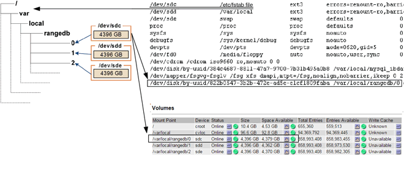

= 識別並卸載故障的儲存磁碟區
:allow-uri-read: 
:icons: font
:imagesdir: ../media/

[role="lead"]
在恢復儲存磁碟區故障的儲存節點時、您必須識別並卸載故障的磁碟區。您必須確認只有故障的儲存磁碟區才會重新格式化為還原程序的一部分。

您必須使用登入Grid Manager xref:../admin/web-browser-requirements.adoc[支援的網頁瀏覽器]。

您應該儘快恢復故障的儲存磁碟區。

恢復程序的第一步是偵測已分離、需要卸載或發生I/O錯誤的磁碟區。如果故障的磁碟區仍附加在磁碟區中、但檔案系統隨機毀損、則系統可能無法偵測到磁碟未使用或未分配的部分有任何毀損。

NOTE: 您必須先完成此程序、再執行手動步驟來恢復磁碟區、例如新增或重新連接磁碟、停止節點、啟動節點或重新開機。否則、當您執行「REformat_storage block_devices.rb」指令碼時、可能會遇到檔案系統錯誤、導致指令碼當機或失敗。

NOTE: 在執行「重新開機」命令之前、請先修復硬體並正確連接磁碟。

CAUTION: 請仔細識別故障的儲存磁碟區。您將使用此資訊來驗證哪些磁碟區必須重新格式化。磁碟區重新格式化之後、就無法恢復磁碟區上的資料。

若要正確恢復故障的儲存磁碟區、您必須知道故障儲存磁碟區的裝置名稱及其Volume ID。

安裝時、每個儲存設備都會指派一個檔案系統通用唯一識別碼（UUID）、並使用指派的檔案系統UUID掛載至儲存節點上的rangedb目錄。檔案系統UUID和rangedb目錄會列在「etc/stabs」檔案中。Grid Manager中會顯示裝置名稱、rangedb目錄、以及掛載磁碟區的大小。

在以下範例中、裝置'dev/sdc'的磁碟區大小為4 TB、會以裝置名稱'/dev/disk/by-uid/822b057-3b2b-472e-ad5e-e1cf1809faba'安裝在/'/'/fst'檔案中：

.步驟
. 完成下列步驟、記錄故障的儲存磁碟區及其裝置名稱：
+
.. 選取*支援*>*工具*>*網格拓撲*。
.. 選擇*站台*>*故障儲存節點*>* LdR*>*儲存設備*>*總覽*>*主節點*、然後尋找具有警示的物件存放區。
+
image::../media/ldr_storage_object_stores.gif[物件存放區區區段]

.. 選擇*站台*>*故障儲存節點*>* SES*>*資源*>*總覽*>*主節點*。確定上一步中識別的每個故障儲存磁碟區的掛載點和磁碟區大小。
+
物件存放區以六角表示法編號。例如、0000是第一個Volume、000F是第16個Volume。在此範例中、ID為0000的物件存放區對應於名稱為sdc且大小為107 GB的/var/local/rangedb/0'。

+
image::../media/ssm_storage_volumes.gif[顯示物件存放區和掛載點的範例]

. 登入故障儲存節點：
+
.. 輸入下列命令：「sh admin@_grid_node_ip_`」
.. 輸入「passwords.txt」檔案中所列的密碼。
.. 輸入下列命令以切換至root：「u -」
.. 輸入「passwords.txt」檔案中所列的密碼。

+
以root登入時、提示會從「$」變更為「#」。

. 執行下列指令碼、以停止儲存服務並卸載故障的儲存磁碟區：
+
「n-unmount Volume object_store_ID」

+
「object_store_ID」是故障儲存磁碟區的ID。例如、在ID為0000的物件存放區命令中指定「0」。

. 如果出現提示、請按* y*停止儲存節點上的儲存服務。
+

NOTE: 如果儲存服務已經停止、系統不會提示您。Cassandra服務僅針對Volume 0停止。

+
image::../media/unmount_failed_storage_volume.png[卸載故障儲存Volume]

+
幾秒鐘後、儲存服務就會停止、磁碟區就會卸載。畫面上會出現訊息、指出程序的每個步驟。最後一則訊息表示磁碟區已卸載。

