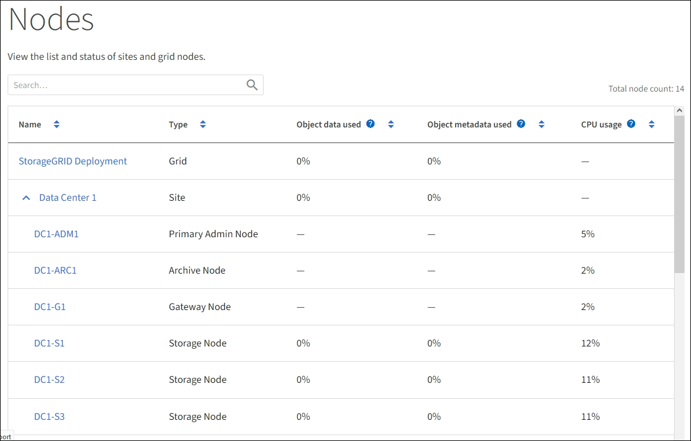

= 啟動網格節點
:allow-uri-read: 
:icons: font
:imagesdir: ../media/

[role="lead"]
完成關機後、請依照此順序啟動網格節點。

.您需要的是 #8217 ；需要的是什麼

CAUTION: 如果整個網格已關閉超過15天、您必須在啟動任何網格節點之前聯絡技術支援部門。請勿嘗試重建Cassandra資料的還原程序。否則可能導致資料遺失。

如有可能、您應依下列順序開啟網格節點電源：

* 先將電力套用至管理節點。
* 最後將電力套用至閘道節點。

NOTE: 如果主機包含多個網格節點、則當您開啟主機電源時、節點會自動恢復連線。

.步驟
. 開啟主要管理節點和任何非主要管理節點的主機。
+

NOTE: 在重新啟動儲存節點之前、您將無法登入管理節點。

. 開啟所有歸檔節點和儲存節點的主機電源。
+
您可以依任何順序開啟這些節點。

. 開啟所有閘道節點的主機電源。
. 登入Grid Manager。
. 選取*節點*並監控網格節點的狀態。確認節點名稱旁沒有警示圖示。
+

