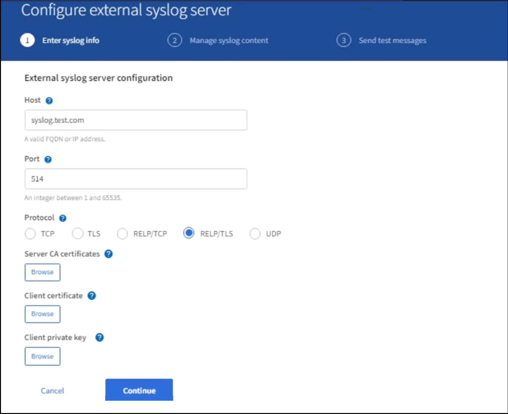
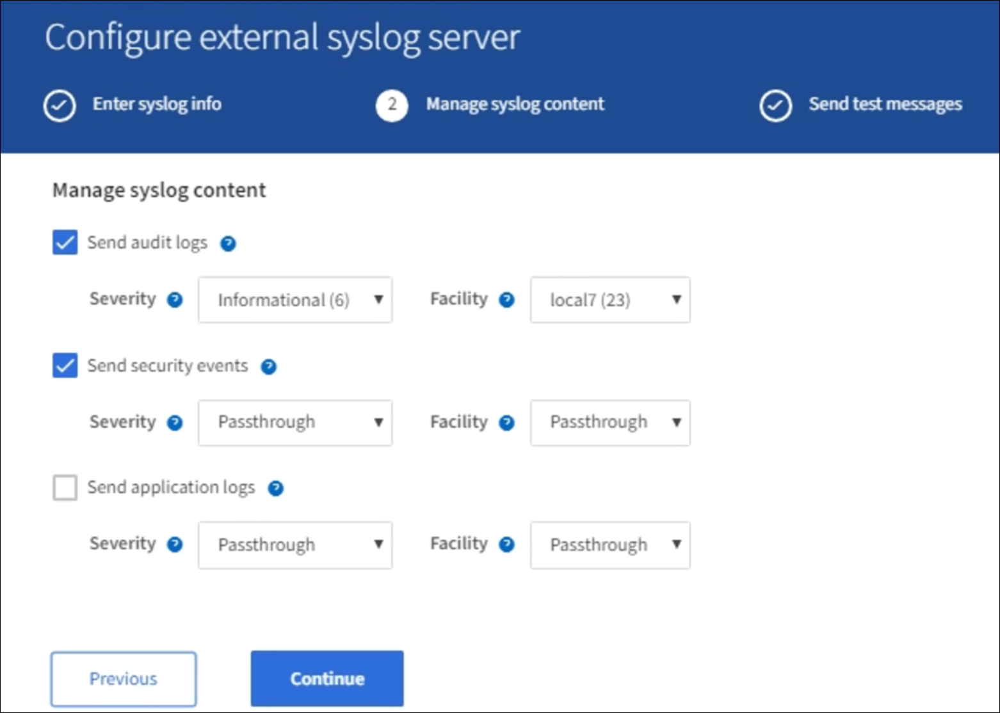

= 設定外部syslog伺服器
:allow-uri-read: 
:icons: font
:imagesdir: ../media/

[role="lead"]
如果您想要將稽核記錄、應用程式記錄和安全性事件記錄儲存到網格以外的位置、請使用此程序來設定外部syslog伺服器。

.您需要的是 #8217 ；需要的是什麼
* 您將使用登入Grid Manager xref:../admin/web-browser-requirements.adoc[支援的網頁瀏覽器]。
* 您具有「維護」或「根」存取權限。
* 您有一部具備接收及儲存記錄檔容量的syslog伺服器。如需詳細資訊、請參閱 xref:../monitor/considerations-for-external-syslog-server.adoc[外部syslog伺服器的考量]。
* 如果您計畫使用TLS或RELP/TLS、則您擁有正確的伺服器和用戶端認證。

如果您想要傳送稽核資訊到外部syslog伺服器、則必須先設定外部伺服器。

將稽核資訊傳送至外部syslog伺服器、可讓您：

* 更有效率地收集和管理稽核資訊、例如稽核訊息、應用程式記錄和安全性事件
* 減少管理節點上的網路流量、因為稽核資訊會直接從不同的儲存節點傳輸到外部syslog伺服器、而不需要經過管理節點
+

CAUTION: 當記錄傳送至外部syslog伺服器時、訊息結尾處會截短大於8192位元組的單一記錄、以符合外部syslog伺服器實作的一般限制。

+

NOTE: 為了在外部syslog伺服器發生故障時、將完整資料還原的選項最大化、每個節點上最多可維護20GB的稽核記錄本機記錄（localremote.log）。

+

NOTE: 如果此程序中可用的組態選項不夠靈活、無法滿足您的需求、則可使用私有API「稽核目的地」端點套用其他組態選項。例如、不同節點群組可以使用不同的syslog伺服器。

== 存取syslog伺服器組態精靈

.步驟
. 選擇*組態*>*監控*>*稽核與系統記錄伺服器*。
+
image::../media/audit-messages-main-page.png[稽核訊息主頁]

. 從「稽核與系統記錄伺服器」頁面、選取*「設定外部系統記錄伺服器*」。如果您先前已設定外部syslog伺服器、請選取*編輯外部syslog伺服器*。

=== 輸入syslog資訊

. 在「*主機*」欄位中、輸入外部syslog伺服器的有效完整網域名稱或IPv6位址。
. 輸入外部syslog伺服器上的目的地連接埠（必須是介於1和6555之間的整數）。預設連接埠為514。
. 選取用於傳送稽核資訊至外部syslog伺服器的傳輸協定。
+
建議使用TLS或RELP/TLS。您必須上傳伺服器憑證、才能使用上述任一選項。

+
使用憑證有助於保護網格與外部syslog伺服器之間的連線。如需詳細資訊、請參閱 xref:../admin/using-storagegrid-security-certificates.adoc[使用StorageGRID 資訊安全證書]。

+
所有的傳輸協定選項都需要外部syslog伺服器的支援和組態。您必須選擇與外部syslog伺服器相容的選項。

+

NOTE: 可靠的事件記錄傳輸協定（RELP）可延伸系統記錄傳輸協定的功能、以提供可靠的事件訊息傳輸。如果您的外部syslog伺服器必須重新啟動、使用RELP有助於防止稽核資訊遺失。

. 選擇*繼續*。
. [[attach認證]如果您選取* TLS*或* RELP/TLS*、請上傳下列認證：
+
** *伺服器CA憑證*：一或多個用於驗證外部系統記錄伺服器的信任CA憑證（以PEEM編碼）。如果省略、則會使用預設的Grid CA憑證。您在這裡上傳的檔案可能是CA套裝組合。
** *用戶端憑證*：用於驗證外部syslog伺服器的用戶端憑證（以PEEM編碼）。
** *用戶端私密金鑰*：用戶端憑證的私密金鑰（以PEEM編碼）。
+

NOTE: 如果您使用用戶端憑證、也必須使用用戶端私密金鑰。如果您提供加密的私密金鑰、也必須提供密碼。使用加密的私密金鑰並無顯著的安全效益、因為必須儲存金鑰和通關密碼；建議使用未加密的私密金鑰（若有）、以簡化操作。

+
... 選取*瀏覽*以取得您要使用的憑證或金鑰。
... 選取憑證檔案或金鑰檔。
... 選取*「Open*（開啟*）」上傳檔案。

+
憑證或金鑰檔名稱旁會出現綠色勾號、通知您已成功上傳。

. 選擇*繼續*。

=== 管理系統記錄內容

. 選取您要傳送至外部syslog伺服器的每種稽核資訊類型。
+
** *傳送稽核記錄*：StorageGRID 不完整的事件與系統活動
** *傳送安全性事件*：安全性事件、例如未獲授權的使用者嘗試登入或使用者以root身分登入
** *傳送應用程式記錄*：可用於疑難排解的記錄檔包括：
+
*** bycast-err.log
*** bycast.log
*** jaeger.log
*** nms.log（僅限管理節點）
*** prometheus.log
*** raft.log
*** hagroups.log

. 使用下拉式功能表、為您要傳送的稽核資訊類別選取嚴重性和設施（訊息類型）。
+
如果您選擇* Passthsthsthation*作為嚴重性和設施、則傳送至遠端syslog伺服器的資訊將會收到與登入本機節點時相同的嚴重性和設施。設定設施和嚴重性可協助您以可自訂的方式彙總記錄、以便更輕鬆地進行分析。

+

NOTE: 如需StorageGRID 有關各項功能的詳細資訊、請參閱 xref:../monitor/storagegrid-software-logs.adoc#[軟體記錄StorageGRID]。

+
.. 對於*嚴重性*、如果您希望傳送至外部系統記錄的每則訊息嚴重性值與本機系統記錄中的嚴重性值相同、請選取* Passthsth*。
+
對於稽核記錄、如果您選取* Passthsthon*、嚴重性為「info.」。

+
對於安全性事件、如果您選取* Passthsth*、嚴重性值會由節點上的Linux發佈套件產生。

+
對於應用程式記錄、如果您選取* Passthsthon*、則「資訊」與「通知」之間的嚴重性會因問題而異。例如、新增NTP伺服器並設定HA群組時、會提供「資訊」值、而刻意停止「超短訊」或「超短訊」服務則會提供「通知」值。

.. 如果您不想使用傳遞值、請選取介於0和7之間的嚴重性值。
+
選取的值將套用至此類型的所有訊息。當您選擇以固定值覆寫嚴重性時、會遺失不同嚴重性的相關資訊。

+
[cols="1a,3a"]
|===
| 嚴重性 | 說明 

 a| 
0
 a| 
緊急：系統無法使用

 a| 
1.
 a| 
警示：必須立即採取行動

 a| 
2.
 a| 
關鍵：關鍵條件

 a| 
3.
 a| 
錯誤：錯誤情況

 a| 
4.
 a| 
警告：警告條件

 a| 
5.
 a| 
注意：正常但重要的情況

 a| 
6.
 a| 
資訊：資訊訊息

 a| 
7.
 a| 
偵錯：偵錯層級的訊息

|===
.. 對於* Facility *、如果您希望傳送至外部syslog的每則訊息具有與本機syslog相同的設施值、請選取* Passthsth*。
+
對於稽核記錄、如果您選取* Passthid*、則傳送至外部syslog伺服器的設施為「local7」。

+
對於安全事件、如果您選取* Passthsth*、則設施值會由節點上的Linux發佈套件產生。

+
對於應用程式記錄、如果您選取* Passthsthsth*、則傳送至外部syslog伺服器的應用程式記錄檔具有下列設施值：

+
[cols="1a,2a"]
|===
| 應用程式記錄 | 傳遞值 

 a| 
bycast.log
 a| 
使用者或精靈

 a| 
bycast-err.log
 a| 
使用者、精靈、local3或local4

 a| 
jaeger.log
 a| 
local2

 a| 
nms.log
 a| 
local3

 a| 
prometheus.log
 a| 
本地4

 a| 
raft.log
 a| 
本地5.

 a| 
hagroups.log
 a| 
local6.

|===
.. 如果您不想使用傳遞值、請選取0到23之間的設施值。
+
選取的值將套用至此類型的所有訊息。當您選擇以固定值覆寫設施時、將會遺失有關不同設施的資訊。

+
[cols="1a,3a"]
|===
| 設施 | 說明 

 a| 
0
 a| 
KERN（核心訊息）

 a| 
1.
 a| 
使用者（使用者層級訊息）

 a| 
2.
 a| 
郵件

 a| 
3.
 a| 
精靈（系統精靈）

 a| 
4.
 a| 
驗證（安全性/授權訊息）

 a| 
5.
 a| 
系統記錄（系統記錄所產生的訊息）

 a| 
6.
 a| 
LPR（線路印表機子系統）

 a| 
7.
 a| 
新聞（網路新聞子系統）

 a| 
8.
 a| 
uucp

 a| 
9.
 a| 
cron（時鐘精靈）

 a| 
10.
 a| 
安全性（安全性/授權訊息）

 a| 
11.
 a| 
FTP

 a| 
12.
 a| 
NTP

 a| 
13.
 a| 
記錄稽核（記錄稽核）

 a| 
14
 a| 
記錄警示（記錄警示）

 a| 
15
 a| 
時鐘（時鐘精靈）

 a| 
16
 a| 
local0

 a| 
17
 a| 
local1

 a| 
18
 a| 
local2

 a| 
19
 a| 
local3

 a| 
20
 a| 
本地4

 a| 
21
 a| 
本地5.

 a| 
22
 a| 
local6.

 a| 
23
 a| 
本地化7.

|===

. 選擇*繼續*。

=== 傳送測試訊息

image::../media/send-test-messages.png[傳送測試訊息]

開始使用外部syslog伺服器之前、您應該要求網格中的所有節點都將測試訊息傳送至外部syslog伺服器。您應該使用這些測試訊息來協助驗證整個記錄收集基礎架構、然後再將資料傳送至外部syslog伺服器。

CAUTION: 除非您確認外部syslog伺服器收到來自網格中每個節點的測試訊息、而且訊息已如預期般處理、否則請勿使用外部syslog伺服器組態。

. 如果您不想傳送測試訊息、而且確定外部syslog伺服器已正確設定、而且可以從網格中的所有節點接收稽核資訊、請選取*跳過並完成*。
+
此時會出現綠色橫幅、表示您的組態已成功儲存。

. 否則、請選取*傳送測試訊息*。
+
測試結果會持續顯示在頁面上、直到您停止測試為止。測試進行中時、您的稽核訊息會繼續傳送至先前設定的目的地。

. 如果您收到任何錯誤、請更正錯誤、然後再次選取*傳送測試訊息*。請參閱 xref:../monitor/troubleshooting-syslog-server.adoc[排除外部syslog伺服器的故障] 協助您解決任何錯誤。

. 請等到看到綠色橫幅、表示所有節點都已通過測試。
. 請檢查您的syslog伺服器、確定是否收到測試訊息、並按照預期處理。
+

IMPORTANT: 如果您使用的是udp、請檢查整個記錄收集基礎架構。此udp傳輸協定不允許像其他傳輸協定一樣嚴格的錯誤偵測。

. 選擇*停止並結束*。
+
您將返回到* Audit和syslog server*頁面。此時會出現綠色橫幅、通知您已成功儲存系統記錄伺服器組態。

+

NOTE: 除非您選取包含外部syslog伺服器的目的地、否則您的「不稽核資訊」不會傳送到外部syslog伺服器。StorageGRID

== 選取稽核資訊目的地

您可以指定安全性事件記錄、應用程式記錄和稽核訊息記錄的傳送位置。

NOTE: 如需StorageGRID 有關各項功能的詳細資訊、請參閱 xref:../monitor/storagegrid-software-logs.adoc#[軟體記錄StorageGRID]。

. 在「稽核與syslog伺服器」頁面上、從列出的選項中選取稽核資訊的目的地：
+
[cols="1a,2a"]
|===
| 選項 | 說明 

 a| 
預設（管理節點/本機節點）
 a| 
稽核訊息會傳送至管理節點上的稽核記錄（「稽核記錄」）、而安全性事件記錄和應用程式記錄則會儲存在產生它們的節點上（也稱為「本機節點」）。

 a| 
外部syslog伺服器
 a| 
稽核資訊會傳送至外部syslog伺服器、並儲存在本機節點上。傳送的資訊類型取決於您設定外部syslog伺服器的方式。只有在設定外部syslog伺服器之後、才會啟用此選項。

 a| 
管理節點和外部syslog伺服器
 a| 
稽核訊息會傳送至管理節點上的稽核記錄（「稽核記錄」）、稽核資訊會傳送至外部syslog伺服器、並儲存在本機節點上。傳送的資訊類型取決於您設定外部syslog伺服器的方式。只有在設定外部syslog伺服器之後、才會啟用此選項。

 a| 
僅限本機節點
 a| 
不會將稽核資訊傳送至管理節點或遠端syslog伺服器。稽核資訊只會儲存在產生該資訊的節點上。

*附註*：StorageGRID 此功能會定期移除這些本機記錄、以釋出空間。當節點的記錄檔達到1 GB時、會儲存現有檔案、並啟動新的記錄檔。記錄檔的旋轉限制為21個檔案。建立22版記錄檔時、會刪除最舊的記錄檔。每個節點平均儲存約20 GB的記錄資料。

|===

NOTE: 在每個本機節點上產生的稽核資訊會儲存在「/var/local/log/localnap審查 記錄」中

. 選擇*保存*。然後選取「確定」以接受對記錄目的地的變更。
. 如果您選擇*外部系統記錄伺服器*或*管理節點和外部系統記錄伺服器*作為稽核資訊的目的地、則會出現額外的警告。檢閱警告文字。

IMPORTANT: 您必須確認外部syslog伺服器可以接收測試StorageGRID 用的資訊。

. 選擇*確定*、確認您要變更稽核資訊的目的地。
+
此時會出現綠色橫幅、通知您稽核組態已成功儲存。

+
新記錄會傳送至您選取的目的地。現有記錄仍會保留在目前位置。

xref:../audit/index.adoc[稽核訊息總覽]

xref:../monitor/configure-audit-messages.adoc[設定稽核訊息和記錄目的地]

xref:../audit/system-audit-messages.adoc[系統稽核訊息]

xref:../audit/object-storage-audit-messages.adoc[物件儲存稽核訊息]

xref:../audit/management-audit-message.adoc[管理稽核訊息]

xref:../audit/client-read-audit-messages.adoc[用戶端讀取稽核訊息]

xref:../admin/index.adoc[管理StorageGRID]
