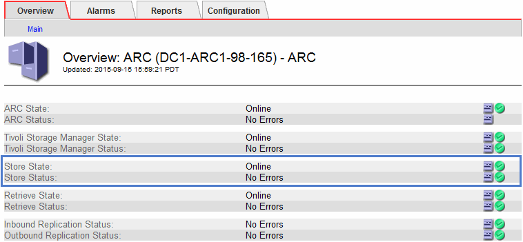

= 監控歸檔容量
:allow-uri-read: 
:icons: font
:imagesdir: ../media/

[role="lead"]
您無法透過StorageGRID 這個系統直接監控外部歸檔儲存系統的容量。不過、您可以監控歸檔節點是否仍可將物件資料傳送至歸檔目的地、這可能表示需要擴充歸檔媒體。

.您需要的是 #8217 ；需要的是什麼
* 您必須使用登入Grid Manager xref:../admin/web-browser-requirements.adoc[支援的網頁瀏覽器]。
* 您必須擁有特定的存取權限。

您可以監控Store元件、檢查歸檔節點是否仍可將物件資料傳送至目標歸檔儲存系統。儲存故障（ARVf）警示也可能表示目標歸檔儲存系統已達到容量、無法再接受物件資料。

.步驟
. 選取*支援*>*工具*>*網格拓撲*。
. 選擇「*歸檔節點_*>* ARC**>總覽*」>「主要*」。
. 請檢查「儲存狀態」和「儲存狀態」屬性、確認「儲存元件」為「線上」且無錯誤。
+

+
離線儲存區元件或有錯誤的元件、可能表示目標歸檔儲存系統已達到容量、因此無法再接受物件資料。

