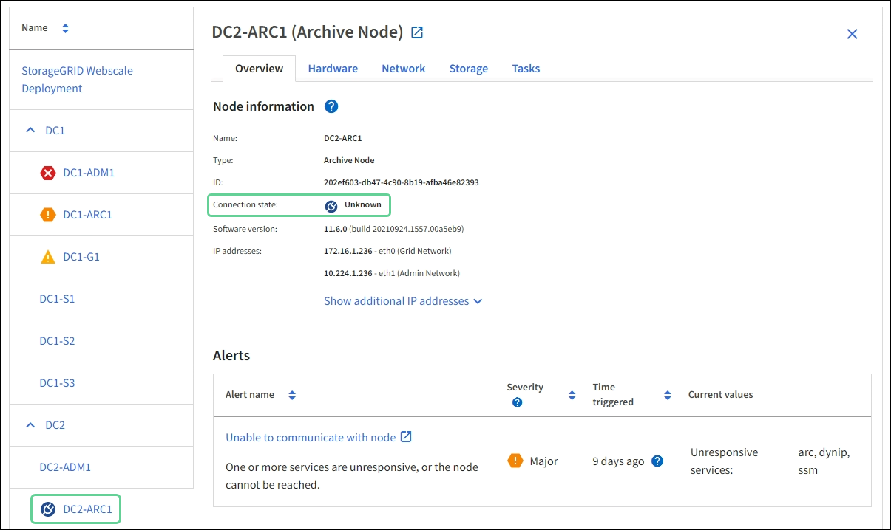

= 監控節點連線狀態
:allow-uri-read: 
:icons: font
:imagesdir: ../media/

[role="lead"]
如果一個或多個節點與網格中斷連線、關鍵StorageGRID 的功能不正常運作可能會受到影響。您必須監控節點連線狀態、並迅速解決任何問題。

.您需要的是 #8217 ；需要的是什麼
* 您必須使用登入Grid Manager xref:../admin/web-browser-requirements.adoc[支援的網頁瀏覽器]。

節點可以有三種連線狀態之一：

* *未連線-未知* image:../media/icon_alarm_blue_unknown.png["藍色問號圖示"]：節點由於不明原因而未連線至網格。例如、節點之間的網路連線中斷或電源中斷。也可能會觸發*無法與node*通訊警示。其他警示也可能處於作用中狀態。這種情況需要立即注意。
+

NOTE: 在託管關機作業期間、節點可能會顯示為「未知」。在這些情況下、您可以忽略「未知」狀態。

* *未連線-管理性關機* image:../media/icon_alarm_gray_administratively_down.png["灰色問號圖示"]：由於預期原因、節點未連線至網格。例如、節點或節點上的服務已正常關機、節點正在重新開機、或軟體正在升級。一個或多個警示也可能處於作用中狀態。
* *已連線* image:../media/icon_alert_green_checkmark.png["圖示警示綠色勾選標記"]：節點已連接至網格。

.步驟
. 如果儀表板的健全狀況面板上出現藍色或灰色圖示、請按一下圖示或按一下*網格詳細資料*。（藍色或灰色圖示和* Grid detail*連結只有在至少有一個節點與網格中斷連線時才會顯示。）
+
此時會出現節點樹狀結構中第一個藍色節點的「總覽」頁面。如果沒有藍色節點、則會出現樹狀結構中第一個灰色節點的「總覽」頁面。

+
在範例中、名為DC1-S3的儲存節點會顯示藍色圖示。節點資訊面板上的*連線狀態*為*未知*、且*無法與節點*通訊警示為作用中。警示表示一或多個服務沒有回應、或無法連線至節點。

+

. 如果節點有藍色圖示、請依照下列步驟操作：
+
.. 選取表格中的每個警示、然後遵循建議的動作。
+
例如、您可能需要重新啟動已停止或重新啟動節點主機的服務。

.. 如果您無法將節點重新連線、請聯絡技術支援部門。

. 如果節點有灰色圖示、請依照下列步驟操作：
+
在維護程序期間、可能會出現灰色節點、並可能與一或多個警示相關聯。根據潛在問題、這些「管理性關機」節點通常會在不需介入的情況下重新連線。

+
.. 檢閱警示區段、並判斷是否有任何警示影響此節點。
.. 如果有一或多個警示處於作用中狀態、請選取表格中的每個警示、然後遵循建議的動作。
.. 如果您無法將節點重新連線、請聯絡技術支援部門。

xref:alerts-reference.adoc[警示參考資料]

xref:../maintain/index.adoc[恢復與維護]
