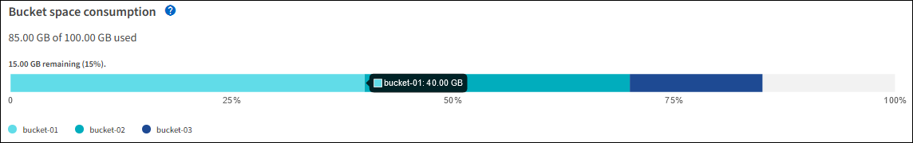
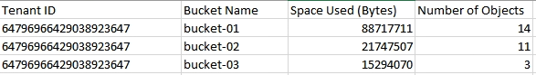

= 監控租戶活動
:allow-uri-read: 
:icons: font
:imagesdir: ../media/

[role="lead"]
所有用戶端活動都與租戶帳戶相關聯。您可以使用Grid Manager來監控租戶的儲存使用量或網路流量、也可以使用稽核記錄或Grafana儀表板來收集租戶使用StorageGRID 率的詳細資訊。

.您需要的產品
* 您將使用登入Grid Manager xref:../admin/web-browser-requirements.adoc[支援的網頁瀏覽器]。
* 您擁有root存取權或系統管理員權限。

.關於這項工作

IMPORTANT: 使用空間值為預估值。這些預估值會受到擷取時間、網路連線能力和節點狀態的影響。

.步驟
. 選取*租戶*以檢閱所有租戶使用的儲存容量。
+
每個租戶都會列出已使用的邏輯空間、配額使用率、配額和物件數。如果未為租戶設定配額、則配額使用率和配額欄位會包含破折號（&#8212；）。

+
image::../media/tenant_accounts_page.png[租戶帳戶頁面]

+
您可以選取登入連結來登入租戶帳戶 image:../media/icon_tenant_sign_in.png["租戶登入圖示"] 在表的*登入/複製URL*欄中。

+
您可以選取複製URL連結、複製租戶登入頁面的URL image:../media/icon_tenant_copy_url.png["租戶複製URL圖示"] 在表的*登入/複製URL*欄中。

. （可選）選擇*匯出至CSV*以檢視及匯出內含所有租戶使用值的.csv*檔案。
+
系統會提示您開啟或儲存「.csv"檔案。

+
CSV檔案的內容如下所示：

+
image::../media/tenant_accounts_example_csv.png[租戶帳戶範例為.csv]

+
您可以在試算表應用程式中開啟.csv檔案、或在自動化中使用。

. 若要檢視特定租戶的詳細資料、包括使用量圖表、請從「租戶」頁面中選取租戶帳戶名稱。
+
image::../media/tenant_usage_modal.png[租戶使用模式]

+
** *租戶總覽*
+
租戶的總覽區域包含物件數、配額使用率、使用的邏輯空間及配額設定值。

** *空間故障：空間消耗*
+
「空間明細」索引標籤包含貯體（S3）或Container（Swift）的總空間使用量值、以及每個貯體或Container的已用空間和物件數。

+
如果為此租戶設定配額、則所使用及剩餘的配額量會以文字顯示（例如「85.00 GB of 100 GB used」（使用100 GB的85.00 GB））。如果未設定配額、則租戶有無限配額、且文字僅包含使用的空間量（例如「85.00 GB已使用」）。長條圖會顯示每個儲存區或容器中的配額百分比。如果租戶超過儲存配額1%以上、而且至少1 GB、則圖表會顯示總配額和超額金額。

+
您可以將游標放在橫條圖上、以查看每個儲存桶或容器所使用的儲存設備。您可以將游標放在可用空間區段上、以查看剩餘的儲存配額量。

+

+

IMPORTANT: 配額使用率是根據內部預估、在某些情況下可能會超過。例如StorageGRID 、當租戶開始上傳物件時、會檢查配額、如果租戶超過配額、則會拒絕新的擷取。不過StorageGRID 、判斷是否超過配額時、不考慮目前上傳的大小。如果刪除物件、則在重新計算配額使用率之前、租戶可能會暫時無法上傳新物件。配額使用率計算可能需要10分鐘或更長時間。

+

NOTE: 租戶的配額使用率表示租戶上傳至StorageGRID 物件資料的總數量（邏輯大小）。配額使用率不代表用來儲存這些物件複本及其中繼資料（實體大小）的空間。

+

NOTE: 您可以啟用*租戶配額使用量高*警示、以判斷租戶是否正在使用配額。如果啟用、當租戶使用90%的配額時、就會觸發此警示。如需詳細資訊、請參閱警示參考資料。

** *空間分佈：儲存庫或容器詳細資料*
+
「*貯體詳細資料*（S3）」或「* Container詳細資料*（Swift）」表格會列出租戶的貯體或容器。「已用空間」是指儲存區或容器中的物件資料總量。此值不代表ILM複本和物件中繼資料所需的儲存空間。

. （可選）選擇*匯出至CSV*以檢視及匯出內含每個儲存區或容器使用值的.csv*檔案。
+
個別S3租戶的.csv檔案內容如下所示：

+

+
您可以在試算表應用程式中開啟.csv檔案、或在自動化中使用。

. 如果租戶已制定流量分類原則、請檢閱該租戶的網路流量。
+
.. 選擇*組態*>*網路*>*流量分類*。
+
「流量分類原則」頁面隨即出現、表中會列出現有的原則。

+
image::../media/traffic_classification_policies_main_screen_w_examples.png[圖表的流量原則範例]

.. 檢閱原則清單、找出適用於特定租戶的原則。
.. 若要檢視與原則相關的度量、請選取原則左側的選項按鈕、然後按一下* Metrics *。
.. 分析圖表、判斷原則限制流量的頻率、以及是否需要調整原則。
+
若要建立、編輯或刪除交通路況分類原則、請參閱《管理StorageGRID 》介紹。

. 您也可以選擇使用稽核日誌來更精細地監控租戶的活動。
+
例如、您可以監控下列類型的資訊：

+
** 特定的用戶端作業、例如PUT、Get或DELETE
** 物件大小
** 套用至物件的ILM規則
** 用戶端要求的來源IP
+
稽核記錄會寫入文字檔、您可以使用所選的記錄分析工具進行分析。這可讓您更深入瞭解客戶活動、或實作精密的計費與計費模式。

+
如需詳細資訊、請參閱瞭解稽核訊息的指示。

. 您也可以使用Prometheus指標來報告租戶活動：
+
** 在Grid Manager中、選取*支援*>*工具*>*指標*。您可以使用現有的儀表板（例如S3 Overview）來檢閱用戶端活動。
+

IMPORTANT: 「指標」頁面上提供的工具主要供技術支援使用。這些工具中的某些功能和功能表項目是刻意無法運作的。

** 從Grid Manager的頂端選取說明圖示、然後選取* API Documentation *。您可以使用Grid Management API的「度量」區段中的度量、為租戶活動建立自訂警示規則和儀表板。

.相關資訊
xref:alerts-reference.adoc[警示參考資料]

xref:../audit/index.adoc[檢閱稽核記錄]

xref:../admin/index.adoc[管理StorageGRID]

xref:reviewing-support-metrics.adoc[檢視支援指標]
