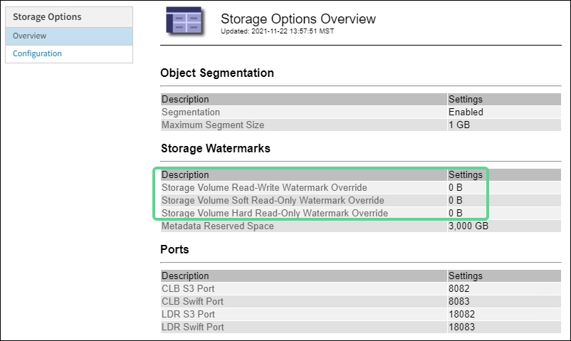

= 疑難排解低唯讀浮水印會覆寫警示
:allow-uri-read: 
:icons: font
:imagesdir: ../media/

[role="lead"]
如果您使用儲存Volume浮點的自訂值、則可能需要解決*低唯讀浮點置換*警示。如果可能、您應該更新系統、以開始使用最佳化的值。

在先前的版本中、這三個 xref:../admin/what-storage-volume-watermarks-are.adoc[儲存Volume浮點] 是全域設定和#8212；每個儲存節點上的每個儲存磁碟區都會套用相同的值。從供應到供應的供應功能中、軟體可根據儲存節點的大小和磁碟區的相對容量、針對每個儲存磁碟區最佳化這些浮點。StorageGRID

當您升級StorageGRID 至更新為版本611.6,除非下列任一項為真、否則最佳化的唯讀和讀寫浮水印會自動套用至所有儲存Volume：

* 您的系統接近容量、如果套用最佳化的浮水印、就無法接受新資料。在此情況下、不會變更浮水印設定。StorageGRID
* 您先前已將任何儲存Volume浮點設為自訂值。無法使用最佳化的值覆寫自訂浮水印設定。StorageGRID不過StorageGRID 、如果您的儲存Volume軟式唯讀浮水印自訂值太小、則可能會觸發*低唯讀浮水印置換*警示。

== 瞭解警示

如果您將自訂值用於儲存Volume浮點、則可能會針對一個或多個儲存節點觸發*低唯讀浮點置換*警示。

每個警示執行個體都表示*儲存Volume軟式唯讀浮點*的自訂值小於該儲存節點的最小最佳化值。如果您繼續使用自訂設定、儲存節點可能會在極低的空間中執行、然後才能安全地轉換至唯讀狀態。當節點達到容量時、部分儲存磁碟區可能無法存取（自動卸載）。

例如、假設您先前已將*儲存磁碟區軟式唯讀浮點*設定為5 GB。現在假設StorageGRID 、針對儲存節點A中的四個儲存磁碟區、已計算出下列最佳化值：

[cols="1a,1a"]
|===

 a| 
Volume 0
 a| 
12 GB

 a| 
Volume 1
 a| 
12 GB

 a| 
Volume 2
 a| 
11 GB

 a| 
Volume 3
 a| 
15 GB

|===
儲存節點A會觸發*低唯讀浮水印overroverride *警示、因為您的自訂浮水印（5 GB）小於該節點中所有磁碟區的最小最佳化值（11 GB）。如果您繼續使用自訂設定、節點可能會在極低的空間中執行、然後才能安全地轉換至唯讀狀態。

== 解決警示

如果觸發了一或多個*低唯讀浮水印置換*警示、請遵循下列步驟。如果您目前使用自訂浮水印設定、而且想要開始使用最佳化設定、即使沒有觸發警示、也可以使用這些指示。

.您需要的產品
* 您已完成StorageGRID 升級至版本611..
* 您將使用登入Grid Manager xref:../admin/web-browser-requirements.adoc[支援的網頁瀏覽器]。
* 您擁有root存取權限。

.關於這項工作
您可以將自訂浮水印設定更新為新的浮水印覆寫、以解決*低唯讀浮水印覆寫*警示。不過、如果一或多個儲存節點接近完整容量、或是您有特殊的ILM需求、您應該先檢視最佳化的儲存浮水印、然後判斷使用它們是否安全。

=== 評估整個網格的物件資料使用量

. 選擇*節點*。
. 針對網格中的每個站台、展開節點清單。
. 檢閱每個站台之每個儲存節點的「*物件資料已使用*」欄中所顯示的百分比值。
+
image::../media/nodes_page_object_data_used_with_alert.png[節點頁面、顯示3個SnS使用的物件資料]

. 如果所有的儲存節點都未接近完整（例如、所有*使用的物件資料*值都低於80%）、您可以開始使用置換設定。前往 <<使用最佳化的浮水印>>。
+

NOTE: 這項一般規則有一些例外情況。例如、如果ILM規則使用嚴格的擷取行為、或是特定的儲存資源池即將滿、您應該先執行中的步驟 <<檢視最佳化的儲存浮水印>> 和 <<判斷您是否可以使用最佳化的浮水印>>。

. 如果再有一個儲存節點接近完整、請執行中的步驟 <<檢視最佳化的儲存浮水印>> 和 <<判斷您是否可以使用最佳化的浮水印>>。

=== 檢視最佳化的儲存浮水印

使用兩個Prometheus指標來顯示其針對*儲存Volume軟式唯讀浮點*所計算的最佳化值。StorageGRID您可以檢視網格中每個儲存節點的最小和最大最佳化值。

. 選取*支援*>*工具*>*指標*。
. 在Prometheus區段中、選取連結以存取Prometheus使用者介面。
. 若要查看建議的最小軟式唯讀浮水印、請輸入下列Prometheus指標、然後選取*執行*：
+
「toragegRid_Storage_volume最小值_最佳化_軟體_readonly浮水印」

+
最後一欄顯示每個儲存節點上所有儲存磁碟區的軟式唯讀浮點的最小最佳化值。如果此值大於*儲存磁碟區軟式唯讀浮點*的自訂設定、則會針對儲存節點觸發*低唯讀浮點置換*警示。

. 若要查看建議的最大軟式唯讀浮水印、請輸入下列Prometheus指標、然後選取*執行*：
+
「toragegRid_Storage_Volume最大值_imized_soft_readonly浮水印」

+
最後一欄顯示每個儲存節點上所有儲存磁碟區的軟式唯讀浮點的最大最佳化值。

. [[maximized_value]請注意每個儲存節點的最大最佳化值。

=== 判斷您是否可以使用最佳化的浮水印

. 選擇*節點*。
. 針對每個線上儲存節點重複這些步驟：
+
.. 選擇「*儲存節點_*>*儲存設備*」。
.. 向下捲動至「物件存放區」表格。
.. 比較每個物件存放區（Volume）的*可用*值、以及您針對該儲存節點所記錄的最佳化浮水印上限。

. 如果每個線上儲存節點上至少有一個磁碟區的可用空間大於該節點的最佳化浮水印上限、請前往 <<使用最佳化的浮水印>> 開始使用最佳化的浮水印。
+
否則、 xref:../expand/index.adoc[擴充網格] 越快越好。將儲存磁碟區新增至現有節點、或新增儲存節點。然後前往 <<使用最佳化的浮水印>> 以更新浮水印設定。

. 如果您需要繼續使用儲存Volume浮水印的自訂值、 xref:../monitor/silencing-alert-notifications.adoc[靜音] 或 xref:../monitor/disabling-alert-rules.adoc[停用] *低唯讀浮水印置換*警示。
+

NOTE: 每個儲存節點上的每個儲存磁碟區都會套用相同的自訂浮水印值。如果將小於建議值的儲存Volume浮點用於儲存磁碟區、則當節點達到容量時、可能會導致部分儲存磁碟區無法存取（自動卸載）。

=== 使用最佳化的浮水印

. 轉至*組態*>*系統*>*儲存選項*。
. 從Storage Options（儲存選項）功能表中選取* Configuration（組態）*。
. 將三個浮點覆寫全部變更為0。
. 選取*套用變更*。

根據儲存節點的大小和Volume的相對容量、每個儲存Volume的最佳化儲存Volume浮水印設定現在都有效。

