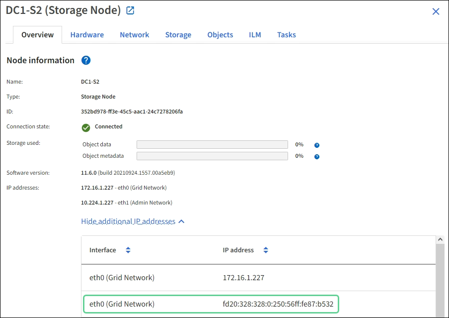

= 疑難排解網路、硬體及平台問題
:allow-uri-read: 
:icons: font
:imagesdir: ../media/

[role="lead"]
您可以執行多項工作、以協助判斷StorageGRID 與故障有關的問題來源。

== 疑難排解「4222：無法處理的實體」錯誤

錯誤4222：無法處理的實體可能會在許多情況下發生。請查看錯誤訊息、以判斷您的問題是由何種原因造成的。

如果您看到列出的錯誤訊息之一、請採取建議的行動。

[cols="2a,2a"]
|===
| 錯誤訊息 | 根本原因與修正行動 

 a| 
[listing]
----
422: Unprocessable Entity

Validation failed. Please check
the values you entered for
errors. Test connection failed.
Please verify your
configuration. Unable to
authenticate, please verify
your username and password:
LDAP Result Code 8 "Strong
Auth Required": 00002028:
LdapErr: DSID-0C090256,
comment: The server requires
binds to turn on integrity
checking if SSL\TLS are not
already active on the
connection, data 0, v3839
---- a| 
如果您在使用Windows Active Directory（AD）設定身分識別聯盟時、選取「傳輸層安全性（TLS）」*「不要使用TLS*」選項、就可能會出現此訊息。

不支援使用*「不使用TLS*」選項來搭配執行LDAP簽署的AD伺服器使用。您必須選取*使用ARTTLS*選項或*使用LDAPS*選項來使用TLS。

 a| 
[listing]
----
422: Unprocessable Entity

Validation failed. Please check
the values you entered for
errors. Test connection failed.
Please verify your
configuration.Unable to
begin TLS, verify your
certificate and TLS
configuration: LDAP Result
Code 200 "Network Error":
TLS handshake failed
    (EOF)
---- a| 
如果您嘗試使用不受支援的密碼、將傳輸層安全性（TLS）連線從StorageGRID 支援的內部系統、連接到用於識別聯盟或雲端儲存資源池的外部系統、則會出現此訊息。

檢查外部系統提供的密碼。系統必須使用StorageGRID 由支援的其中一個加密器進行傳出TLS連線、如管理StorageGRID 資訊所示。

|===
xref:../admin/index.adoc[管理StorageGRID]

== 疑難排解Grid Network MTU不相符警示

當Grid Network介面（eth0）的最大傳輸單位（MTU）設定在網格中的各個節點之間大幅不同時、就會觸發* Grid Network MTU mismis*警示。

MTU設定的差異可能代表部分（但並非全部）eth0網路已設定為使用巨型框架。MTU大小不相符的值大於1000、可能會導致網路效能問題。

.步驟
. 列出所有節點上eth0的MTU設定。
+
** 使用Grid Manager中提供的查詢。
** 瀏覽至「主要管理節點IP位址」/「指標/圖表」、然後輸入下列查詢：「node_network_MTU字節｛interface='eth0｝」

. 視需要修改MTU設定、以確保所有節點上的Grid Network介面（eth0）都相同。
+
** 如需應用裝置節點、請參閱應用裝置的安裝與維護說明。
** 對於基於Linux和VMware的節點、請使用下列命令：「+usr/sbin/change-ip.py（-h）[-n node] MTU network [network...]+'
+
*範例*：「change-ip.py -n節點1500 GRID管理」

+
*附註*：在Linux型節點上、如果容器內網路所需的MTU值超過主機介面上已設定的值、您必須先設定主機介面、使其具有所需的MTU值、 然後使用「change-ip.py」指令碼來變更容器中網路的MTU值。

+
請使用下列引數來修改Linux或VMware節點上的MTU。

+
[cols="2a,2a"]
|===
| 位置引數 | 說明 

 a| 
"Motu"
 a| 
要設定的MTU。必須介於1280至9216之間。

 a| 
網路
 a| 
要套用MTU的網路。包括下列一種或多種網路類型：

*** 網格
*** 管理
*** 用戶端

|===
+
[cols="2a,2a"]
|===
| 選用引數 | 說明 

 a| 
「-h、–help」
 a| 
顯示說明訊息並結束。

 a| 
n節點、--node-node-'
 a| 
節點。預設值為本機節點。

|===

xref:../sg100-1000/index.adoc[SG100與SG1000服務應用裝置]

xref:../sg6000/index.adoc[SG6000儲存設備]

xref:../sg5700/index.adoc[SG5700儲存設備]

xref:../sg5600/index.adoc[SG5600儲存設備]

== 疑難排解網路接收錯誤（NERRER）警示

網路接收錯誤（NERRE）警示可能是StorageGRID 由於故障導致的、例如在連接到您的網路硬體時發生問題。在某些情況下、NERRER錯誤可以在不需手動介入的情況下清除。如果錯誤不清楚、請採取建議的行動。

NERRER警示可能是因為下列連線StorageGRID 到該產品的網路硬體問題所導致：

* 需要轉送錯誤修正（FEC）、且不使用
* 交換器連接埠和NIC MTU不符
* 高連結錯誤率
* NIC環狀緩衝區溢位

.步驟
. 請依照您的網路組態、針對NERRER警示的所有可能原因、遵循疑難排解步驟。
+
** 如果錯誤是由FEC不相符所造成、請執行下列步驟：
+
*附註*：這些步驟僅適用於StorageGRID 因FEC不相符而導致的NERR,適用於各種應用。

+
... 檢查連接StorageGRID 到您的產品的交換器連接埠的FEC狀態。
... 檢查從設備到交換器的纜線實體完整性。
... 如果您想要變更FEC設定以嘗試解決NERR警示、請先確認StorageGRID 應用裝置已設定為* Auto*模式、位於《ENFR應用裝置安裝程式連結組態》頁面（請參閱應用裝置的安裝與維護說明）。然後變更交換器連接埠上的FEC設定。如果可能、該產品連接埠會調整其FEC設定。StorageGRID
+
（您無法在StorageGRID 不包含任何功能的應用裝置上設定FEC設定。相反地、應用裝置會嘗試探索並鏡射其所連接之交換器連接埠上的FEC設定。如果鏈路被迫達到25-GbE或100-GbE網路速度、交換器和NIC可能無法協調通用的FEC設定。如果沒有通用的FEC設定、網路就會回到「no FEC」模式。若未啟用FEC、則連線更容易受到電子雜訊所造成的錯誤影響。）

+
*附註* StorageGRID ：此產品支援Firecode（FC）和Reed Solomon（RS）FEC、以及無FEC。

+
** 如果錯誤是由交換器連接埠和NIC MTU不符所造成、請檢查節點上設定的MTU大小是否與交換器連接埠的MTU設定相同。
+
節點上設定的MTU大小可能小於節點所連接之交換器連接埠上的設定。如果StorageGRID 某個站台接收的乙太網路訊框大於其MTU（此組態可能有此功能）、則可能會報告NERRER警示。如果您認為這是發生的情況、請根據StorageGRID 端點對端點MTU的目標或需求、變更交換器連接埠的MTU以符合該網路介面MTU、或變更StorageGRID 該網路介面的MTU以符合交換器連接埠。

+

IMPORTANT: 為獲得最佳網路效能、所有節點都應在其Grid Network介面上設定類似的MTU值。如果個別節點上Grid Network的MTU設定有顯著差異、則會觸發* Grid Network MTU mismis*警示。所有網路類型的MTU值都不一定相同。

+

NOTE: 若要變更MTU設定、請參閱應用裝置的安裝與維護指南。

** 如果錯誤是由高連結錯誤率所造成、請執行下列步驟：
+
... 啟用FEC（若尚未啟用）。
... 確認您的網路纜線品質良好、而且未損壞或連接不當。
... 如果纜線似乎不是問題所在、請聯絡技術支援部門。
+

NOTE: 您可能會注意到、在電子雜訊較高的環境中、錯誤率很高。

** 如果錯誤是NIC環緩衝區溢位、請聯絡技術支援部門。
+
當無法及時處理網路事件時、當整個過程中出現過多的問題時、環狀緩衝區可能會發生溢位StorageGRID 。

. 解決基礎問題之後、請重設錯誤計數器。
+
.. 選取*支援*>*工具*>*網格拓撲*。
.. 選擇*站台_*>*網格節點_*>* SES*>*資源*>*組態*>*主*。
.. 選擇*重設接收錯誤計數*、然後按一下*套用變更*。

,疑難排解Grid Network MTU不相符警示

xref:alarms-reference.adoc[警示參考（舊系統）]

xref:../sg6000/index.adoc[SG6000儲存設備]

xref:../sg5700/index.adoc[SG5700儲存設備]

xref:../sg5600/index.adoc[SG5600儲存設備]

xref:../sg100-1000/index.adoc[SG100與SG1000服務應用裝置]

== 疑難排解時間同步錯誤

您可能會在網格中看到時間同步的問題。

如果您遇到時間同步問題、請確認您已指定至少四個外部NTP來源、每個來源都提供階層3或更好的參考資料、而且所有外部NTP來源都正常運作、StorageGRID 且可由您的支援節點存取。

NOTE: 指定外部NTP來源進行正式作業層級StorageGRID 的安裝時、請勿在Windows Server 2016之前的Windows版本上使用Windows Time（W32Time）服務。舊版Windows上的時間服務不夠準確、Microsoft不支援在StorageGRID 高準確度環境中使用、例如：

xref:../maintain/index.adoc[恢復與維護]

== Linux：網路連線問題

您可能會發現StorageGRID Linux主機上裝載的架構網格節點的網路連線問題。

=== MAC位址複製

在某些情況下、可使用MAC位址複製來解決網路問題。如果您使用的是虛擬主機、請在節點組態檔中將每個網路的MAC位址複製金鑰值設為「true」。此設定會使StorageGRID 不支援的容器的MAC位址使用主機的MAC位址。若要建立節點組態檔、請參閱平台安裝指南中的指示。

IMPORTANT: 建立獨立的虛擬網路介面、供Linux主機作業系統使用。如果StorageGRID Hypervisor上未啟用混雜模式、則在Linux主機作業系統和支援此功能的Container上使用相同的網路介面、可能會導致主機作業系統無法連線。

如需啟用MAC複製的詳細資訊、請參閱平台安裝指南中的指示。

=== 混雜模式

如果您不想使用MAC位址複製、而想要允許所有介面接收和傳輸非Hypervisor指派的MAC位址資料、 請確定虛擬交換器和連接埠群組層級的安全性內容已設定為*接受*、適用於混雜模式、MAC位址變更和假傳輸。虛擬交換器上設定的值可由連接埠群組層級的值覆寫、因此請確保兩個位置的設定都相同。

xref:../rhel/index.adoc[安裝Red Hat Enterprise Linux或CentOS]

xref:../ubuntu/index.adoc[安裝Ubuntu或DEBIAN]

== Linux：節點狀態為「孤立」

處於孤立狀態的Linux節點通常表示StorageGRID 、控制StorageGRID 節點容器的孤立服務或是由節點監控的節點監控程式、會在非預期情況下死亡。

如果Linux節點回報其處於孤立狀態、您應該：

* 檢查記錄中是否有錯誤和訊息。
* 嘗試重新啟動節點。
* 如有必要、請使用Container Engine命令來停止現有的節點容器。
* 重新啟動節點。

.步驟
. 檢查服務精靈和孤立節點的記錄、查看是否有明顯的錯誤或非預期結束的訊息。
. 以root身分或使用具有Sudo權限的帳戶登入主機。
. 嘗試執行下列命令、再次啟動節點：「$ Sudo StorageGRID Sudo節點start node-name'
+
 $ sudo storagegrid node start DC1-S1-172-16-1-172
+
如果節點是孤立的、則回應為

+
[listing]
----
Not starting ORPHANED node DC1-S1-172-16-1-172
----
. 從Linux停止Container引擎和任何控制的storagegrid節點程序。例如：「'show Docker stop --time輔助container名稱'
+
對於「秒」、請輸入您要等待容器停止的秒數（通常為15分鐘或更短）。例如：

+
[listing]
----
sudo docker stop --time 900 storagegrid-DC1-S1-172-16-1-172
----
. 重新啟動節點：StorageGRID 「不完整節點的起始節點名稱」
+
[listing]
----
storagegrid node start DC1-S1-172-16-1-172
----

== Linux：疑難排解IPv6支援

如果您在StorageGRID Linux主機上安裝了支援IPv6的節點、而且您注意到IPv6位址尚未如預期指派給節點容器、則可能需要在核心中啟用IPv6支援。

您可以在Grid Manager的下列位置查看已指派給網格節點的IPv6位址：

* 選取*節點*、然後選取節點。然後在「總覽」標籤上、選取「* IP位址*」旁的*「顯示更多」*。
+

* 選取*支援*>*工具*>*網格拓撲*。然後選取「*節點_*>* SUS*>* Resources *（*資源*）」。如果已指派IPv6位址、則會在「*網路位址*」區段的「IPv6位址」下方列出。

如果未顯示IPv6位址、且節點已安裝在Linux主機上、請依照下列步驟在核心中啟用IPv6支援。

.步驟
. 以root身分或使用具有Sudo權限的帳戶登入主機。
. 執行下列命令：「yscll net.ipve.conf.all.disable_ipv6」
+
[listing]
----
root@SG:~ # sysctl net.ipv6.conf.all.disable_ipv6
----
+
結果應為0。

+
[listing]
----
net.ipv6.conf.all.disable_ipv6 = 0
----
+

NOTE: 如果結果不是0、請參閱作業系統的說明文件、以變更「syscll」設定。然後、請先將值變更為0再繼續。

. 進入StorageGRID 「不StorageGRID 完整節點」容器：「不完整節點輸入節點名稱」
. 執行下列命令：「yscll net.ipve.conf.all.disable_ipv6」
+
[listing]
----
root@DC1-S1:~ # sysctl net.ipv6.conf.all.disable_ipv6
----
+
結果應為1。

+
[listing]
----
net.ipv6.conf.all.disable_ipv6 = 1
----
+

NOTE: 如果結果不是1、則此程序不適用。聯絡技術支援。

. 離開容器：「exit」
+
[listing]
----
root@DC1-S1:~ # exit
----
. 以root用戶身份編輯下列檔案：「/var/lib/storagegRd/settings / syscl.d/net.conf」。
+
[listing]
----
sudo vi /var/lib/storagegrid/settings/sysctl.d/net.conf
----
. 找出下列兩行、並移除註解標記。然後儲存並關閉檔案。
+
[listing]
----
net.ipv6.conf.all.disable_ipv6 = 0
----
+
[listing]
----
net.ipv6.conf.default.disable_ipv6 = 0
----
. 執行下列命令以重新啟動StorageGRID 此資訊容器：
+
[listing]
----
storagegrid node stop node-name
----
+
[listing]
----
storagegrid node start node-name
----

