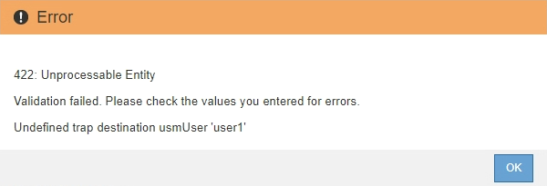

= 更新SNMP代理程式
:allow-uri-read: 
:icons: font
:imagesdir: ../media/

[role="lead"]
您可能想要停用SNMP通知、更新社群字串、或是新增或移除代理程式位址、USM使用者和陷阱目的地。

.您需要的是 #8217 ；需要的是什麼
* 您必須使用登入Grid Manager xref:../admin/web-browser-requirements.adoc[支援的網頁瀏覽器]。
* 您必須具有「根存取」權限。

每當您更新時 xref:configuring-snmp-agent.adoc[SNMP代理程式組態]請注意、您必須按一下「SNMP代理程式」頁面底部的*「儲存*」、以提交您在每個索引標籤上所做的任何變更。

.步驟
. 選擇*組態*>*監控*>* SNMP代理程式*。
+
此時會顯示「SNMP代理程式」頁面。

. 如果您要停用所有網格節點上的SNMP代理程式、請取消選取「*啟用SNMP*」核取方塊、然後按一下「*儲存*」。
+
所有網格節點的SNMP代理程式都會停用。如果稍後重新啟用代理程式、則會保留先前的任何SNMP組態設定。

. 或者、請更新您為*系統聯絡人*和*系統位置*所輸入的值。
. 或者、如果您不再想StorageGRID 讓S不明SNMP代理程式傳送陷阱和通知、請取消選取「*啟用SNMP代理程式通知*」核取方塊。
+
取消選取此核取方塊時、SNMP代理程式支援唯讀的MIB存取、但不會傳送任何SNMP通知。

. 或者、如果StorageGRID 您不想讓Setp SNMP代理程式在收到未正確驗證的傳輸協定訊息時傳送驗證陷阱、請取消選取「*啟用驗證陷阱*」核取方塊。
. 如果您使用的是SNMPv1或SNMPv2c、請選擇性地更新「社群字串」區段。
+
本節中的欄位用於在SNMPv1或SNMPv2c中進行社群型驗證。這些欄位不適用於v3。

+

NOTE: 如果您要移除預設的社群字串、必須先確定所有的陷阱目的地都使用自訂的社群字串。

. 如果您要更新代理程式位址、請選取「其他組態」區段中的「代理程式位址」索引標籤。
+
image::../media/snmp_other_configurations_agent_addresses_table.png[SNMP其他組態代理程式位址表]

+
使用此索引標籤可指定一或多個「偵聽位址」。 以下是SNMP代理程式可接收查詢的功能位址。StorageGRID每個代理程式位址都包含網際網路傳輸協定、傳輸傳輸協定、StorageGRID 一個EIP網路和一個連接埠。

+
.. 若要新增代理位址、請按一下*建立*。然後、請參閱設定SNMP代理程式說明中的代理程式位址步驟。
.. 若要編輯代理位址、請選取該位址的選項按鈕、然後按一下*編輯*。然後、請參閱設定SNMP代理程式說明中的代理程式位址步驟。
.. 若要移除代理位址、請選取該位址的選項按鈕、然後按一下*移除*。然後按一下*確定*以確認您要移除此地址。
.. 若要提交變更、請按一下「SNMP代理程式」頁面底部的*「儲存*」。

. 如果您要更新USM使用者、請選取「其他組態」區段中的「USM使用者」索引標籤。
+
image::../media/snmp_other_config_usm_users_table.png[SNMP其他組態USM使用者表格]

+
使用此索引標籤可定義有權查詢mib或接收陷阱和通知的USM使用者。

+
.. 若要新增USM使用者、請按一下「*建立*」。然後、請參閱設定SNMP代理程式說明中USM使用者的步驟。
.. 若要編輯USM使用者、請選取該使用者的選項按鈕、然後按一下*編輯*。然後、請參閱設定SNMP代理程式說明中USM使用者的步驟。
+
無法變更現有USM使用者的使用者名稱。如果您需要變更使用者名稱、則必須移除使用者並建立新的使用者名稱。

+

NOTE: 如果您新增或移除使用者的授權引擎ID、且目前已選取目的地的使用者、則必須依照步驟中所述、編輯或移除目的地 ,SNMP設陷目的地。否則、當您儲存SNMP代理程式組態時、就會發生驗證錯誤。

.. 若要移除USM使用者、請選取該使用者的選項按鈕、然後按一下*移除*。然後按一下*確定*以確認您要移除此使用者。
+

NOTE: 如果您移除的使用者目前已選取作為設陷目的地、您必須編輯或移除目的地、如步驟所述 ,SNMP設陷目的地。否則、當您儲存SNMP代理程式組態時、就會發生驗證錯誤。

+

.. 若要提交變更、請按一下「SNMP代理程式」頁面底部的*「儲存*」。

. [[SNMP陷阱目的地、start=9]]如果您要更新設陷目的地、請選取「其他組態」區段中的「設陷目的地」索引標籤。
+
image::../media/snmp_other_config_trap_dest_table.png[SNMP其他組態設陷目的地表格]

+
設陷目的地索引標籤可讓您定義一個或多個目的地、以供StorageGRID 捕捉或通知。啟用SNMP代理程式並按一下*「Save*」時StorageGRID 、即可開始傳送通知至每個定義的目的地。警示和警示觸發時會傳送通知。也會針對支援的MIB-II實體（例如ifdown和coldStart）傳送標準通知。

+
.. 若要新增設陷目的地、請按一下*「Create」（建立）*。然後、請參閱設定SNMP代理程式說明中的設陷目的地步驟。
.. 若要編輯設陷目的地、請選取使用者的選項按鈕、然後按一下*編輯*。然後、請參閱設定SNMP代理程式說明中的設陷目的地步驟。
.. 若要移除設陷目的地、請選取目的地的選項按鈕、然後按一下*移除*。然後按一下*確定*以確認您要移除此目的地。
.. 若要提交變更、請按一下「SNMP代理程式」頁面底部的*「儲存*」。

. 更新SNMP代理程式組態後、請按一下*「Save（儲存）」*。

