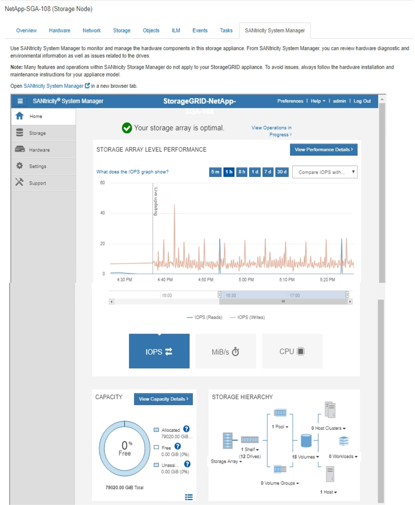

= 檢視SANtricity 「系統管理程式」索引標籤
:allow-uri-read: 
:icons: font
:imagesdir: ../media/

[role="lead"]
「支援系統管理程式」索引標籤可讓您存取《支援系統管理程式》、而無需設定或連接儲存應用裝置的管理連接埠。SANtricity SANtricity您可以使用此索引標籤來檢閱硬體診斷與環境資訊、以及與磁碟機相關的問題。

顯示儲存應用裝置節點的「系統管理程式」索引標籤。SANtricity

使用「系統管理程式」、您可以執行下列動作：SANtricity

* 檢視效能資料、例如儲存陣列層級效能、I/O延遲、儲存控制器CPU使用率及處理量
* 檢查硬體元件狀態
* 執行支援功能、包括檢視診斷資料及設定E系列AutoSupport 的功能

NOTE: 若要使用SANtricity 「物件系統管理員AutoSupport 」來設定E系列的Proxy、請參閱管理StorageGRID中的指示。

xref:../admin/index.adoc[管理StorageGRID]

若要SANtricity 透過Grid Manager存取「更新系統管理程式」、您必須擁有Storage Appliance管理員權限或「根存取權限」。

NOTE: 您必須擁有SANtricity 更新版本的韌體8.70才能SANtricity 使用Grid Manager存取《系統管理程式》。

IMPORTANT: 從SANtricity Grid Manager存取「支援系統管理程式」通常只是為了監控應用裝置硬體、以及設定E系列AutoSupport 的功能。許多功能和操作SANtricity 都不適用於監控StorageGRID 您的產品。為避免發生問題、請務必遵循設備的硬體安裝與維護指示。

索引標籤會顯示SANtricity 「系統管理程式」的首頁。

NOTE: 您可以使用SANtricity 「更新系統管理程式」連結、在SANtricity 新的瀏覽器視窗中開啟「更新系統管理程式」、以便更輕鬆地檢視。

若要查看儲存陣列層級效能與容量使用量的詳細資料、請將游標停留在每個圖表上。

如需更多有關檢視SANtricity 可從「還原系統管理程式」索引標籤存取資訊的詳細資訊、請參閱 https://mysupport.netapp.com/info/web/ECMP1658252.html["NetApp E系列與SANtricity 不完整的文件"^]。
