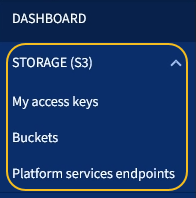

= 探索租戶管理程式
:allow-uri-read: 
:icons: font
:imagesdir: ../media/

[role="lead"]
租戶管理程式是以瀏覽器為基礎的圖形介面、租戶使用者可存取此介面來設定、管理及監控其儲存帳戶。

當租戶使用者登入租戶管理程式時、他們會連線至管理節點。

== 租戶管理程式儀表板

網格管理員使用Grid Manager或Grid Management API建立租戶帳戶之後、租戶使用者就可以登入租戶管理程式。

租戶管理程式儀表板可讓租戶使用者一目瞭然監控儲存使用量。「儲存使用」面板包含租戶最大的貯體（S3）或容器（Swift）清單。「已用空間」值是指儲存區或容器中的物件資料總量。長條圖代表這些貯體或容器的相對大小。

長條圖上方顯示的值是租戶所有貯體或容器所使用空間的總和。如果在建立帳戶時指定租戶可用的GB、TB或PB上限、也會顯示已使用及剩餘的配額量。

image::../media/tenant_dashboard_with_buckets.png[租戶管理程式儀表板]

== 儲存功能表（僅限S3租戶）

儲存功能表僅提供給S3租戶帳戶。此功能表可讓S3使用者管理存取金鑰、建立及刪除儲存區、以及管理平台服務端點。

=== 我的存取金鑰

S3租戶使用者可以管理存取金鑰、如下所示：

* 擁有「管理您自己的S3認證」權限的使用者、可以建立或移除自己的S3存取金鑰。
* 擁有「根存取」權限的使用者可以管理S3根帳戶的存取金鑰、自己的帳戶及所有其他使用者。除非儲存區原則明確停用、否則根存取金鑰也能提供租戶的儲存區和物件的完整存取權。
+

NOTE: 管理其他使用者的存取金鑰是從「存取管理」功能表進行。

=== 桶

具有適當權限的S3租戶使用者可以執行下列與貯體相關的工作：

* 建立貯體
* 為新的儲存區啟用S3物件鎖定（假設StorageGRID 已啟用S3物件鎖定功能以供整個系統使用）
* 更新一致性層級設定
* 套用預設保留設定
* 設定跨來源資源共用（CORS）
* 針對屬於租戶的貯體啟用和停用上次存取時間更新設定
* 刪除空的儲存區
* 使用管理儲存庫中的物件 xref:../tenant/use-s3-console.adoc[S3主控台處於實驗階段]

如果網格管理員已啟用使用租戶帳戶的平台服務、具有適當權限的S3租戶使用者也可以執行下列工作：

* 設定S3事件通知、可傳送至支援AWS Simple Notification Service™（SNS）的目的地服務。
* 設定CloudMirror複寫、讓租戶能夠自動將物件複寫到外部S3儲存區。
* 設定搜尋整合、每當物件建立、刪除或更新中繼資料或標記時、會將物件中繼資料傳送至目的地搜尋索引。

=== 平台服務端點

如果網格管理員已針對租戶帳戶啟用平台服務、具有「管理端點」權限的S3租戶使用者就能為每個平台服務設定目的地端點。

== 存取管理功能表

「存取管理」功能表可讓StorageGRID 無權從聯盟身分識別來源匯入使用者群組、並指派管理權限。租戶也可以管理本機租戶群組和使用者、除非整個StorageGRID 作業系統都有單一登入（SSO）功能。

image::../media/access_management_menu.png[存取管理功能表]

.相關資訊
* xref:exploring-grid-manager.adoc[瀏覽Grid Manager]
* xref:../tenant/index.adoc[使用租戶帳戶]

