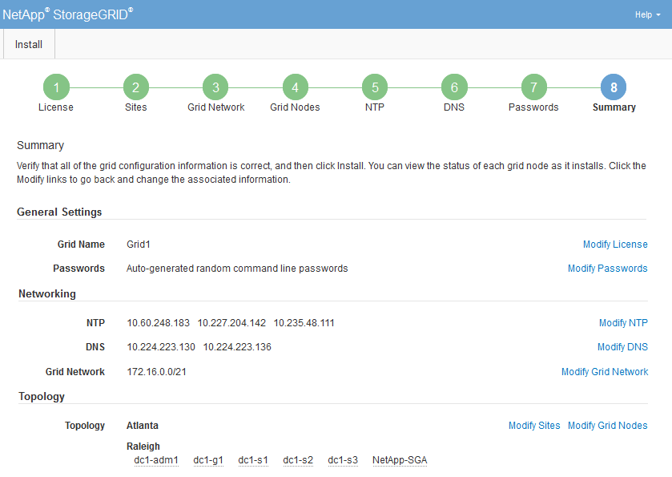
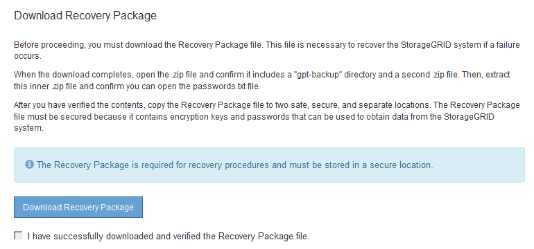

= 檢閱組態並完成安裝
:allow-uri-read: 
:icons: font
:imagesdir: ../media/

[role="lead"]
您必須仔細檢閱輸入的組態資訊、以確保安裝順利完成。

.步驟
. 查看* Summary（摘要）*頁面。
+

. 確認所有網格組態資訊均正確無誤。使用「摘要」頁面上的「修改」連結、即可返回並修正任何錯誤。
. 按一下「*安裝*」。
+

NOTE: 如果節點已設定為使用用戶端網路、則當您按一下「*安裝*」時、該節點的預設閘道會從Grid Network切換至用戶端網路。如果失去連線、您必須確保透過可存取的子網路存取主要管理節點。請參閱 xref:../network/index.adoc[網路準則] 以取得詳細資料。

. 按一下*下載恢復套件*。
+
當安裝程序移至定義網格拓撲的位置時、系統會提示您下載「恢復套件」檔案（`.Zip）、並確認您可以成功存取此檔案的內容。您必須下載「恢復套件」檔案、以便StorageGRID 在一個或多個網格節點發生故障時、恢復該系統。安裝會在背景中繼續進行、但StorageGRID 您必須下載並驗證此檔案、才能完成安裝並存取該系統。

. 確認您可以擷取「.zip」檔案的內容、然後將其儲存在兩個安全、安全且獨立的位置。
+

IMPORTANT: 必須保護恢復套件檔案、因為其中包含可用於從StorageGRID 該系統取得資料的加密金鑰和密碼。

. 選取「*我已成功下載並驗證還原套件檔案*」核取方塊、然後按一下「*下一步*」。
+

+
如果安裝仍在進行中、則會顯示狀態頁面。此頁面會指出每個網格節點的安裝進度。

+
image::../media/12_gmi_installer_status_page.gif[此影像由周邊文字說明。]

+
當到達所有網格節點的完整階段時、會出現Grid Manager的登入頁面。

. 使用「root」使用者和您在安裝期間指定的密碼登入Grid Manager。

