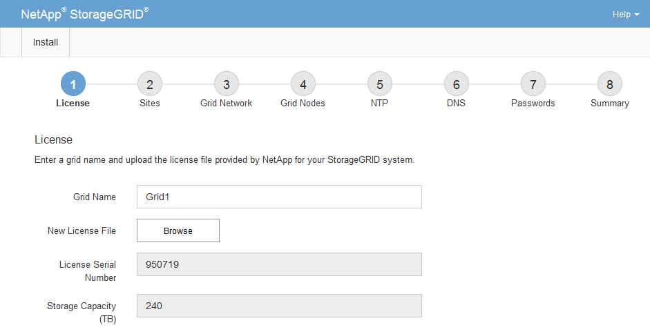

= 指定StorageGRID 不含授權的資訊
:allow-uri-read: 
:icons: font
:imagesdir: ../media/

[role="lead"]
您必須指定StorageGRID 您的系統名稱、並上傳NetApp提供的授權檔案。

.步驟
. 在「授權」頁面上StorageGRID 、於* Grid Name*中輸入您的一套有意義的系統名稱。
+
安裝後、名稱會顯示在節點功能表頂端。

. 按一下「*瀏覽*」、找到NetApp授權檔案（「NLfunie_id.txt'）、然後按一下「*開啟*」。
+
授權檔案已驗證、並顯示序號和授權儲存容量。

+

NOTE: 此產品的安裝歸檔包含免費授權、不提供任何產品的支援權利。StorageGRID您可以更新至安裝後提供支援的授權。

+

. 單擊 * 下一步 * 。

