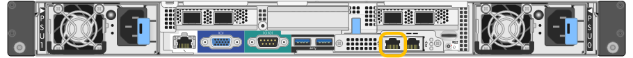
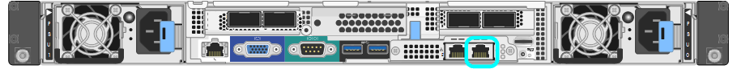

= 存取StorageGRID 產品安裝程式
:allow-uri-read: 
:icons: font
:imagesdir: ../media/

[role="lead"]
您必須存取StorageGRID 《不景設備安裝程式》、才能設定應用裝置與StorageGRID 三個靜態網路之間的連線：Grid Network（網格網路）、管理網路（選用）和用戶端網路（選用）。

.您需要的產品
* 您正在使用任何可連線StorageGRID 至「管理員網路」的管理用戶端。
* 用戶端有 xref:../admin/web-browser-requirements.adoc[支援的網頁瀏覽器]。
* 服務應用裝置已連線StorageGRID 至您計畫使用的所有支援網。
* 您知道這些網路上服務應用裝置的IP位址、閘道和子網路。
* 您已設定要使用的網路交換器。

.關於這項工作
若要一開始存取StorageGRID 《NetApp應用裝置安裝程式》、您可以使用服務應用裝置上管理網路連接埠的DHCP指派IP位址（假設已連線至管理網路）、也可以將服務筆記型電腦直接連線至服務應用裝置。

.步驟
. 如有可能、請使用服務應用裝置上管理網路連接埠的DHCP位址來存取StorageGRID 《支援應用程式安裝程式（NetApp®NetApp®
+
* SG100管理網路連接埠*

+

+
* SG1000管理網路連接埠*

+
image::../media/sg1000_admin_network_port.png[SG1000上的管理網路連接埠]

+
.. 找出服務器設備正面的MAC位址標籤、然後判斷管理網路連接埠的MAC位址。
+
MAC位址標籤會列出BMC管理連接埠的MAC位址。

+
若要判斷管理網路連接埠的MAC位址、您必須將* 2 *新增至標籤上的十六進位數字。例如、如果標籤上的MAC位址以* 09 *結尾、則管理連接埠的MAC位址將以* 0B*結尾。如果標籤上的MAC位址以*（_y_）FF*結尾、則管理連接埠的MAC位址將以*（_y_+1*）結尾。您可以在Windows中開啟「計算機」、將其設定為「程式設計師」模式、選取「Hex」、輸入MAC位址、然後輸入*+ 2 =*、輕鬆完成此計算。

.. 請將MAC位址提供給網路管理員、以便他們在管理網路上查詢設備的DHCP位址。
.. 從用戶端輸入StorageGRID 此URL以取得《不適用的應用程式》安裝程式：+、* https://_services-appliance_IP_:8443*`
+
若為「_services應用裝置IP」、請使用DHCP位址。

.. 如果系統提示您輸入安全性警示、請使用瀏覽器的安裝精靈來檢視及安裝憑證。
+
下次存取此URL時、警示不會出現。

+
畫面會出現「the不再安裝StorageGRID 程式」首頁。第一次存取此頁面時顯示的資訊和訊息、取決於您的應用裝置目前如何連線StorageGRID 至各個網站。可能會出現錯誤訊息、稍後將予以解決。

. 或者、如果您無法使用DHCP取得IP位址、請使用連結本機連線來存取StorageGRID 《應用程式安裝程式（Cisco Appliance Installer）」。
+
.. 使用乙太網路纜線、將服務型筆記型電腦直接連接至服務應用裝置最右側的RJ-45連接埠。
+
* SG100連結本機連線*

+
image::../media/sg100_link_local_port.png[SG100連結本機連線]

+
* SG1000連結本機連線*

+

.. 開啟網頁瀏覽器。
.. 輸入StorageGRID 此URL以取得《SUREASEAppliance Installer》：+`*\https://169.254.0.1:8443*`
+
畫面會出現「the不再安裝StorageGRID 程式」首頁。第一次存取此頁面時顯示的資訊和訊息、取決於您的應用裝置目前如何連線StorageGRID 至各個網站。可能會出現錯誤訊息、稍後將予以解決。

+

NOTE: 如果無法透過連結本機連線存取首頁、請將服務筆記型電腦的IP位址設定為「169.254.0.2」、然後再試一次。

. 檢閱首頁上顯示的任何訊息、並視需要設定連結組態和IP組態。
+
image::../media/appliance_installer_home_services_appliance.png[應用裝置安裝程式首頁- SG100和SG1000]

