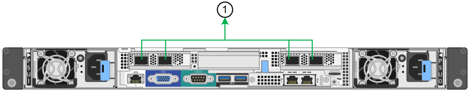

= 設定網路連結（SG100和SG1000）
:allow-uri-read: 
:icons: font
:imagesdir: ../media/

[role="lead"]
您可以設定用於將應用裝置連線至Grid Network、用戶端網路和管理網路的連接埠網路連結。您可以設定連結速度、連接埠和網路連結模式。

.您需要的是 #8217 ；需要的是什麼
* 您已取得纜線類型和連結速度所需的額外設備。
* 您已將網路連接埠連接至支援所選速度的交換器。

如果您打算使用Aggregate連接埠連結模式、LACP網路連結模式或VLAN標記：

* 您已將應用裝置上的網路連接埠連接至可支援VLAN和LACP的交換器。
* 如果有多個交換器參與LACP連結、交換器就會支援多機箱連結集合群組（MLAG）或等效群組。
* 您瞭解如何將交換器設定為使用VLAN、LACP及MLAG或同等功能。
* 您知道每個網路使用的獨特VLAN標記。此VLAN標記將新增至每個網路封包、以確保網路流量路由傳送至正確的網路。

圖中顯示四個網路連接埠在固定連接埠繫結模式（預設組態）中的連結方式。

* SG100固定連接埠連結模式*

image::../media/sg100_fixed_port_draft.png[SG100固定連接埠綁定模式]

* SG1000固定連接埠連結模式*

image::../media/sg1000_fixed_port.png[SG1000固定連接埠綁定模式]

|===
| 標註 | 連結哪些連接埠 

 a| 
c
 a| 
如果使用此網路、用戶端網路的連接埠1和3會連結在一起。

 a| 
G
 a| 
連接埠2和4會連結至Grid Network。

|===
此圖顯示如何在Aggregate連接埠繫結模式下繫結四個網路連接埠。

* SG100 Aggregate連接埠連結模式*

* SG1000 Aggregate連接埠連結模式*

image::../media/sg1000_aggregate_ports.png[Aggregate連接埠綁定模式SG1000]

|===
| 標註 | 連結哪些連接埠 

 a| 
1.
 a| 
所有四個連接埠都集中在單一LACP連結中、因此所有連接埠都可用於Grid Network和Client Network流量。

|===
下表摘要說明設定四個網路連接埠的選項。預設設定以粗體顯示。如果您要使用非預設設定、只需要在「連結組態」頁面上設定設定。

NOTE: LACP傳輸雜湊原則預設為第2層+ 3模式。如有必要、您可以使用Grid Management API將其變更為layer3+4模式。

* *固定（預設）連接埠連結模式*
+
|===
| 網路連結模式 | 用戶端網路已停用（預設） | 用戶端網路已啟用 

 a| 
雙主動備份（預設）
 a| 
** 連接埠2和4使用適用於Grid Network的主動備份連結。
** 不使用連接埠1和3。
** VLAN標記為選用項目。

 a| 
** 連接埠2和4使用適用於Grid Network的主動備份連結。
** 連接埠1和3使用用戶端網路的主動備份連結。
** 為方便網路管理員、可為兩個網路指定VLAN標記。

 a| 
LACP（802.3ad）
 a| 
** 連接埠2和4使用LACP連結來連接網格網路。
** 不使用連接埠1和3。
** VLAN標記為選用項目。

 a| 
** 連接埠2和4使用LACP連結來連接網格網路。
** 連接埠1和3使用LACP連結連接至用戶端網路。
** 為方便網路管理員、可為兩個網路指定VLAN標記。

|===
* * Aggregate連接埠連結模式*
+
|===
| 網路連結模式 | 用戶端網路已停用（預設） | 用戶端網路已啟用 

 a| 
僅適用於LACP（802.3ad）
 a| 
** 連接埠1-4使用單一LACP連結來連接網格網路。
** 單一VLAN標記可識別Grid Network封包。

 a| 
** 連接埠1-4使用單一LACP連結來連接網格網路和用戶端網路。
** 兩個VLAN標記可讓Grid Network封包與Client Network封包隔離。

|===

如需其他詳細資料、請參閱服務應用裝置的GbE連接埠連線相關文章。

本圖顯示SG100上的兩個1-GbE管理連接埠如何以主動備份網路連結模式連結至管理網路。

這些圖顯示設備上的兩個1-GbE管理連接埠如何以主動備份網路連結模式連結至管理網路。

* SG100管理網路連接埠已連結*

image::../media/sg100_bonded_management_ports.png[管理網路連接埠已連結SG100]

* SG1000管理網路連接埠已連結*

image::../media/sg1000_bonded_management_ports.png[管理網路連接埠已連結SG1000]

.步驟
. 從「SectionAppliance安裝程式」的功能表列StorageGRID 中、按一下「*組態網路*」>「*連結組態*」。
+
「網路連結組態」頁面會顯示設備的圖表、其中的網路和管理連接埠編號為。

+
* SG100連接埠*

+
image::../media/sg100_configuring_network_ports.png[SG100後端連接器]

+
* SG1000連接埠*

+
image::../media/sg1000_configuring_network_ports.png[SG1000連接埠]

+
「連結狀態」表列出編號連接埠的連結狀態和速度（顯示SG1000）。

+
image::../media/sg1000_configuring_network_link_status.png[SG1000連結狀態]

+
第一次存取此頁面時：

+
** *連結速度*設為*自動*。
** *連接埠連結模式*設為*固定*。
** *網格網路的網路連結模式*設為*主動備份*。
** *管理網路*已啟用、網路連結模式設定為*獨立*。
** *用戶端網路*已停用。
+
image::../media/sg1000_network_link_configuration_fixed.png[網路連結組態已修正]

. 從「*連結速度*」下拉式清單中選取網路連接埠的連結速度。
+
您用於Grid Network和用戶端網路的網路交換器也必須支援並設定此速度。您必須使用適當的介面卡或收發器來設定連結速度。如果可能、請使用自動連結速度、因為此選項會與連結合作夥伴協調連結速度和轉送錯誤修正（FEC）模式。

. 啟用或停用StorageGRID 您計畫使用的支援網。
+
網格網路為必填項目。您無法停用此網路。

+
.. 如果設備未連線至管理網路、請取消選取管理網路的*啟用網路*核取方塊。
+
image::../media/admin_network_disabled.gif[顯示核取方塊的螢幕擷取畫面、用於啟用或停用管理網路]

.. 如果設備已連線至用戶端網路、請選取「用戶端網路」的「*啟用網路*」核取方塊。
+
此時會顯示資料NIC連接埠的用戶端網路設定。

. 請參閱表、並設定連接埠連結模式和網路連結模式。
+
此範例顯示：

+
** * Aggregate *和* lacp *已選取用於Grid和用戶端網路。您必須為每個網路指定唯一的VLAN標記。您可以選取0到4095之間的值。
** *已為管理網路選取Active備份*。
+
image::../media/sg1000_network_link_configuration_aggregate.png[網路連結組態Aggregate]

. 當您對所選項目感到滿意時、請按一下「*儲存*」。
+

NOTE: 如果您變更所連線的網路或連結、可能會失去連線。如果您在1分鐘內沒有重新連線、StorageGRID 請使用指派給應用裝置的其他IP位址之一、重新輸入該應用裝置的URL：+`* https://_services_appliance_IP_:8443*`

xref:obtaining-additional-equipment-and-tools-sg100-and-sg1000.adoc[取得額外的設備與工具（SG100和SG1000）]
