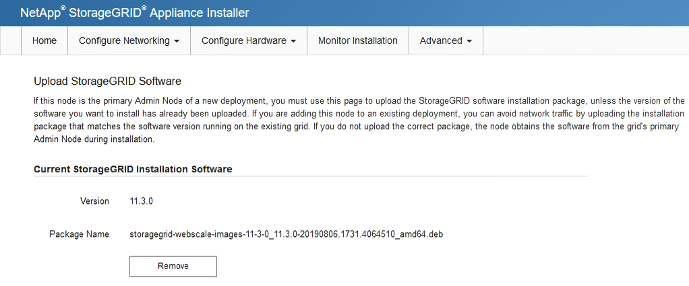

= 將服務應用裝置部署為閘道或非主要管理節點
:allow-uri-read: 
:icons: font
:imagesdir: ../media/

[role="lead"]
當您將服務應用裝置部署為閘道節點或非主要管理節點時、請使用StorageGRID 應用裝置隨附的《支援服務應用程式》安裝程式。

.您需要的是 #8217 ；需要的是什麼
* 設備已安裝在機架或機櫃中、並已連接至您的網路、並已開啟電源。
* 網路連結、IP位址和連接埠重新對應（如有必要）已使用StorageGRID 《應用程式安裝程式》為應用裝置設定。
+

IMPORTANT: 如果您已重新對應任何連接埠、則無法使用相同的連接埠來設定負載平衡器端點。您可以使用重新對應的連接埠來建立端點、但這些端點會重新對應至原始CLB連接埠和服務、而非負載平衡器服務。請依照中的步驟進行 xref:../maintain/removing-port-remaps.adoc[移除連接埠重新對應]。

+

NOTE: CLB服務已過時。

* 已部署適用於此系統的主要管理節點StorageGRID 。
* 列出在《IP組態》頁面StorageGRID 上的所有Grid Network子網路、均已在主要管理節點的Grid Network Subnet List（網格網路子網路清單）中定義。
* 您的服務型筆記型電腦配備 xref:../admin/web-browser-requirements.adoc[支援的網頁瀏覽器]。
* 您知道指派給應用裝置的IP位址。您可以將IP位址用於任何附加StorageGRID 的靜態網路。

若要在StorageGRID 服務應用裝置節點上安裝支援：

* 您可以指定或確認主要管理節點的IP位址、以及應用裝置節點的名稱。
* 您開始安裝、並等待軟體安裝完成。
+
在設備閘道節點的安裝工作中、安裝會暫停一段時間。若要繼續安裝、請登入Grid Manager、核准所有網格節點、並完成StorageGRID 安裝程序。安裝非主要管理節點不需要您的核准。

IMPORTANT: 請勿在同一個站台部署SG100和SG1000服務應用裝置。可能會導致無法預測的效能。

NOTE: 如果您需要一次部署多個應用裝置節點、可以使用「configure - SGA.py」應用裝置安裝指令碼來自動化安裝程序。您也可以使用應用裝置安裝程式上傳包含組態資訊的Json檔案。請參閱 xref:automating-appliance-installation-and-configuration.adoc[自動化設備安裝與組態（SG100和SG1000）] 以取得自動化安裝的詳細資訊。

.步驟
. 開啟瀏覽器、然後輸入應用裝置的IP位址。
+
https://_Controller_IP_:8443*`

+
畫面會出現「the不再安裝StorageGRID 程式」首頁。

. 在「主要管理節點連線」區段中、判斷是否需要指定主要管理節點的IP位址。
+
如果您先前已在此資料中心安裝其他節點、StorageGRID 則當主管理節點或至少有一個已設定ADD_IP的其他網格節點出現在同一個子網路上時、即可自動探索此IP位址。

. 如果未顯示此IP位址、或您需要變更它、請指定位址：
+
|===
| 選項 | 說明 

 a| 
手動輸入IP
 a| 
.. 取消選取「*啟用管理節點探索*」核取方塊。
.. 手動輸入IP位址。
.. 按一下「 * 儲存 * 」。
.. 等待連線狀態、讓新的IP位址準備就緒。

 a| 
自動探索所有連線的主要管理節點
 a| 
.. 選取「*啟用管理節點探索*」核取方塊。
.. 等待顯示已發現的IP位址清單。
.. 選取要部署此應用裝置儲存節點的網格主要管理節點。
.. 按一下「 * 儲存 * 」。
.. 等待連線狀態、讓新的IP位址準備就緒。

|===
. 在「*節點名稱*」欄位中、輸入您要用於此應用裝置節點的名稱、然後按一下「*儲存*」。
+
節點名稱會指派給StorageGRID 此應用裝置節點的功能。它會顯示在Grid Manager的節點頁面（總覽索引標籤）上。如果需要、您可以在核准節點時變更名稱。

. 或者、若要安裝StorageGRID 不同版本的更新版的更新版本、請依照下列步驟操作：
+
.. 下載安裝歸檔：https://mysupport.netapp.com/site/products/all/details/storagegrid-appliance/downloads-tab["NetApp下載：StorageGRID NetApp產品"^]。
.. 擷取歸檔。
.. 從《Sile Appliance Installer》StorageGRID （英文）中、選取*進階*>*上傳StorageGRID 《Some Software*》（英文）。
.. 按一下「*移除*」以移除目前的軟體套件。
+

.. 按一下*瀏覽*以取得您下載並解壓縮的軟體套件、然後按一下*瀏覽*以取得Checksum檔案。
+
image::../media/appliance_installer_upload_sg_software.png[應用裝置安裝程式-上傳SG軟體]

.. 選擇*主頁*返回主頁。

. 在「安裝」區段中、確認目前狀態為「準備好開始在主管理節點'_admin_ip_'的網格中安裝'_node name_'」、且已啟用*開始安裝*按鈕。
+
如果*開始安裝*按鈕未啟用、您可能需要變更網路組態或連接埠設定。如需相關指示、請參閱設備的安裝與維護說明。

. 從「the Some Appliance Installer」首頁、按一下StorageGRID 「*開始安裝*」。
+
image::../media/appliance_installer_services_appliance_non_pan.png[應用裝置安裝程式首頁-安裝非主要管理節點]

+
目前狀態會變更為「Installation is in progress、」、並顯示「Monitor Installation（監控安裝）」頁面。

+

NOTE: 如果您需要手動存取「監視器安裝」頁面、請從功能表列按一下「*監視器安裝*」。

. 如果網格包含多個應用裝置節點、請針對每個應用裝置重複上述步驟。

