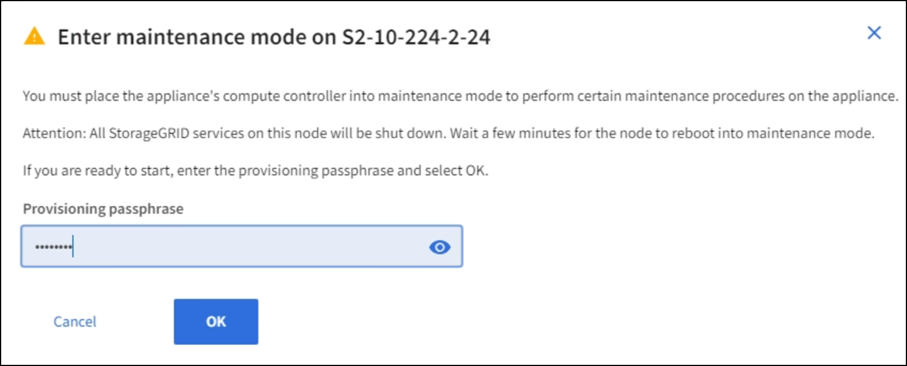
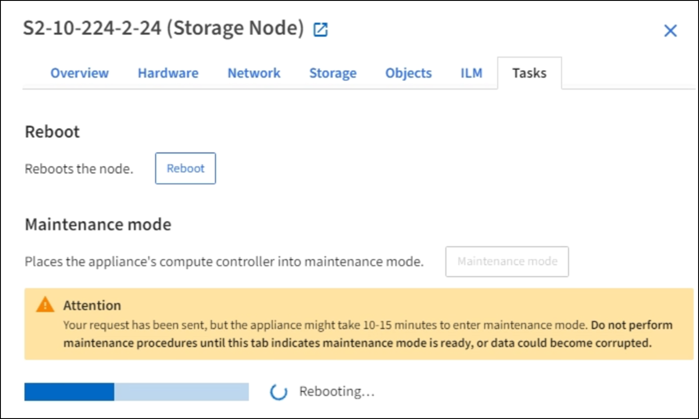
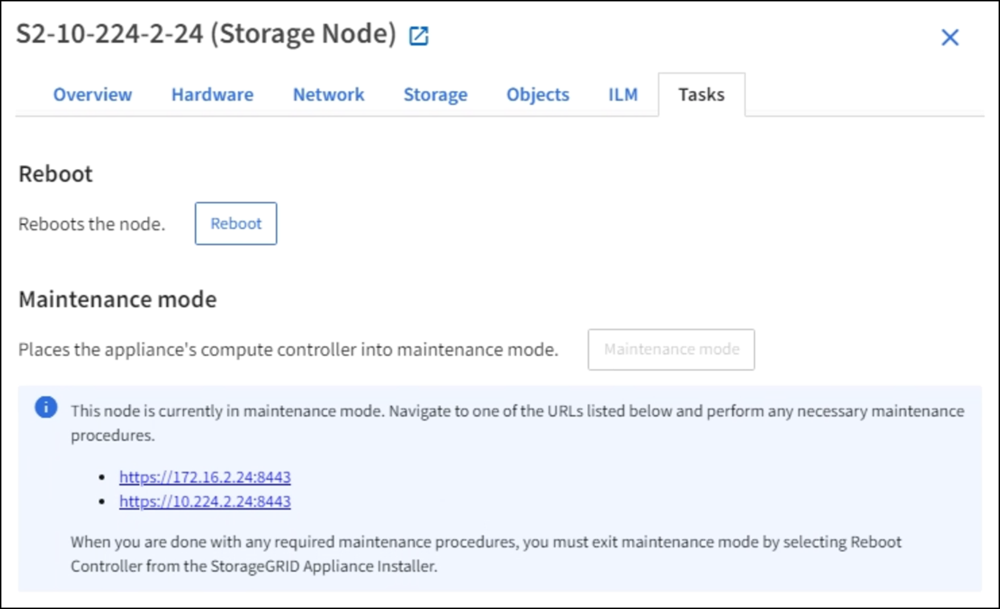
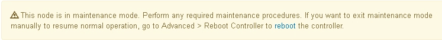

= 將應用裝置置於維護模式
:allow-uri-read: 
:icons: font
:imagesdir: ../media/

[role="lead"]
您必須先將設備置於維護模式、才能執行特定的維護程序。

.您需要的是 #8217 ；需要的是什麼
* 您將使用登入Grid Manager xref:../admin/web-browser-requirements.adoc[支援的網頁瀏覽器]。
* 您具有「維護」或「根」存取權限。如需詳細資訊、請參閱《關於管理StorageGRID 功能的說明》。

在極少數情況StorageGRID 下、將某個應用程式置於維護模式可能會使應用裝置無法遠端存取。

NOTE: 在維護模式下、用於某個應用程式的管理員帳戶密碼和SSH主機金鑰StorageGRID 與設備使用中的相同。

.步驟
. 從Grid Manager中選取* nodes *。
. 從節點頁面的樹狀檢視中、選取應用裝置儲存節點。
. 選取*工作*索引標籤。
+
image::../media/maintenance_mode.png[應用裝置的維護模式按鈕]

. 選擇*維護模式*。
+
隨即顯示確認對話方塊。

+

. 輸入資源配置通關密碼、然後選取*確定*。
+
進度列和一系列訊息StorageGRID 、包括「Request sent」（要求已傳送）、「Sting the Sfor」（停止執行）和「rebooting」（重新啟動）、表示裝置正在完成進入維護模式的步驟。

+

+
當應用裝置處於維護模式時、會出現一則確認訊息、列出您可用來存取StorageGRID 《支援應用程式安裝程式的URL」。

+

. 若要存取StorageGRID 《物件設備安裝程式》、請瀏覽顯示的任何URL。
+
如有可能、請使用包含設備管理網路連接埠IP位址的URL。

+

NOTE: 如果您直接連線到應用裝置的管理連接埠、請使用「+https://169.254.0.1:8443+`」存取StorageGRID 「NetApp應用裝置安裝程式」頁面。

. 從《支援產品安裝程式（the不支援產品）：確認產品處於維護模式。StorageGRID
+

. 執行任何必要的維護工作。
. 完成維護工作之後、請結束維護模式並恢復正常節點作業。從「the Some Appliance Installer」StorageGRID 選取「*進階*>*重新開機控制器*」、然後選取「*重新開機至StorageGRID *」。
+
image::../media/reboot_controller_from_maintenance_mode.png[以維護模式重新啟動控制器]

+
裝置重新開機和重新加入網格可能需要20分鐘的時間。若要確認重新開機已完成、且節點已重新加入網格、請返回Grid Manager。「*節點*」頁面應顯示應用裝置節點的正常狀態（無圖示）、表示沒有警示處於作用中狀態、且節點已連線至網格。

+
image::../media/nodes_menu.png[節點頁面正常狀態]

