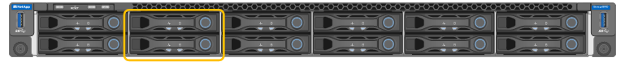

= SG100與SG1000應用裝置總覽
:allow-uri-read: 
:icons: font
:imagesdir: ../media/

[role="lead"]
功能完善的SG100服務應用裝置和SG1000服務應用裝置可做為閘道節點和管理節點、在一個不穩定的系統中提供高可用度負載平衡服務。StorageGRID StorageGRID這兩種設備可同時做為閘道節點和管理節點（主要或非主要）運作。

== 應用裝置功能

服務應用裝置的兩種機型都提供下列功能：

* 閘道節點或管理節點功能StorageGRID 適用於一個不全系統。
* 旨在簡化節點部署與組態的《產品安裝程式（the StorageGRID
* 部署後、即可從StorageGRID 現有的管理節點或從下載到本機磁碟機的軟體存取此功能。為了進一步簡化部署程序、最新版軟體會在製造期間預先載入應用裝置。
* 用於監控和診斷部分應用裝置硬體的基礎板管理控制器（BMC）。
* 連線到所有三StorageGRID 個不完整網路的能力、包括Grid Network、管理網路和用戶端網路：
+
** SG100最多可支援四個10或25 GbE連線至Grid Network和Client Network。
** SG1000最多可支援四個10、25、40或100-GbE連線至Grid Network和Client Network。

== SG100和SG1000圖表

此圖顯示SG100和SG1000的正面、並已卸下擋板。

NOTE: 從正面來說、除了擋板上的產品名稱之外、這兩種產品完全相同。

兩個以橘色外框表示的固態硬碟（SSD）用於儲存StorageGRID 作業系統、並使用RAID1鏡射以提供備援。當SG100或SG1000服務應用裝置設定為管理節點時、這些磁碟機會用來儲存稽核記錄、度量和資料庫表格。

其餘磁碟機插槽為空白。

== SG100背面的連接器

此圖顯示SG100背面的連接器。

image::../media/sg100_rear_connectors.png[後部連接器SG100]

|===
|  | 連接埠 | 類型 | 使用 

 a| 
1.
 a| 
網路連接埠1-4
 a| 
10/25-GbE、根據纜線或SFP收發器類型（支援SFP28和SFP+模組）、交換器速度和設定的連結速度
 a| 
連線到Grid Network和Client Network for StorageGRID the

 a| 
2.
 a| 
BMC管理連接埠
 a| 
1-GbE（RJ-45）
 a| 
連接至應用裝置基板管理控制器。

 a| 
3.
 a| 
診斷與支援連接埠
 a| 
* VGA
* 序列、115200 8-N-1
* USB

 a| 
保留以供技術支援使用。

 a| 
4.
 a| 
管理網路連接埠1
 a| 
1-GbE（RJ-45）
 a| 
將應用裝置連接至管理網路StorageGRID 以供其使用。

 a| 
5.
 a| 
管理網路連接埠2.
 a| 
1-GbE（RJ-45）
 a| 
選項：

* 與管理連接埠1連結、以建立與管理網路StorageGRID 的備援連線、以利執行支援。
* 保持中斷連線、可用於暫用本機存取（IP 169.254.0.1）。
* 安裝期間、如果無法使用DHCP指派的IP位址、請使用連接埠2進行IP組態。

|===

== SG1000背面的連接器

此圖顯示SG1000背面的連接器。

image::../media/sg1000_rear_connectors.png[後置連接器SG1000]

|===
|  | 連接埠 | 類型 | 使用 

 a| 
1.
 a| 
網路連接埠1-4
 a| 
10/25/40/100-GbE、取決於纜線或收發器類型、交換器速度及設定的連結速度。原生支援QSFP28和QSFP+（40/100GbE）、而SFP28/SFP+收發器可搭配QSA（另售）使用10/25GbE速度。
 a| 
連線到Grid Network和Client Network for StorageGRID the

 a| 
2.
 a| 
BMC管理連接埠
 a| 
1-GbE（RJ-45）
 a| 
連接至應用裝置基板管理控制器。

 a| 
3.
 a| 
診斷與支援連接埠
 a| 
* VGA
* 序列、115200 8-N-1
* USB

 a| 
保留以供技術支援使用。

 a| 
4.
 a| 
管理網路連接埠1
 a| 
1-GbE（RJ-45）
 a| 
將應用裝置連接至管理網路StorageGRID 以供其使用。

 a| 
5.
 a| 
管理網路連接埠2.
 a| 
1-GbE（RJ-45）
 a| 
選項：

* 與管理連接埠1連結、以建立與管理網路StorageGRID 的備援連線、以利執行支援。
* 保持中斷連線、可用於暫用本機存取（IP 169.254.0.1）。
* 安裝期間、如果無法使用DHCP指派的IP位址、請使用連接埠2進行IP組態。

|===