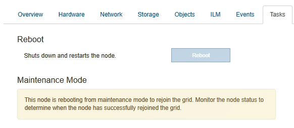

= 更換E2700控制器
:allow-uri-read: 
:icons: font
:imagesdir: ../media/

[role="lead"]
如果E2700控制器無法正常運作或故障、您可能需要更換它。

.您需要的是 #8217 ；需要的是什麼
* 您的更換控制器的零件編號與您要更換的控制器相同。
* 您可以使用標籤來識別連接至控制器的每條纜線。
* 您有防靜電保護。
* 您必須具有維護或根存取權限。如需詳細資訊、請參閱《關於管理StorageGRID 功能的說明》。

您可以檢查控制器上的「Service Action Required」（所需的服務動作）LED（如圖所示為1）、以判斷控制器是否故障。如果此LED亮起、則應更換控制器。

image::../media/e2700_controller_sar_led.gif[E2700控制器上的「需要維修行動」LED]

當您更換控制器時、將無法存取應用裝置儲存節點。如果E2700控制器運作正常、您可以將E5600SG控制器置於維護模式。

更換控制器時、您必須從原始控制器中取出電池、然後將其安裝在更換的控制器中。

.步驟
. 準備移除控制器。
+
您可以使用SANtricity 「功能區儲存管理員」來執行這些步驟。

+
.. 記下SANtricity 控制器上目前安裝的是哪個版本的作業系統軟體。
.. 記下目前安裝的是哪個版本的NVSRAM.
.. 如果已啟用「磁碟機安全性」功能、請確定已儲存金鑰存在、而且您知道安裝金鑰所需的密碼。
+

IMPORTANT: *可能會遺失資料存取：*如果設備中的所有磁碟機都已啟用安全功能、則新的控制器將無法存取設備、直到您使用SANtricity NetApp儲存管理程式中的「企業管理」視窗解除鎖定安全磁碟機為止。

.. 備份組態資料庫。
+
如果移除控制器時發生問題、您可以使用儲存的檔案來還原組態。

.. 收集應用裝置的支援資料。
+

NOTE: 在更換元件之前和之後收集支援資料、可確保您可以傳送一組完整的記錄給技術支援部門、以免更換無法解決問題。

. 如果StorageGRID 該產品在StorageGRID 一個不完善的系統中執行、 xref:placing-appliance-into-maintenance-mode.adoc[將E5600SG控制器置於維護模式]。
. 如果E2700控制器的運作能力足以允許控制關機、請確認所有作業均已完成。
+
.. 在Array Management（陣列管理）窗口的標題欄中，選擇* Monitor *>* Reports*>* Operations in progress*。
.. 確認所有作業均已完成。

. 請依照單工E2700控制器更換程序中的指示、完成下列步驟：
+
.. 標記纜線、然後拔下纜線。
+

IMPORTANT: 為避免效能降低、請勿扭轉、摺疊、夾緊或踏上纜線。

.. 從設備中取出故障控制器。
.. 卸下控制器護蓋。
.. 旋下指旋螺絲、然後從故障控制器中取出電池。
.. 將電池裝入更換的控制器、然後裝回控制器護蓋。
.. 將替換控制器安裝到設備中。
.. 更換纜線。
.. 等待E2700控制器重新開機。驗證七段顯示器顯示的狀態是否為「99」。

. 如果應用裝置使用安全磁碟機、請匯入磁碟機安全金鑰。
. 讓產品恢復正常運作模式。從「the Some Appliance Installer」StorageGRID 選取「*進階*>*重新開機控制器*」、然後選取「*重新開機至StorageGRID *」。
+
image::../media/reboot_controller_from_maintenance_mode.png[以維護模式重新啟動控制器]

+
在重新開機期間、會出現下列畫面：

+

+
應用裝置會重新開機並重新加入網格。此程序最多可能需要20分鐘。

. 確認重新開機已完成、且節點已重新加入網格。在Grid Manager中、確認「節點」頁面顯示應用裝置節點的正常狀態（節點名稱左側沒有圖示）、表示沒有警示處於作用中狀態、且節點已連線至網格。
+
image::../media/node_rejoin_grid_confirmation.png[應用裝置節點重新加入網格]

. 從NetApp Storage Manager確認新的控制器是最佳的、並收集支援資料。SANtricity

https://mysupport.netapp.com/info/web/ECMP11751516.html["NetApp E系列和EF系列硬體更換程序"^]

http://mysupport.netapp.com/documentation/productlibrary/index.html?productID=61765["NetApp文件：E2700系列"^]
