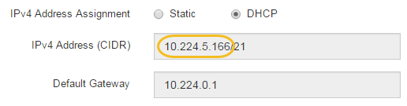

= 設定E2700控制器的IP位址
:allow-uri-read: 
:icons: font
:imagesdir: ../media/

[role="lead"]
E2700控制器上的管理連接埠1可將應用裝置連接至SANtricity 管理網路、以利執行《E2700儲存管理程式》。您必須為E2700控制器設定靜態IP位址、以確保不會中斷與StorageGRID 硬體和控制器韌體的管理連線。

.您需要的產品
您使用的是 xref:../admin/web-browser-requirements.adoc[支援的網頁瀏覽器]。

.關於這項工作
DHCP指派的位址可能隨時變更。為控制器指派靜態IP位址、以確保存取一致。

.步驟
. 從用戶端輸入StorageGRID URL以供使用：+`* https://_E5600SG_Controller_IP_:8443*`
+
若為「_E5600SG_Controller_IP_」、請在StorageGRID 任何一個靜態網路上使用應用裝置的IP位址。

+
畫面會出現「the不再安裝StorageGRID 程式」首頁。

. 選擇* Hardware Configuration（硬體組態）** Storage Controller Network Configuration（儲存控制器網路組態）*。
+
此時將顯示Storage Controller Network Configuration（儲存控制器網路組態）頁面

. 根據您的網路組態、選取*「已啟用」*、適用於IPV4、IPV6或兩者。
. 記下自動顯示的IPV4位址。
+
DHCP是指派IP位址給此連接埠的預設方法。

+

NOTE: 可能需要幾分鐘時間才能顯示DHCP值。

+

. 或者、為E2700控制器管理連接埠設定靜態IP位址。
+

NOTE: 您應該為管理連接埠指派靜態IP、或為DHCP伺服器上的位址指派永久租用。

+
.. 選擇* Static *（靜態*）。
.. 輸入使用CIDR表示法的IPV4位址。
.. 輸入預設閘道。
+
image::../media/storage_controller_ipv4_and_def_gateway.gif[儲存控制器網路組態：IPV4和預設閘道]

.. 按一下「 * 儲存 * 」。
+
您可能需要幾分鐘的時間才能套用變更。

+
當您連線SANtricity 至靜態儲存管理員時、您將使用新的靜態IP位址作為URL：+`* https://_E2700_Controller_IP_*`

.相關資訊
http://mysupport.netapp.com/documentation/productlibrary/index.html?productID=61197["NetApp文件：SANtricity NetApp Storage Manager"^]
