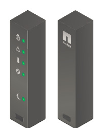

= 打開包裝箱（SG5600）
:allow-uri-read: 
:icons: font
:imagesdir: ../media/

[role="lead"]
安裝StorageGRID 此產品之前、請先打開所有包裝箱的包裝、然後比較包裝單上的物品。

* * SG5660機箱、4U機箱、配備60個磁碟機*
+
image::../media/appliance_enclosure.gif[4U機箱]

* * SG5612機箱、2U機箱、含12個磁碟機*
+
image::../media/appliance_enclosure_2u.gif[DE1600 2U機箱]

* * 4U擋板或2U端蓋*
+
image:../media/appliance_bezel.gif["4U擋板"] 

* * NL-SAS磁碟機*
+
image::../media/appliance_drive.gif[磁碟機]

+
磁碟機已預先安裝在2U SG5612中、但出於安全起見、未安裝在4U SG5660中。

* * E5600SG控制器*
+
image::../media/sga_controller_5600_diagram.gif[E5600控制器]

* * E2700控制器*
+
image::../media/sga_controller_2700_diagram.gif[E2700控制器]

* *安裝軌道與螺絲*
+
image::../media/appliance_mounting_rail_kit.png[安裝軌道套件]

* *機箱處理（僅4U機箱）*
+
image::../media/appliance_enclosure_handles.gif[機箱處理]

== 纜線與連接器

產品隨附StorageGRID 下列纜線和接頭：

* *您所在國家/地區的電源線*
+
image::../media/appliance_power_cords.gif[電源線]

+
本產品隨附兩條AC電源線、可連接至外部電源、例如牆上插座。您的機櫃可能有特殊的電源線、您可以使用這些電源線、而非產品隨附的電源線。

* * SAS互連纜線*
+
image::../media/appliance_mini_sas_cables.gif[Mini SAS纜線]

+
兩條0.5公尺SAS互連纜線、搭配Mini-SAS-HD和Mini-SAS連接器。

+
方形接頭插入E2700控制器、矩形接頭插入E5600SG控制器。

