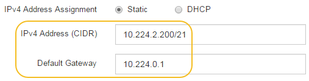

= 使用StorageGRID 一套解決方法安裝程式來設定儲存控制器的IP位址
:allow-uri-read: 
:icons: font
:imagesdir: ../media/

[role="lead"]
每個儲存控制器上的管理連接埠1會將應用裝置連線至管理網路、以利SANtricity 執行《系統管理程式》。如果SANtricity 您無法從StorageGRID 《E靜止 應用裝置安裝程式》存取《更新系統管理程式》、則必須為每個儲存控制器設定靜態IP位址、以確保您不會失去與控制器機櫃中硬體和控制器韌體的管理連線。

.您需要的產品
* 您正在使用任何可連線StorageGRID 至「管理員網路」的管理用戶端、或是您有一台服務用筆記型電腦。
* 用戶端或服務筆記型電腦具有支援的網頁瀏覽器。

.關於這項工作
DHCP指派的位址可以隨時變更。為控制器指派靜態IP位址、以確保存取一致。

NOTE: 只有在SANtricity 您無法從StorageGRID 《ESome Appliance Installer》（*進階*>* SANtricity 《系統管理員》*）或《Grid Manager》（*節點*>* SANtricity 《系統管理員》*）存取《Some System Manager》時、才需遵循此程序。

.步驟
. 從用戶端輸入StorageGRID URL以供使用：+`* https://_Appliance_Controller_IP_:8443*`
+
若為「_Appliance控制器IP」、請在任何StorageGRID 一個網上使用應用裝置的IP位址。

+
畫面會出現「the不再安裝StorageGRID 程式」首頁。

. 選擇*設定硬體*>*儲存控制器網路組態*。
+
此時將顯示Storage Controller Network Configuration（儲存控制器網路組態）頁面

. 根據您的網路組態、選取*「已啟用」*、適用於IPV4、IPV6或兩者。
. 記下自動顯示的IPV4位址。
+
DHCP是將IP位址指派給儲存控制器管理連接埠的預設方法。

+

NOTE: 可能需要幾分鐘時間才能顯示DHCP值。

+
image::../media/storage_controller_network_config_ipv4.gif[儲存控制器網路組態IPV4]

. 您也可以為儲存控制器管理連接埠設定靜態IP位址。
+

NOTE: 您應該為管理連接埠指派靜態IP、或為DHCP伺服器上的位址指派永久租用。

+
.. 選擇* Static *（靜態*）。
.. 輸入使用CIDR表示法的IPV4位址。
.. 輸入預設閘道。
+

.. 按一下「 * 儲存 * 」。
+
您可能需要幾分鐘的時間才能套用變更。

+
當您連線SANtricity 到「靜態系統管理程式」時、您將使用新的靜態IP位址作為URL：+`* https://_Storage_Controller_IP_*`

