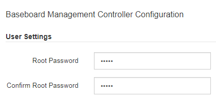

= 變更BMC介面的root密碼
:allow-uri-read: 
:icons: font
:imagesdir: ../media/

[role="lead"]
為了安全起見、您必須變更BMC root使用者的密碼。

.您需要的產品
* 管理用戶端使用 xref:../admin/web-browser-requirements.adoc[支援的網頁瀏覽器]。

.關於這項工作
首次安裝設備時、BMC會使用root使用者的預設密碼（「root/calvin」）。您必須變更root使用者的密碼、才能保護系統安全。

.步驟
. 從用戶端輸入StorageGRID URL以供使用：+`* https://_Appliance_Controller_IP_:8443*`
+
若為「_Appliance控制器IP」、請在任何StorageGRID 一個網上使用應用裝置的IP位址。

+
畫面會出現「the不再安裝StorageGRID 程式」首頁。

. 選擇*設定硬體*>* BMC組態*。
+
image::../media/bmc_configuration_page.gif[顯示「進階」>「BMC組態」選項的快照]

+
出現「Baseboard Management Controller Configuration（基礎板管理控制器組態）」

. 在提供的兩個欄位中輸入root帳戶的新密碼。
+

. 按一下「 * 儲存 * 」。

