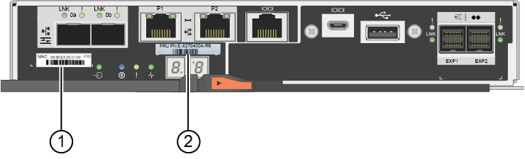

= 更換儲存控制器
:allow-uri-read: 
:icons: font
:imagesdir: ../media/

[role="lead"]
如果E2800控制器或EF570控制器無法正常運作或故障、您可能需要更換它。

.您需要的是 #8217 ；需要的是什麼
* 您的更換控制器的零件編號與您要更換的控制器相同。
* 您可以使用標籤來識別連接至控制器的每條纜線。
* 您有一個ESD腕帶、或是已採取其他防靜電預防措施。
* 您有1號十字螺絲起子。
* 您有E系列的指示說明、可以在雙工組態中更換控制器。
+

IMPORTANT: 請僅在有指示或需要更多詳細資料以執行特定步驟時、才參閱E系列說明。請勿仰賴E系列的指示來更換StorageGRID 產品中的控制器、因為這些程序並不相同。

* 您已將儲存設備實際放置在資料中心中、以便更換控制器。
+
xref:locating-controller-in-data-center.adoc[在資料中心找到控制器]

您可以透過兩種方式判斷控制器是否故障：

* 《恢復大師SANtricity 》（Recovery Guru in the SytrSystem Manager）會引導您更換控制器。
* 控制器上的黃色警示LED亮起、表示控制器發生故障。
+

IMPORTANT: 如果機櫃中的兩個控制器都有其注意LED亮起、請聯絡技術支援部門以尋求協助。

由於儲存控制器機櫃包含兩個儲存控制器、因此只要符合下列條件、您就可以在裝置開機並執行讀寫作業時更換其中一個控制器：

* 機櫃中的第二個控制器具有最佳狀態。
* 「恢復大師」的「詳細資料」區域中SANtricity 的「OK to remove」欄位會顯示「是」、表示移除此元件是安全的。

IMPORTANT: 如有可能、請將設備置於維護模式以進行此更換程序、以盡量減少意外錯誤或故障所造成的潛在影響。

IMPORTANT: 如果磁碟櫃中的第二個控制器磁碟櫃沒有最佳狀態、或如果Recovery Guru表示無法移除控制器磁碟櫃、請聯絡技術支援部門。

更換控制器時、您必須從原始控制器中取出電池、然後將其安裝在更換的控制器中。在某些情況下、您可能還需要從原始控制器中移除主機介面卡、然後將其安裝在更換的控制器中。

NOTE: 大多數應用裝置機型的儲存控制器不含主機介面卡（HIC）。

.步驟
. 打開新控制器的包裝、將其放置在無靜態的平面上。
+
保存包裝材料、以便在運送故障控制器時使用。

. 在更換的控制器背面找到MAC位址和FRU零件編號標籤。
+
本圖顯示E2800控制器。更換EF570控制器的程序相同。

+

+
|===
| 標籤 | 標籤 | 說明 

 a| 
1.
 a| 
MAC位址
 a| 
管理連接埠1（「P1」）的MAC位址。如果您使用DHCP取得原始控制器的IP位址、則需要此位址才能連線至新的控制器。

 a| 
2.
 a| 
FRU零件編號
 a| 
FRU零件編號。此編號必須符合目前安裝之控制器的更換零件編號。

|===
. 準備移除控制器。
+
您可以使用SANtricity 「系統管理程式」來執行這些步驟。如需更多詳細資料、請參閱E系列更換儲存控制器的說明。

+
.. 確認故障控制器的更換零件編號與更換控制器的FRU零件編號相同。
+
當控制器發生故障且需要更換時、替換零件編號會顯示在Recovery Guru的「Details（詳細資料）」區域中。如果您需要手動尋找此號碼、可以在控制器的*基礎*索引標籤上查看。

+

IMPORTANT: *資料存取可能遺失：*如果兩個零件編號不同、請勿嘗試執行此程序。

.. 備份組態資料庫。
+
如果移除控制器時發生問題、您可以使用儲存的檔案來還原組態。

.. 收集應用裝置的支援資料。
+

NOTE: 在更換元件之前和之後收集支援資料、可確保您可以傳送一組完整的記錄給技術支援部門、以免更換無法解決問題。

.. 讓您計畫要更換的控制器離線。

. 從應用裝置中取出控制器：
+
.. 放置於防靜電腕帶上或採取其他防靜電預防措施。
.. 標示纜線、然後拔下纜線和SFP。
+

IMPORTANT: 為避免效能降低、請勿扭轉、摺疊、夾緊或踏上纜線。

.. 擠壓CAM握把上的栓鎖直到釋放為止、然後打開右側的CAM握把、即可從產品中釋放控制器。
.. 使用兩隻手和CAM握把、將控制器滑出產品。
+

IMPORTANT: 請務必用兩隻手支撐控制器的重量。

.. 將控制器放在無靜電的平面上、可拆式外蓋朝上。
.. 按下按鈕並滑下蓋板、以卸下蓋板。

. 從故障控制器中取出電池、並將其安裝至更換的控制器：
+
.. 確認控制器內部的綠色LED（電池與DIMM之間）已關閉。
+
如果此綠色LED亮起、表示控制器仍在使用電池電力。您必須等到LED熄滅後、才能移除任何元件。

+
image::../media/e2800_internal_cache_active_led.gif[E2800上的綠色LED]

+
|===
| 項目 | 說明 

 a| 
1.
 a| 
內部快取作用中LED

 a| 
2.
 a| 
電池

|===
.. 找到電池的藍色釋放栓鎖。
.. 向下推動釋放栓鎖、將電池從控制器中取出。
+
image::../media/e2800_remove_battery.gif[電池卡扣]

+
|===
| 項目 | 說明 

 a| 
1.
 a| 
電池釋放栓鎖

 a| 
2.
 a| 
電池

|===
.. 提起電池、將其滑出控制器。
.. 從更換的控制器上取下護蓋。
.. 調整更換控制器的方向、使電池插槽朝向您。
.. 以稍微向下的角度將電池插入控制器。
+
您必須將電池正面的金屬法蘭插入控制器底部的插槽、然後將電池頂端滑入控制器左側的小型定位插銷下方。

.. 向上移動電池栓鎖以固定電池。
+
當栓鎖卡入定位時、栓鎖底部會掛入機箱的金屬插槽。

.. 翻轉控制器、確認電池安裝正確。
+

IMPORTANT: *可能的硬體損壞*：電池正面的金屬法蘭必須完全插入控制器上的插槽（如第一個圖所示）。如果電池安裝不正確（如第二個圖所示）、則金屬法蘭可能會接觸控制器板、造成損壞。

+
*** *正確：電池的金屬法蘭已完全插入控制器上的插槽：*
+
image::../media/e2800_battery_flange_ok.gif[電池法蘭正確]

*** *不正確：電池的金屬法蘭未插入控制器上的插槽：*
+
image::../media/e2800_battery_flange_not_ok.gif[電池法蘭不正確]

.. 裝回控制器護蓋。

. 將替換控制器安裝到設備中。
+
.. 翻轉控制器、使可拆式護蓋面朝下。
.. 將CAM握把放在開啟位置、將控制器完全滑入產品。
.. 將CAM握把往左移動、將控制器鎖定到位。
.. 更換纜線和SFP。
.. 如果原始控制器使用DHCP作為IP位址、請在替換控制器背面的標籤上找到MAC位址。請網路管理員將您移除的控制器的DNS/網路和IP位址與更換控制器的MAC位址建立關聯。
+

NOTE: 如果原始控制器未將DHCP用於IP位址、則新控制器會採用您移除的控制器IP位址。

. 使用SANtricity NetApp System Manager讓控制器上線：
+
.. 選取*硬體*。
.. 如果圖形顯示磁碟機、請選取*顯示磁碟櫃背面*。
.. 選取您要放置在線上的控制器。
.. 從內容功能表中選取*「線上放置」*、然後確認您要執行此作業。
.. 驗證七段顯示器顯示的狀態是否為「99」。

. 確認新的控制器處於最佳狀態、並收集支援資料。

http://mysupport.netapp.com/info/web/ECMP1658252.html["NetApp E系列系統文件網站"^]
