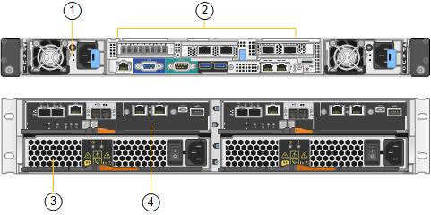

= SGF6024總覽
:allow-uri-read: 
:icons: font
:imagesdir: ../media/

[role="lead"]
StorageGRIDSGF6024包含運算控制器和儲存控制器機櫃、可容納24個固態磁碟機。

== SGF6024元件

SGF6024應用裝置包含下列元件：

|===
| 元件 | 說明 

 a| 
運算控制器
 a| 
SG6000-CN-控制器、單機架單元（1U）伺服器、包括：

* 40個核心（80個執行緒）
* 192 GB RAM
* 高達4 x 25 Gbps的Aggregate乙太網路頻寬
* 4 x 16 Gbps光纖通道（FC）互連
* 基礎板管理控制器（BMC）、可簡化硬體管理
* 備援電源供應器

 a| 
Flash Array（控制器機櫃）
 a| 
E系列EF570 Flash Array（也稱為控制器機櫃）、2U機櫃包括：

* 兩個E系列EF570控制器（雙工組態）可提供儲存控制器容錯移轉支援
* 24個固態磁碟機（也稱為SSD或Flash磁碟機）
* 備援電源供應器與風扇

|===

== SGF6024圖表

此圖顯示SGF6024的正面、其中包含1U運算控制器和2U機箱、其中包含兩個儲存控制器和24個Flash磁碟機。

image::../media/sgf6024_front_view_with_and_without_bezels.png[SG6024前視圖]

|===
| 標註 | 說明 

 a| 
1.
 a| 
SG6000-CN-含前擋板的運算控制器

 a| 
2.
 a| 
EF570快閃陣列、含前擋板

 a| 
3.
 a| 
SG6000-CN-移除前擋板的運算控制器

 a| 
4.
 a| 
EF570快閃陣列（已卸下前擋板）

|===
此圖顯示SGF6024的背面、包括運算與儲存控制器、風扇和電源供應器。

|===
| 標註 | 說明 

 a| 
1.
 a| 
SG6000-CN-運算控制器的電源供應器（圖1）

 a| 
2.
 a| 
SG6000-CN-運算控制器的連接器

 a| 
3.
 a| 
EF570 Flash Array的電源供應器（圖1）

 a| 
4.
 a| 
E系列EF570儲存控制器（圖1）和連接器

|===