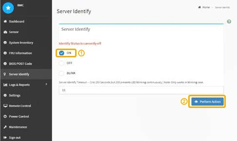

= 開啟和關閉控制器識別LED
:allow-uri-read: 
:icons: font
:imagesdir: ../media/

[role="lead"]
控制器正面和背面的藍色識別LED可開啟、以協助在資料中心找到應用裝置。

.您需要的產品
您必須擁有要識別的控制器的BMC IP位址。

.步驟
. 存取控制器BMC介面。
. 選擇*伺服器識別*。
. 選擇*開啟*、然後選取*執行動作*。
+

.結果
控制器正面（如圖所示）和背面的藍色識別LED燈會亮起。

image::../media/sg6060_front_panel_service_led_on.jpg[正面識別LED -亮起]

NOTE: 如果控制器上安裝了擋板、可能很難看到正面的識別LED。

.完成後
若要關閉控制器識別LED：

* 按下控制器前面板上的識別LED開關。
* 從控制器BMC介面中選取*伺服器識別*、選取*關*、然後選取*執行動作*。

控制器正面和背面的藍色識別LED會熄滅。

image::../media/sg6060_front_panel_service_led_off.jpg[正面識別LED -關閉]

.相關資訊
xref:verifying-fibre-channel-hba-to-replace.adoc[驗證要更換的Fibre Channel HBA]

xref:locating-controller-in-data-center.adoc[在資料中心找到控制器]

xref:accessing-bmc-interface-sg6000.adoc[存取BMC介面]
