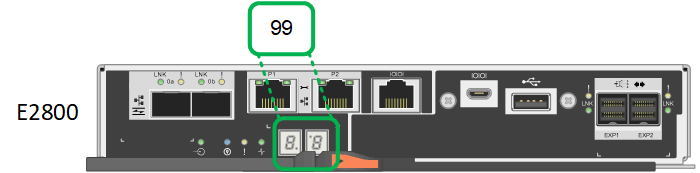

= 檢視SG6000儲存控制器的開機狀態代碼
:allow-uri-read: 
:icons: font
:imagesdir: ../media/

[role="lead"]
每個儲存控制器都有七段顯示、可在控制器開機時提供狀態代碼。E2800控制器和EF570控制器的狀態代碼相同。

如需這些代碼的說明、請參閱儲存控制器類型的E系列系統監控資訊。

.步驟
. 在開機期間、檢視每個儲存控制器七段顯示器上顯示的代碼、以監控進度。
+
每個儲存控制器上的七區段顯示會顯示重複順序* OS*、* SD*、「*空白_*」、表示控制器正在執行一天開始的處理。

. 控制器開機後、確認每個儲存控制器顯示99、這是E系列控制器機櫃的預設ID。
+
請確定兩個儲存控制器都顯示此值、如本例E2800控制器所示。

+

. 如果其中一個或兩個控制器顯示其他值、請參閱 xref:troubleshooting-hardware-installation.adoc[疑難排解硬體安裝（SG6000）] 並確認您已正確完成安裝步驟。如果您無法解決問題、請聯絡技術支援部門。

https://library.netapp.com/ecmdocs/ECMLP2588751/html/frameset.html["E5700與E2800系統監控指南"^]

https://mysupport.netapp.com/site/global/dashboard["NetApp支援"^]

xref:powering-on-sg6000-cn-controller-and-verifying-operation.adoc[開啟SG6000-CN-控制器電源、並確認運作正常]
