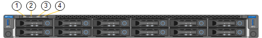

= 檢視SG6000-CN-控制器上的狀態指示燈和按鈕
:allow-uri-read: 
:icons: font
:imagesdir: ../media/

[role="lead"]
SG6000-CN-控制器包含可協助您判斷控制器狀態的指示燈、包括下列指示燈和按鈕。

[cols="1a,2a,3a"]
|===
|  | 顯示 | 說明 

 a| 
1.
 a| 
電源按鈕
 a| 
* 藍色：控制器已開啟電源。
* 不亮：控制器已關機。

 a| 
2.
 a| 
重設按鈕
 a| 
_無指標_

使用此按鈕可執行控制器的硬重設。

 a| 
3.
 a| 
識別按鈕
 a| 
* 呈藍色或持續亮起：識別機櫃或機架中的控制器。
* 不亮：控制器無法在機櫃或機架中識別。

此按鈕可設定為「Blink（亮起）」、「On（亮起）」或「Off（關閉）」。

 a| 
4.
 a| 
警示LED
 a| 
* 黃色：發生錯誤。
+
*附註：*若要檢視開機和錯誤代碼、您必須存取BMC介面。

* 不亮：不存在錯誤。

|===

== 一般開機代碼

在開機期間或SG6000-CN-控制器硬重設之後、會發生下列情況：

. 底板管理控制器（BMC）會記錄開機順序的代碼、包括發生的任何錯誤。
. 電源按鈕會亮起。
. 如果開機期間發生任何錯誤、警示LED會亮起。
+
若要檢視開機和錯誤代碼、您必須存取BMC介面。

xref:troubleshooting-hardware-installation.adoc[疑難排解硬體安裝（SG6000）]

xref:configuring-bmc-interface-sg6000.adoc[設定BMC介面（SG6000）]

xref:powering-on-sg6000-cn-controller-and-verifying-operation.adoc[開啟SG6000-CN-控制器電源、並確認運作正常]
