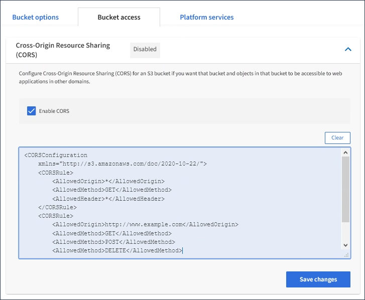

= 設定跨來源資源共享（CORS）
:allow-uri-read: 
:icons: font
:imagesdir: ../media/

[role="lead"]
如果您想要讓其他網域中的Web應用程式能夠存取S3儲存區中的儲存區和物件、可以設定S3儲存區的跨來源資源共享（CORS）。

.您需要的是 #8217 ；需要的是什麼
* 您必須使用登入租戶管理程式 xref:../admin/web-browser-requirements.adoc[支援的網頁瀏覽器]。
* 您必須屬於具有「管理所有庫位」或「根存取」權限的使用者群組。這些權限會覆寫群組或儲存區原則中的權限設定。

跨來源資源共享（CORS）是一種安全機制、可讓一個網域中的用戶端Web應用程式存取不同網域中的資源。例如、假設您使用名為「imag像」的S3儲存區來儲存圖形。如果將CORS設定為「映像」儲存區、您就能在網站「http://www.example.com`」上顯示該儲存區中的影像。

.步驟
. 使用文字編輯器建立啟用CORS所需的XML。
+
此範例顯示用於啟用S3儲存區的CORS的XML。此XML可讓任何網域將Get要求傳送至儲存區、但僅允許「+http://www.example.com+`」網域傳送POST和刪除要求。允許所有要求標頭。

+
[listing]
----
<CORSConfiguration
    xmlns="http://s3.amazonaws.com/doc/2020-10-22/">
    <CORSRule>
        <AllowedOrigin>*</AllowedOrigin>
        <AllowedMethod>GET</AllowedMethod>
        <AllowedHeader>*</AllowedHeader>
    </CORSRule>
    <CORSRule>
        <AllowedOrigin>http://www.example.com</AllowedOrigin>
        <AllowedMethod>GET</AllowedMethod>
        <AllowedMethod>POST</AllowedMethod>
        <AllowedMethod>DELETE</AllowedMethod>
        <AllowedHeader>*</AllowedHeader>
    </CORSRule>
</CORSConfiguration>
----
+
如需CORS組態XML的詳細資訊、請參閱 http://docs.aws.amazon.com/AmazonS3/latest/dev/Welcome.html["Amazon Web Services（AWS）文件：Amazon Simple Storage Service開發人員指南"^]。

. 在租戶管理程式中、選取*儲存設備（S3）*>*桶*。
. 從清單中選取儲存貯體名稱。
+
此時會顯示「庫位詳細資料」頁面。

. 選擇* Bucket access*>* Cross-Origin Resource Sharing（CORS）*。
. 選取「*啟用CORS*」核取方塊。
. 將CORS組態XML貼到文字方塊中、然後選取*儲存變更*。
+

. 若要修改儲存區的CORS設定、請更新文字方塊中的CORS組態XML、或選取* Clear*重新開始。然後選取*儲存變更*。
. 若要停用儲存區的CORS、請取消選取「*啟用CORS*」核取方塊、然後選取「*儲存變更*」。

